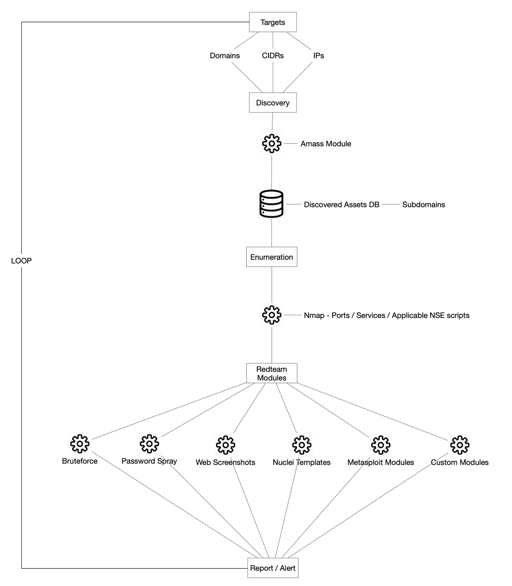
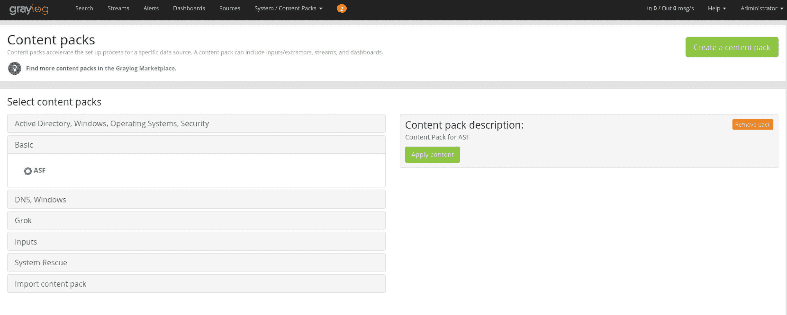
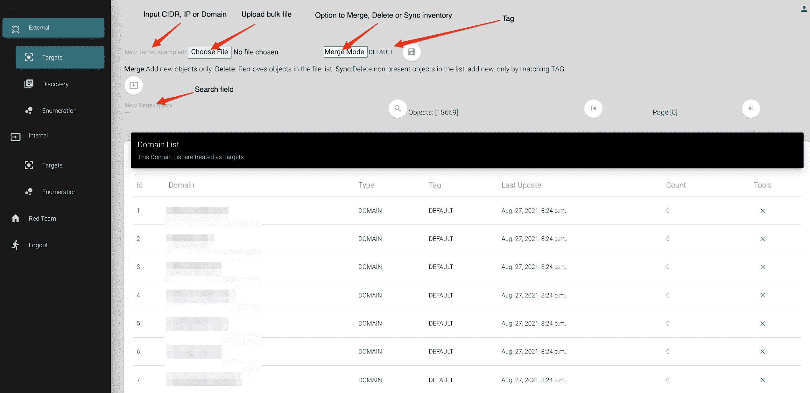
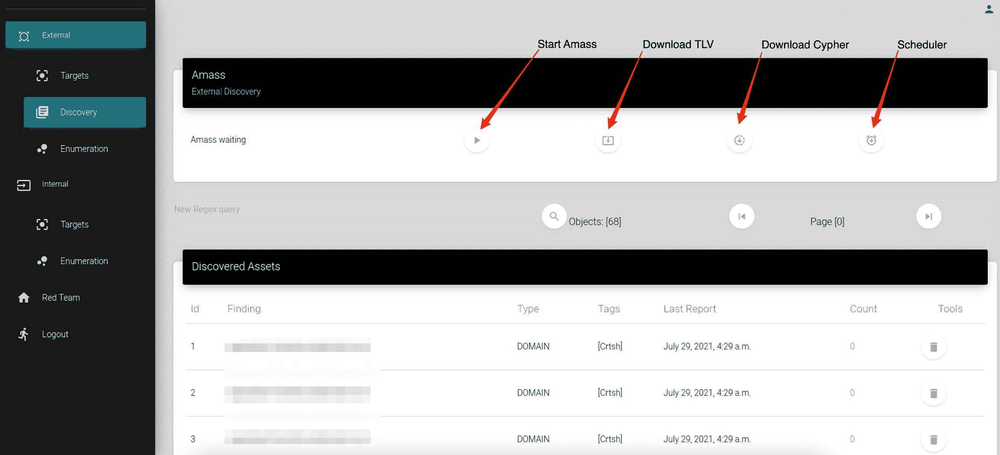
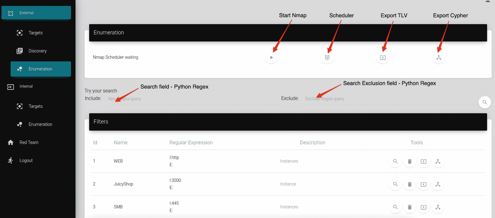
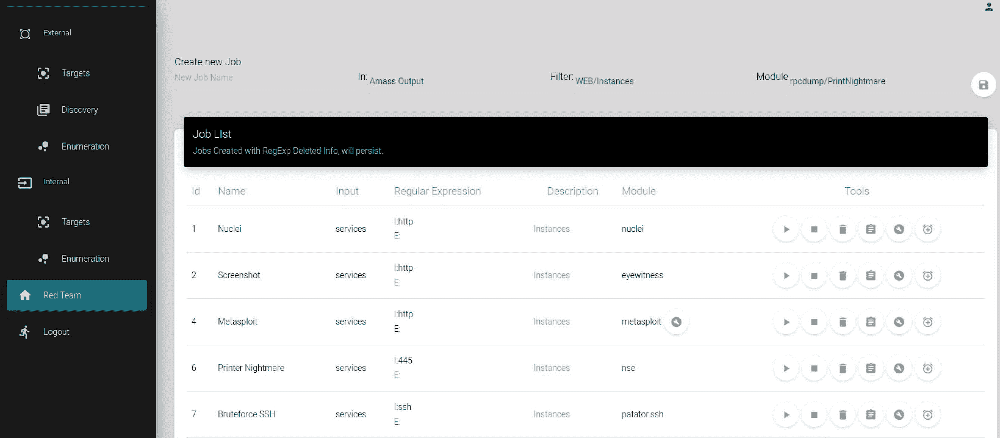

# 攻击面框架:发现外部和内部网络攻击面的工具

> 原文：<https://kalilinuxtutorials.com/attack-surface-framework/>

**攻击面框架**旨在保护充当攻击面监视者的组织，前提是“对象”可能是:域、IP 地址或 CIDR(内部或外部)，ASF 将发现资产/子域，枚举它们的端口和服务，跟踪增量，并作为一个连续和灵活的攻击和警报框架，利用额外的一层支持来对抗公开可用的 PoC 的 0 天漏洞。

**动机**

缺乏支持和灵活性，无法通过持续扫描或利用单一控制台来自动发现动态资产及其相关漏洞，这是创建 ASF 的驱动力，当前的解决方案受到技术或程序的限制，我们需要一个可扩展的解决方案，并利用流行的开源安全工具来处理完整的漏洞生命周期。

ASF 是一种开源项目，它利用了一个强大的工具库，这些工具被包装在 GUI 顶部的单一窗口中。ASF 架构图如下所示:

**先决条件**

Kali Linux 的最新版本(在 64 位上测试)–https://kali.org/get-kali/

至少 16 GB 内存

1 TB 硬盘—建议使用 XFS 文件系统

**建造&运行**

作为根

*   `**git clone https://github.com/vmware-labs/attack-surface-framework.git /opt/asf**`
*   `**cd /opt/asf/**`
*   运行`**./setup.sh**`
*   分配您的用户、电子邮件和通行证

一旦安装完成

*   `**cd /opt/asf/frontend/asfgui/**`
*   `**. bin/activate**`
*   `**python3 manage.py runserver 0.0.0.0:8080**`–我们建议在屏幕会话上运行它，以保持服务器的持久性(`**screen -S asf**`)

**安全**

ASF 不打算公开，假设您将它安装在云提供商甚至本地实例上，我们建议通过 SSH 使用端口转发来访问它，下面是一个示例:

**`ssh -i "key.pem" -L 8080:127.0.0.1:8080 user@yourhost`**–用于 ASF GUI

`**ssh -i "key.pem" -L 9045:127.0.0.1:9045 user@yourhost**`–进入灰色对话框 2 面板

然后打开浏览器，转到:

`**http://127.0.0.1:8080**`–对于 ASF–用户:您的用户通行证:您的通行证(在初始设置中提供)

`**https://127.0.0.1:9045**`–对于 gray log 2–用户:管理员通行证:管理员#在/graylog/docker-compose.yaml 中更改它

Graylog2 需要几个步骤来开始从 ASF 接收日志:

登录后，转到 System/“Content Packs”并导入位于/opt/asf/tools/gray log/Content _ Pack _ ASF . json 的内容包，单击“Upload”按钮，您应该会看到“Select Content Packs”部分中反映的“Basic ”,单击“Basic ”,确保“ASF”单选按钮被选中并单击“Apply content”按钮，这将创建全局输入来解析 JSON 日志和相关提取器。

现在你已经准备好从 ASF 接收日志并设置你的流/警报/dasboard 了！

更多信息@ https://docs.graylog.org/en/4.1/

**文档**

ASF 有两个范围:

a)外部:针对您的公开资产。

b)内部:公司网络中的资产。

对于外部范围，流程经过四个基本步骤:

A.1 目标–这里是您输入目标的地方

a . 2 Discovery–运行 Amass 流程以发现公开资产的模块，请随意创建您的配置文件来设置您的 API 密钥 https://github . com/OWASP/Amass/blob/master/examples/config . ini

a . 3 Enumeration–运行 NMAP 进程以枚举端口/服务并为 Redteam 模块创建过滤器的模块。默认设置是寻找`**--top-ports 200**`,但是您可以在/opt/asf/tools/nmap/*中根据自己的需要进行设置。嘘

a . 4 red team–运行位于“/opt/asf/redteam”中的子模块的模块

**注:**对于内部作用域，流程经过 A.1(Targets)、A.3(Enumeration)和 A.4(Redteam)。

[**Download**](https://github.com/vmware-labs/attack-surface-framework)