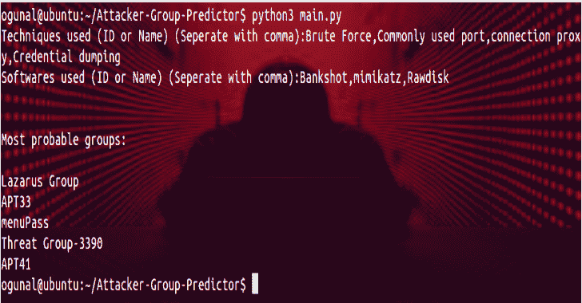

# 攻击者群体预测器:预测攻击者群体的工具

> 原文：<https://kalilinuxtutorials.com/attacker-group-predictor/>

[](https://1.bp.blogspot.com/-5o0yusvuiII/XvZP-6-88NI/AAAAAAAAGug/Mvtcqi82WsgCc-ddc_lMT6Inh0yAtfQOQCLcBGAsYHQ/s1600/Screenhot%25281%2529.png)

**攻击者群体预测器**是一个根据所使用的技术和软件预测攻击者群体的工具。它基于米特 ATT & CK 框架进行搜索。

它是如何工作的？

*   从[https://attack.mitre.org/](https://attack.mitre.org/)收集关于攻击者组织的数据
*   从用户处获取攻击数据
*   比较数据并创建结果

**安装**

**git 克隆 https://github.com/omergunal/Attacker-Group-Predictor.git
CD 攻击者-团体-预测者/
pip 3 install-r requirements . txt**

**用途**

**python3 main.py
填充输入**

**更新攻击者群组数据**

**cd 更新器
python3 update.py**

**例子**

```
python3 main.py
  Techniques used (ID or Name) (Seperate with comma):Brute Force,Commonly used port,connection proxy,Credential dumping
  Softwares used (ID or Name) (Seperate with comma):Bankshot,mimikatz,Rawdisk

  Most probable groups:
    Lazarus Group
    APT33
    menuPass
    Threat Group-3390
    APT41 
```

[**Download**](https://github.com/omergunal/Attacker-Group-Predictor)