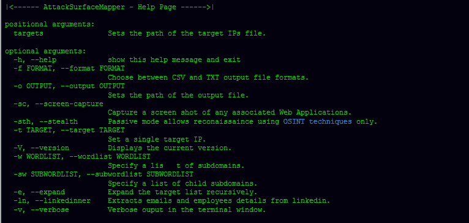

# AttackSurfaceMapper:旨在自动化侦察过程的工具

> 原文：<https://kalilinuxtutorials.com/attacksurfacemapper/>

**attacks surface mapper**是一款侦察工具，它混合使用开源智能和主动技术来扩大目标的攻击面。

你输入一个或多个域名、子域名和 IP 地址，它会使用多种技术来寻找更多的目标。它列举了具有暴力强制和被动查找的子域、同一网络块所有者的其他 IP、具有指向它们的多个域名的 IP 等等。

一旦目标列表完全展开，它就会对其进行被动侦察，拍摄网站截图，生成可视地图，在公共漏洞中查找凭据，使用 Shodan 进行被动端口扫描，并从 LinkedIn 上搜集员工信息。

**设置**

由于这是一个基于 Python 的工具，理论上它应该可以在 Linux、ChromeOS ( [开发者模式](https://www.chromium.org/chromium-os/developer-information-for-chrome-os-devices/generic))、macOS 和 Windows 上运行。

[1]下载攻击面映射器

**$ git 克隆 https://github.com/superhedgy/AttackSurfaceMapper**

[2]安装 Python 依赖项

**$ CD attack surface mapper
$ python 3-m pip install–no-cache-dir-r requirements . txt**

[3]添加可选的 API 键以支持更多的数据收集

从以下地址注册并获取 API 密钥:

*   [VirusTotal](https://www.virustotal.com/gui/join-us)
*   [ShodanIO](https://account.shodan.io/register)
*   亨特里奥
*   [WeLeakInfo](https://weleakinfo.com/register)
*   [LinkedIn](https://www.linkedin.com/start/join)
*   [灰色战争](https://buckets.grayhatwarfare.com/register)

编辑并输入密钥列表文件中的密钥

**$ nano keylist.asm**

**运行命令示例**

**$ python 3 ASM . py-t your.site.com-ln-w resources/top 100 _ sublist . txt-o demo _ run**

**另请阅读-[保护网站免受黑客攻击的最重要安全提示](https://kalilinuxtutorials.com/security-tips-to-protect-website-from-hackers/)**

**可选参数**

除了默认的被动模块之外，还可以设置附加的可选参数来选择包括主动侦察模块。

**演示**

[https://www.youtube.com/embed/buIQSf_gmdE?feature=oembed&enablejsapi=1](https://www.youtube.com/embed/buIQSf_gmdE?feature=oembed&enablejsapi=1)

**鸣谢:** [亚斯乔治乌](https://twitter.com/superhedgy) & [雅各布威尔金](https://github.com/Greenwolf)

[**Download**](https://github.com/superhedgy/AttackSurfaceMapper)