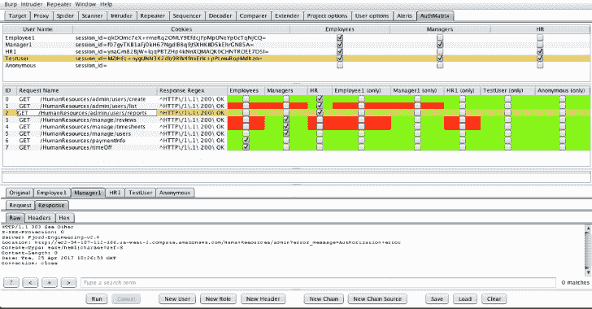
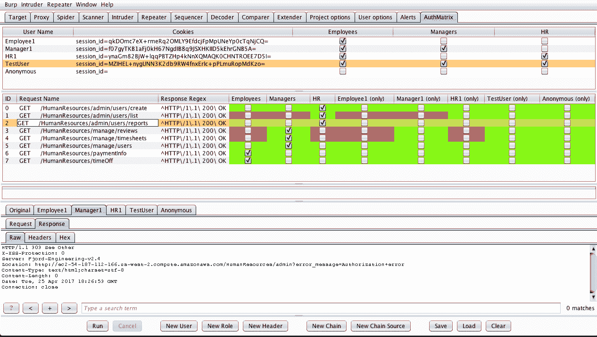
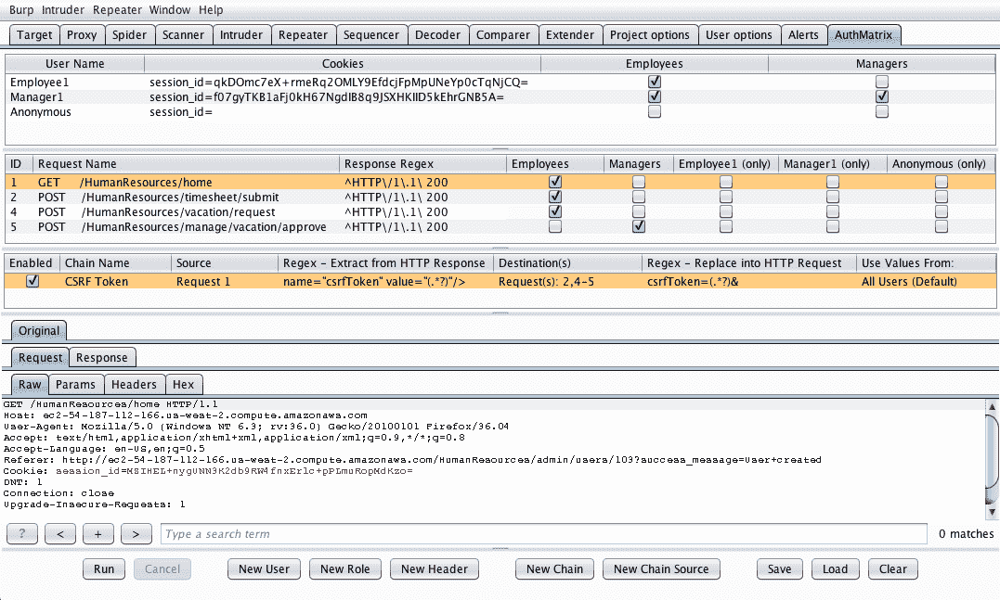
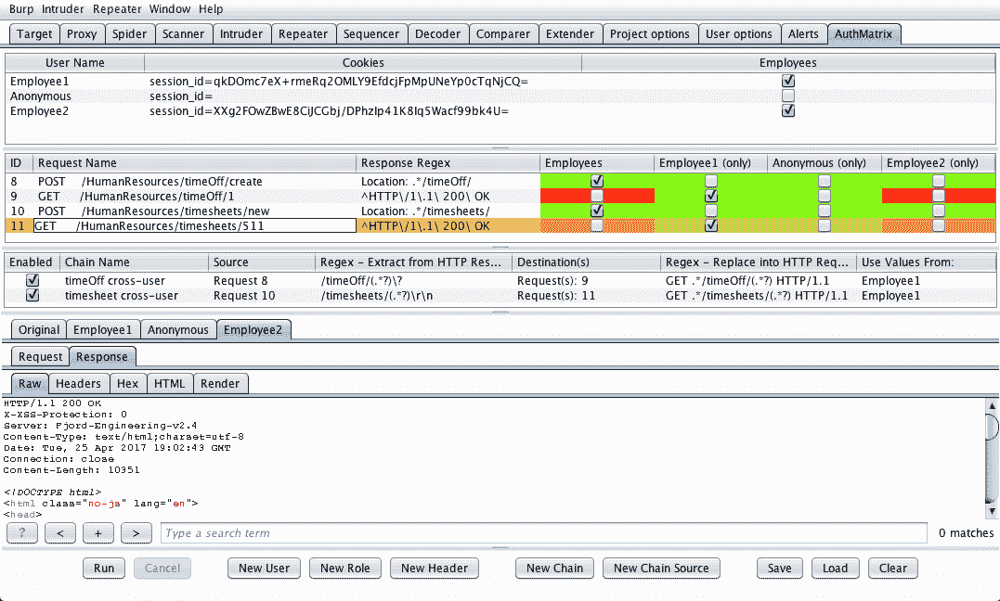
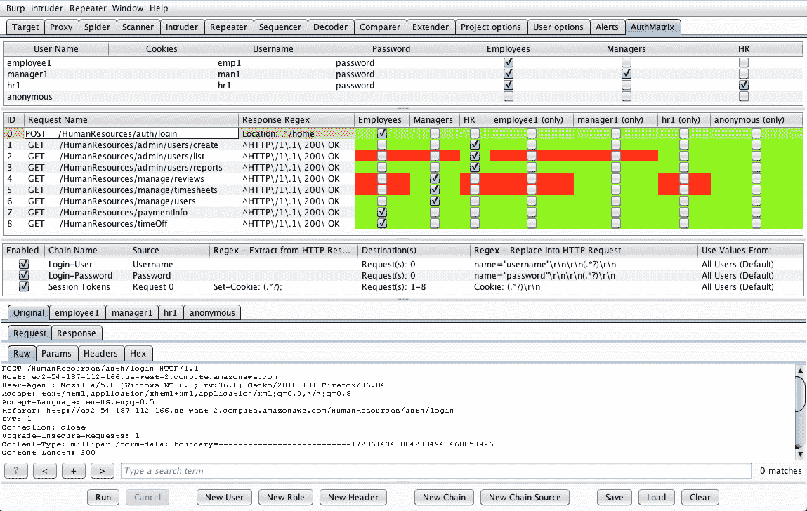
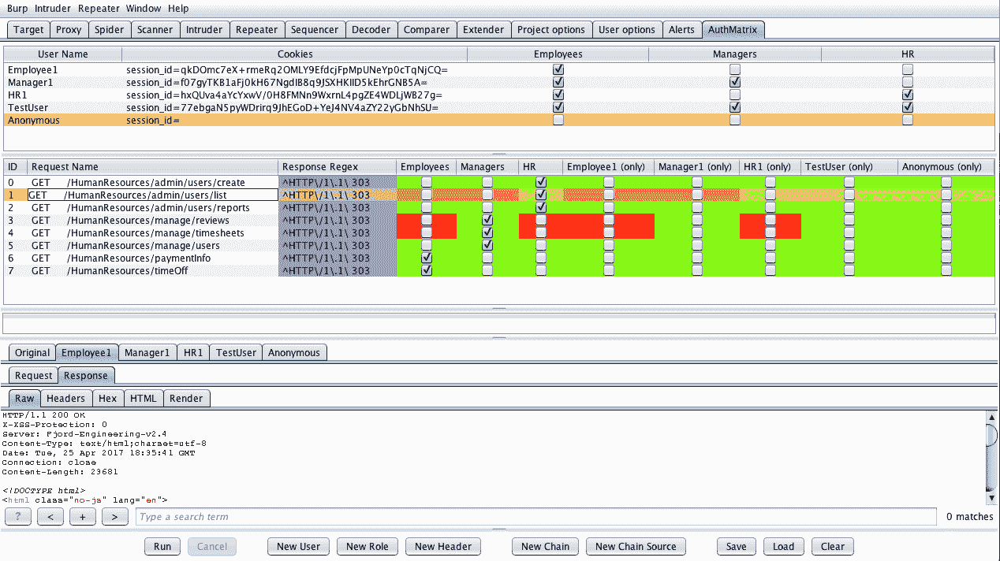

# AuthMatrix:一个 Burp 套件扩展，它提供了一种测试授权的简单方法

> 原文：<https://kalilinuxtutorials.com/authmatrix/>

AuthMatrix 是 Burp Suite 的扩展，它提供了一种简单的方法来测试 web 应用程序和 web 服务中的授权。使用 AuthMatrix，测试人员关注于预先为他们特定的目标应用程序彻底定义用户、角色和请求的表格。

这些表的结构类似于各种威胁建模方法中常见的访问控制矩阵。

一旦表被组装，测试人员可以使用简单的点击运行界面来启动所有的角色和请求的组合。可以通过一个易于阅读的彩色编码界面来确认结果，该界面显示系统中检测到的任何授权漏洞。

此外，该扩展提供了为简单回归测试保存和加载目标配置的能力。

**安装**

AuthMatrix 可以通过 Burp Suite BApp 商店安装。在 Burp Suite 中，选择 Extender 选项卡，选择 BApp 商店，选择 AuthMatrix，然后单击 install。

对于手动安装，请从该存储库中下载 AuthMatrix.py。然后在 Burp Suite 中，选择 Extender 选项卡，单击 Add 按钮，将扩展类型更改为 Python，并选择 AuthMatrix python 文件。

**注**

AuthMatrix 需要配置 Burp Suite 来使用 Jython。这方面的简单说明位于以下 URL。

[https://portswigger . net/burp/help/extender . html # options _ python env](https://portswigger.net/burp/help/extender.html#options_pythonenv)

确保使用 Jython 版本 2.7.0 或更高版本，以确保兼容性。

**基本用法**

*   为目标应用程序中的所有权限级别创建角色。(常见角色可能包括用户、管理员和匿名用户)
*   创建足够多的用户来适应这些不同的角色，并选择用户所属的所有角色的复选框。仅包含一个用户的“单用户”角色将被自动配置，以帮助进行跨用户资源测试。如果不需要这些角色，可以通过右键单击请求表中的列来删除它们。
*   从 Repeater 选项卡为每个用户生成会话令牌，并将其输入到 Users 表的相关列中。Cookies 可以通过 Repeater 中的右键菜单直接发送给用户。AuthMatrix 将智能地解析表中的 cookie 字符串，并在适用的情况下将它们替换/添加到请求中。
    *   注意:Cookies 字段是可选的。如果目标使用 HTTP 头，可以通过单击“新建头”按钮来添加这些头。
    *   有关更高级的配置，包括自动刷新凭据，请参见下面的“验证用户的链”示例。
*   从 Burp Suite 的另一个区域(即目标选项卡、转发器选项卡等)右键单击请求，然后选择“发送到 AuthMatrix”
*   在 AuthMatrix 的请求表中，选中被授权发出每个 HTTP 请求的所有角色的复选框。
*   根据请求的预期响应行为自定义响应正则表达式，以确定操作是否成功。
    *   常见的正则表达式包括 HTTP 响应头、正文中的成功消息或页面正文中的其他变体。
    *   注意:可以通过右键菜单将请求配置为使用一个失败的正则表达式(即经过身份验证的用户永远不会收到 HTTP 303)
*   单击底部的运行运行所有请求，或者右键单击几个请求并选择运行。注意相邻的表格将显示彩色编码的结果。
    *   绿色表示未检测到漏洞
    *   红色表示请求可能包含漏洞
    *   蓝色表示结果可能是假阳性。(这通常意味着存在无效/过期的会话令牌或不正确的正则表达式)

**验证矩阵配置示例**

*   **检测到误报(无效会话令牌)**

**高级用法**

**链条**

链提供了一种将静态或动态值复制到请求体中的方法。这些值可以从以前运行的请求的响应中提取(使用正则表达式)，或者通过指定特定于用户的静态字符串值来提取。

链条最常见的使用案例有:

1.  用有效的 CSRF 令牌填充请求
2.  测试新创建的 id/guid 是否存在跨用户授权问题
3.  自动化身份验证和会话刷新

链条目具有以下值:

*   **链名:**描述性名称
*   **源:**用户表中定义的静态用户字符串或请求表中源请求的 ID
*   **提取正则表达式:**用于从源请求的响应中提取值的正则表达式。仅当在前一字段中指定了请求时，才使用该字段。如果使用，这必须包含一个要提取的括号分组[即(。*)]
*   **目的地:**源值将被替换到的请求 id 列表。
*   **替换正则表达式:**用于确定源值插入位置的正则表达式。这必须包含一个要替换的括号分组[即(。*)]
*   **使用值来自:**指定是使用从一个选定用户处获得的源值(对于跨用户资源测试很有用)，还是使用来自所有用户的值并将它们放入相应用户的目标请求中(对于 CSRF 令牌检索等自动化任务很有用)

**注意:**请求按行的顺序运行，但是，如果检测到链依赖，AuthMatrix 将按要求的顺序运行请求。

**CSRF 的链条**

**跨用户资源测试链**

**用户认证链**

**失败正则模式**

对于某些目标，配置 AuthMatrix 来检测请求失败时的响应情况可能更容易。例如，如果目标站点在成功请求时返回唯一数据，但在执行未经授权的操作时总是返回 HTTP 303。

在此模式下，AuthMatrix 将为不属于后续角色的所有用户验证此正则表达式。

为此，右键单击请求并选择“切换正则表达式模式”。regex 字段将以紫色突出显示，表示 AuthMatrix 将以失败 Regex 模式运行请求。

**注意:**在失败正则表达式模式下，误报检测和突出显示可能不起作用

**正则表达式模式失败的配置示例**

[**Download**](https://github.com/SecurityInnovation/AuthMatrix)