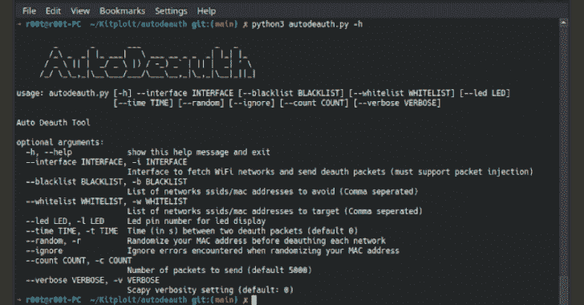

# Autodeauth:一个用来自动解除本地网络授权的工具

> 原文：<https://kalilinuxtutorials.com/autodeauth/>

.png)

Autodeauth 是一个用来自动解除本地网络授权的工具

*   在 Raspberry Pi 操作系统和 Kali Linux 上测试

## 设置

**$ chmod +x setup.sh
$ sudo。/setup.sh
[ *]这个可以通过编辑/etc/systemd/system/autodeauth . service[？]进入你的 WiFi 接口使用 autodeauth 服务:wlan0 [* ]已安装！，您可以使用 sudo autodeauth -h 来查看可用的选项。
[ *]使用 sudo systemctl start autodeauth 启动服务[* ]查看自述文件了解有关配置服务的更多信息**

## 选择

**$ sudo autodeauth-h _ _ _ _ _/*\**| |*|*| \*_ _*| |
/_ \ | |*/*\ |)/–*` | | |*| ' \/*/_ _， *|_* ___/ */__* ，| _ _ |*| |*| |
用法:autodeauth[-h]–INTERFACE[–black List 黑名单][–white List 白名单][–LED LED LED][–TIME TIME][–random][–ignore][–COUNT COUNT][–VERBOSE][–VERBOSE]
Auto deauth 工具
选项:
-h，–help 显示此帮助消息并退出
–INTERFACE INTERFACE，-i INTERFACE
接口获取 WiFi 网络并发送 Deauth -w 白名单
目标网络 ssid/mac 地址列表(逗号分隔)
–LED LED，-l LED LED LED 显示 pin 号
–时间时间，-t 时间两个取消授权数据包之间的时间(秒)(默认为 0)
–随机，-r 在取消授权每个网络之前随机化您的 MAC 地址
–忽略随机化您的 MAC 地址时遇到的错误
–计数计数，-c 计数
要发送的数据包数量(默认为 5000)** 

# 使用

运行安装程序后，您可以从任何目录使用 autodeauth 运行脚本

## 命令行

带有空格的网络可以用它们的 mac 地址来表示

**$ sudo autodeauth-I WLAN 0–黑名单 FreeWiFi，E1:DB:12:2F:C1:57 -c 10000**

## 服务

**$ sudo systemctl 开始自动授权**

# 抢劫和记录文件

## 战利品

当检测到网络并符合白名单/黑名单标准时，其网络信息将作为 json 文件保存在/var/log/autodeauth/中

**{
"ssid": "MyWiFiNetwork "，
" MAC _ address ":" 10:0B:21:2E:C1:11 "，
"channel": 1，
" network . frequency ":" 2.412 GHz "，
"mode": "Master "，
"bitrates": [
"6 Mb/s "，
"9 Mb/s "，
"12 Mb/s "，**

## 日志文件

**$ cat/var/log/autodeauth/log
2022-08-20 21:01:31-扫描本地网络
2022-08-20 21:20:29-向网络发送 5000 个 deauth 帧:A0:63:91:D5:B8:76-my wifi network
2022-08-20 21:21:00-退出/清理**

# 编辑服务配置

要更改 autodeauth 服务的设置，请编辑文件/etc/systemd/system/autodeauth . service
假设您希望将以下配置设置为服务

$**sudo autodeauth-I WLAN 0–黑名单 FreeWiFi，myWifi -c 10000**

**$ vim/etc/systemd/system/autodeauth . service**

然后，您应该将 ExecStart 行改为

**ExecStart =/usr/bin/python 3/usr/local/bin/autodeauth-I WLAN 0–黑名单 FreeWiFi，myWifi -c 10000**

[Download](https://github.com/Drew-Alleman/autodeauth)