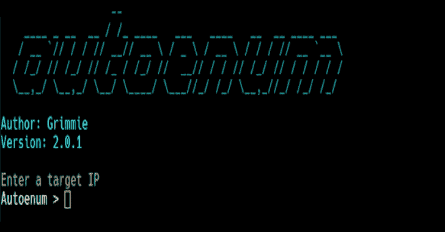

# Autoenum:自动服务枚举脚本

> 原文：<https://kalilinuxtutorials.com/autoenum/>

Autoenum 是一个 recon 工具，它对发现的服务进行自动枚举。我构建这个是为了在 CTFs 和 pen 测试环境(即 HTB、VulnHub、OSCP)中节省一些时间，并借鉴了一些现有的工具，包括 AutoRecon(【https://github.com/Tib3rius/AutoRecon】[)、Auto-Recon(](https://github.com/Tib3rius/AutoRecon)[https://github . com/Knowledge-Wisdom-understand/Auto-Recon](https://github.com/Knowledge-Wisdom-Understanding/Auto-Recon))和 nmapautomator([https://github.com/21y4d/nmapAutomator](https://github.com/21y4d/nmapAutomator))。

也可以在现实生活中使用。目前只在卡利进行了测试。如果您注意到一个 bug 或者有一个不在待办事项中的功能请求，请提交一个问题或者以其他方式告知(最好是 discord)。感谢并享受 autoenum！

它是如何工作的？

Autoenum 首先一前一后运行两次 nmap 扫描，一次扫描专门查找针对 searchsploit 运行的服务版本，另一次扫描取决于参数。

每个扫描配置文件都会检查正在运行的服务，唯一不同的是扫描类型。扫描完成后，服务/端口打开，操作系统以及脚本输出(如果有)被提取出来并进行进一步分析。

如果找到某个服务，Autoenum 将通过启动一些工具开始枚举，并为该服务创建一个目录(即检测 http 启动 nikto、wafw00f、gobuster 等)。

如果没有检测到所需的依赖项，将自动安装该依赖项，并在每次运行该工具时检查是否有新的更新。Autoenum 在两个主要部分(扫描类型和拾取目录)输出该信息，子目录根据找到的内容分支。

**安装**

git 克隆 https://github.com/Gr1mmie/autoenum.git
chmod+x auto enum/auto enum . sh

有什么新消息？

**1.1 版本**

*   第一个版本，增加了 HTTP 和 SMB 枚举，以及功能化的混乱代码
*   增加了主动扫描，包括用于版本漏洞搜索的 nmap 到 searchsploit 扫描
*   添加了用于参数解析的 getopts，以替换拼凑的基于位置的条件

**1.2 版本**

*   添加了帮助菜单和逻辑来检测依赖性
*   修正了终端中断的问题(有点，如果有比清除终端输出更好的想法可以考虑)。

**1.3 版本**

*   修复了同时扫描问题，现在两个扫描同时启动，并且有一些工具用于某些服务枚举在后台运行，而其他的留在前台以节省时间

**1.4 版本**

*   添加了各种服务的枚举，包括 LDAP、SNMP、SMTP、oracle 和 FTP 以及横幅
*   添加了包含在命令失败时运行的所有命令的文件
*   安装未检测到的工具，并检查是否所有工具都是最新的

**版本 1.4.1**

*   修复了从文本编辑器中读取时，部件显示为已编码的 searchsploit 编码问题

**2.0 版本**

*   Autoenum 现在作为类似于 msfconsole 的控制台工具运行。

**版本 2.0.1**

*   持久 shell 命令

**2.1 版本**

*   imap、mysql、redis 枚举

**3.0 版本**

*   完美的用户界面
*   清理了 shell util 错误并修复了转义关键字
*   添加了更多扫描选项:
    *   前 1k 扫描
    *   前 10k 扫描
    *   UDP 扫描
*   添加了组合扫描(vuln 扫描可以添加到任何其他扫描上)
*   添加了辅助扫描:
    *   添加了快速扫描
    *   增加了 Vuln 扫描
*   修正了更新抛出错误的问题
*   现在支持 URL 和 FQDNs
*   验证输入的 IP 是否有效
*   aggr + reg 扫描现在首先扫描前 1k 个端口
*   使用 ttl 执行基本操作系统检测
*   searchsploit 输出现在被发送到一个 JSON 文件中，以便于查看
*   nfs 枚举现在尝试装载发现的 nfs 共享
*   修复了 http 多个端口未被检测到的问题

**依赖关系**

默认情况下，您的操作系统可能安装了一些，也可能没有。不用担心，autoenum 会识别未安装的工具并为您安装它们，即使它们不是最新的，它也会进行更新！

*   nmap
*   nikto
*   gobuster
*   whatweb
*   一六一
*   snmp 检查
*   snmpwalk
*   凶猛的
*   dnsenum
*   dnsrecon
*   sslscan
*   uniscan
*   SNMP-用户-枚举
*   扫描仪
*   wafw00f
*   odat
*   searchsploit
*   rpcbind
*   tput
*   japan quarterly 日本季刊
*   wpscan

**信用:** Dievus

[**Download**](https://github.com/Gr1mmie/autoenum)