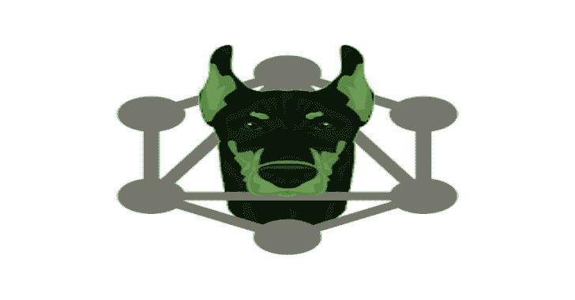
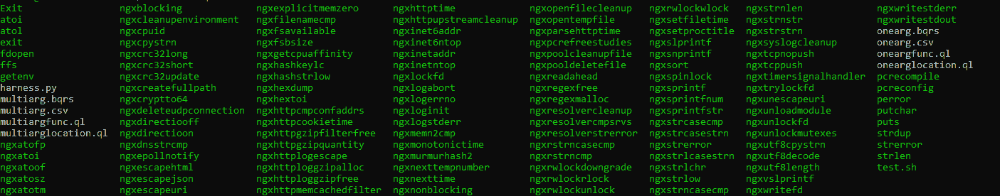

# Autoharness:基于库自动创建模糊线束的工具

> 原文：<https://kalilinuxtutorials.com/autoharness/>

**AutoHarness** 是一款为你自动生成 fuzzing 线束的工具。这种想法源于当今模糊代码库的一个并发问题:大型代码库有成千上万的函数和代码片段，可以嵌入到库中相当深的位置。智能模糊器很难或者有时甚至不可能到达那个代码路径。即使是像 oss-fuzz 这样的大型 fuzzing 项目，仍然有一些代码库没有包含在 fuzzing 中。因此，这个程序试图在某种程度上缓解这个问题，并提供一个工具，安全研究人员可以使用它来初步测试代码库。这个程序只支持用 C 和 C++编写的代码库。

**设置/演示**

这个程序利用 llvm 和 clang 实现 libfuzzer，利用 Codeql 实现函数查找，利用 python 实现通用程序。这个程序在 Ubuntu 20.04 上用 llvm 12 和 python 3 进行了测试。这是初始设置。

**sudo apt-get 更新；
sudo apt-get 安装 python 3 python 3-pip llvm-12 * clang-12 git；
pip3 安装熊猫 lief 子进程 os argparse ast**

按照 https://github.com/github/codeql.上的 Codeql 安装过程，确保安装 CLI 工具和库。对于我的测试，我将工具和库都存储在一个文件夹下。最后，克隆这个库或者下载一个版本。下面是程序在 nginx 上运行后的输出，设置了多参数模式。这是我使用的命令。

**python 3 harness . py-l/home/akshat/engine x-1 . 21 . 0/objects/-c/home/akshat/code QL-h/-m1-o/home/akshat/auto arness/-d engine x1-y1-f "-I/home/akshat/engine x-1 . 21 . 0/objects-I/home/akshat/engine-1 . 21 . 0/src/core-I/home/akshat/engine-1.21**

**结果**

通过进一步调试编译和添加更多的头文件，肯定有可能提高成功率。注意 nginx 项目在编译后没有任何共享对象。然而，这个程序有一个特性可以将 PIE 可执行文件转换成共享库。

**【计划功能(按进度顺序)**

*   **结构模糊化**

目前在程序中实现的模糊具有多个参数的函数的方法是使用模糊数据提供程序。在这种集成中需要做一些改进；然而，我相信我可以将这个特性与数据结构结合起来。我在编写代码时遇到的一个问题是 codeql 和嵌套结构。如果不编写针对每个函数都不同的多个查询，这将变得特别困难。简而言之，这个功能需要更多的工作。我也在考虑一个使用 protobufs 的简单解决方案。

*   **实现基于线束的创建**

使用 codeql，可以使用来生成映射函数中参数初始化方式的控制流图。利用这些信息，我们可以创造出更好的马具。另一种方法是寻找库中存在的函数的实现，并使用该信息对函数的实现进行有根据的猜测。我目前遇到的问题是用 codeql 生成控制流图。

*   **并行化模糊/误报检测**

我可以创建一个简单的程序，运行所有的线束，并使用 ASAN 找出任何常见的误报。此外，我可以创建一个新的接口，它可以同时运行所有的线束并显示它们的统计数据。

**投稿/bug**

如果您发现此程序有任何错误，请创建一个问题。我会努力想出一个解决办法。此外，如果您对任何新功能或如何实施性能升级或当前计划的功能有任何想法，请创建一个拉式请求或带有标签(贡献)的问题。

**PSA**

该工具会产生一些误报。请首先分析崩溃，看看它是有效的错误，还是只是一个实现错误。此外，如果某些函数没有编译，您可以启用调试模式。这将帮助您了解是否缺少一些头文件或任何链接问题。如果您正在处理的项目没有共享库，但有一个可执行文件，请确保以饼图形式编译该可执行文件，以便该程序可以将其转换为共享库。

[**Download**](https://github.com/parikhakshat/autoharness)