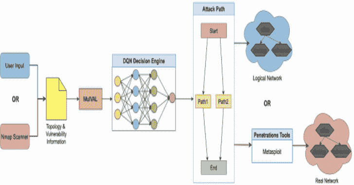
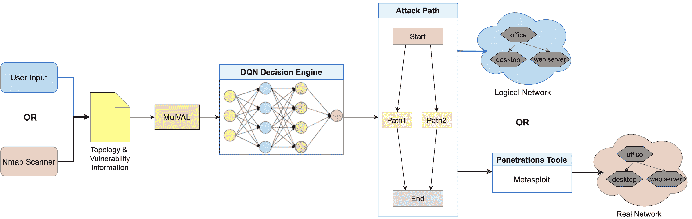

# AutoPentest DRL:使用深度强化学习的自动化渗透测试

> 原文：<https://kalilinuxtutorials.com/autopentest-drl/>

DRL 自动渗透测试是一个基于深度强化学习(DRL)技术的自动化渗透测试框架。AutoPentest-DRL 可以为给定的逻辑网络确定最合适的攻击路径，还可以用于通过 Nmap 和 Metasploit 等工具在真实网络上执行渗透测试攻击。该框架旨在用于教育目的，以便用户可以研究渗透测试攻击机制。位于日本石川的日本高等科学技术学院( [JAIST](https://www.jaist.ac.jp/english/) )的网络范围组织和设计( [CROND](https://www.jaist.ac.jp/misc/crond/index-en.html) ) NEC 主席正在开发 AutoPentest-DRL。

下面是 AutoPentest-DRL 公司的概况。该框架接收关于逻辑目标网络的用户输入，包括脆弱性信息；或者，该框架可以使用 Nmap 进行网络扫描，以在具有已知拓扑的真实目标网络中找到实际漏洞。然后，MulVAL 攻击图生成器用于确定潜在的攻击树，并以简化的形式输入 DQN 决策引擎。作为输出产生的攻击路径可用于研究大量逻辑网络上的攻击机制。或者，框架可以将攻击路径与渗透测试工具(如 Metasploit)一起使用，使用户能够研究如何在真实的目标网络上进行攻击。

接下来，我们将简要介绍如何设置和使用 DRL 自动检测系统。有关其操作的详细信息，请参考我们也提供的[用户指南](https://github.com/crond-jaist/AutoPentest-DRL/blob/master/user_guide.md)。

**先决条件**

使用 DRL 自动检测系统需要几个外部工具；对于基本功能(DQN 训练和对逻辑网络的攻击)，您需要:

*   **mul val**:DRL 自动检测公司使用的攻击图生成器，为给定网络生成可能的攻击路径。参见 [MulVAL 页](https://github.com/risksense/mulval)了解安装说明和依赖关系。MulVAL 应该安装在自动测试-DRL 文件夹的目录`**repos/mulval**`中。您还需要配置 **`/etc/profile`** 文件，如这里讨论的。在某些系统上，可能还需要安装 **`epstopdf`** 工具，例如使用以下命令:

**sudo apt 安装 texliv-font-utils**

如果您计划在真实网络中使用 DRL 自动测试，您还需要:

*   **Nmap**:DRL 自动检测公司使用的网络扫描器，用于确定给定真实网络中的漏洞。在 Ubuntu 上安装`**nmap**`所需的命令如下:

**sudo 安装 nmap**

*   **Metasploit**:DRL 自动测试公司使用的渗透测试工具，用于在真实的目标网络上实际执行 DQN 引擎提出的攻击。要安装 Metasploit，您可以使用在 [Metasploit 网站](https://www.metasploit.com/)上提供的安装程序。另外，我们使用 **`pymetasploit3`** 作为 RPC API 与 Metasploit 进行通信，这个工具需要按照其作者的[说明](https://github.com/DanMcInerney/pymetasploit3)安装在目录`**Penetration_tools/pymetasploit3**`中。

**设置**

自动测试-DRL 主要是在 Ubuntu 18.04 LTS 操作系统上开发的；其他操作系统可能可以工作，但尚未经过测试。为了设置 AutoPentest-DRL，使用 [releases](https://github.com/crond-jaist/AutoPentest-DRL/releases) 页面下载最新版本，并将源代码归档文件解压缩到您打算使用它的主机上您选择的目录中(例如，您的主目录)。

DRL 是用 Python 实现的，它需要几个包才能运行。发行版中包含的文件 **`requirements.txt`** 可用于通过以下命令安装必要的软件包，这些命令应该从`**AutoPentest-DRL/**`目录运行:

**$ sudo -H pip 安装要求. txt**

**快速启动**

AutoPentest-DRL 包括一个经过训练的 DQN 模型，因此您可以通过在终端中从`**AutoPentest-DRL/**`目录运行以下命令，在示例逻辑网络拓扑上开箱即用:

**$ python3。/AutoPentest-drl . py logical _ attack**

在这种**逻辑攻击模式**中，不进行实际攻击，AutoPentest-DRL 将只为文件`**MulVal_P/logical_attack_v1.P**`中描述的逻辑网络拓扑确定最佳攻击路径。通过将输出路径与 MulVAL 在文件`**mulval_results/AttackGraph.pdf**`中生成的攻击图进行比较，您可以详细研究攻击步骤。

关于 AutoPentest-DRL 操作模式的更多信息，包括**真实攻击模式**和**训练模式**，参见我们的[用户指南](https://github.com/crond-jaist/AutoPentest-DRL/blob/master/user_guide.md)。

[**Download**](https://github.com/crond-jaist/AutoPentest-DRL)