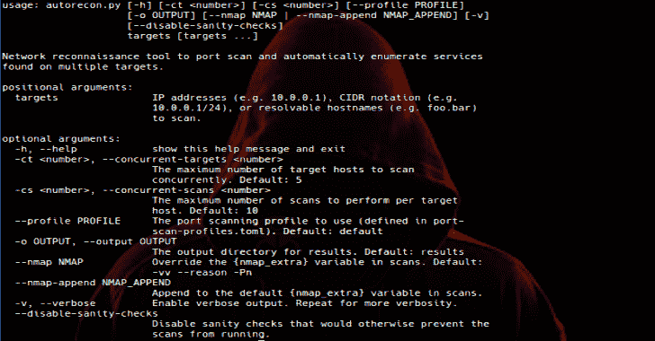

# AutoRecon:多线程网络侦察工具

> 原文：<https://kalilinuxtutorials.com/autorecon-multi-threaded-network-reconnaissance/>

[](https://1.bp.blogspot.com/-fndLPd2yc4M/XUncVC2q1pI/AAAAAAAABtk/hHPMYcwbT0syaPUqFnGz0QKFyYRxGQePwCLcBGAs/s1600/autorecon%25281%2529.png)

**AutoRecon** 是一款多线程网络侦察工具，可执行服务的自动枚举。它旨在作为一种节省时间的工具，用于 CTFs 和其他渗透测试环境(如 OSCP)。它在现实世界中也很有用。

该工具首先执行端口扫描/服务检测扫描。根据这些初始结果，该工具将使用许多不同的工具启动对这些服务的进一步枚举扫描。例如，如果找到 HTTP，就会启动 nikto(以及其他许多工具)。

工具中的一切都是高度可配置的。默认配置执行**无自动利用**以保持工具符合 OSCP 考试规则。如果您希望在配置中添加自动漏洞利用工具，您需要自担风险。作者将不对因误用该工具而导致的负面行为负责。

**来历**

AutoRecon 的灵感来自作者在 OSCP 实验室使用的三个工具:[侦察](https://github.com/codingo/Reconnoitre)、[侦察](https://github.com/RoliSoft/ReconScan)和 [bscan](https://github.com/welchbj/bscan) 。虽然这三个工具都很有用，但没有一个工具单独具有所需的功能。AutoRecon 结合了上述工具的最佳功能，同时还实现了许多新功能，以帮助测试人员枚举多个目标。

**特色**

*   支持 IP 地址、IP 范围(CIDR 表示法)和可解析主机名形式的多个目标。
*   可以利用多个处理器(如果有)同时扫描目标。
*   可定制的端口扫描配置文件，使您的初始扫描更加灵活。
*   可定制的服务枚举命令和建议的手动后续命令。
*   用于结果收集的直观目录结构。
*   完整记录已运行的命令，以及失败时的错误。
*   全局和每次扫描模式匹配，以便您可以从噪音中突出显示/提取重要信息。

**亦读-[Slurp:评估 S3 木桶的安全性](https://kalilinuxtutorials.com/slurp-evaluate-the-security-s3-buckets/)**

**要求**

*   python3
*   彩色光
*   汤姆

一旦安装了 Python 3，就可以使用 pip3 来安装其他需求:

**$ pip 3 install-r requirements . txt**

AutoRecon 中使用的几个命令引用/usr/share/seclists/目录中的 SecLists 项目。您可以手动将 SecLists 项目下载到这个目录([https://github.com/danielmiessler/SecLists](https://github.com/danielmiessler/SecLists))，或者如果您使用的是 Kali Linux ( **强烈推荐**)，您可以运行以下代码:

**$ sudo 安装 sec list**

如果不安装 SecLists，AutoRecon 仍将运行，尽管一些命令可能会失败，一些手动命令也可能无法运行。

此外，根据您的操作系统，可能需要安装以下命令:

curl
enum 4 Linux
gobuster
NBT scan
nikto
nmap
one sixtyone
OS scanner
SMB client
SMB map
SMTP-user-enum
SNMP walk
SSL scan
svwar
tnscmd 10g
what web
wkhtmltoimage

**用途**

AutoRecon 使用 Python 3 的特定功能，不支持 Python 2。

**用法:**autorecon . py[-h][-CT][-cs][–PROFILE PROFILE]
[-o OUTPUT][–nmap NMAP |–nmap-APPEND NMAP _ APPEND][-v][–disable-sanity-checks]
targets[targets…]

**网络侦察工具，用于端口扫描并自动枚举在多个目标上发现的服务。**

**位置参数:**
目标 IP 地址(如 10.0.0.1)、CIDR 符号(如
10.0.0.1/24)或可解析主机名(如 foo.bar)
进行扫描。

**可选参数:**
-h，–help 显示此帮助信息并退出
-ct，–concurrent-targets 可同时扫描的目标主机的最大数量。默认值:5
-cs，–concurrent-scans 每个目标主机要执行的最大扫描次数。默认值:10
–PROFILE PROFILE 要使用的端口扫描配置文件(在 port-scan-profiles.toml 中定义)。默认:默认
-o 输出，–OUTPUT 输出结果的输出目录。默认:结果
–nmap NMAP 覆盖扫描中的{nmap_extra}变量。default:-vv–reason-Pn
–nmap-APPEND NMAP _ APPEND 添加到扫描中的默认{nmap_extra}变量。
-v，–verbose 启用详细输出。重复以上步骤获得更多详细信息。
–Disable-sanity-checks 禁用会阻止扫描运行的健全性检查。

**例题**

扫描单个目标:

**python 3 autorecon . py 127.0.0.1** []扫描目标 127.0.0.1 []运行服务检测 nmap-full-tcp 于 127.0.0.1
[]运行服务检测 nmap-top-20-udp 于 127.0.0.1 []运行服务检测 nmap-quick 于 127.0.0.1
[]服务检测 nmap-quick 于 127 . 0 . 0 . 1 成功完成[] 在 127.0.0.1
上运行任务 TCP/80/curl-index[]在 127.0.0.1
上运行任务 TCP/80/curl-robots[]在 127 . 0 . 0 . 1
上运行任务 tcp/80/nikto[]在 127.0.0.1
上运行任务 TCP/80/nikto 127.0.0.1 上的任务 tcp/80/nikto 成功完成[]127 . 0 . 0 . 1 上的服务检测 nmap-top-20-udp 成功完成
[]127 . 0 . 0 . 1 上的服务检测 nmap-full-tcp 成功完成[] [127.0.0.1]在 tcp/5984 上找到 http
[][127 . 0 . 0 . 1]在 tcp/5985 上找到 rtsp 正在运行任务 tcp 127.0.0.1 上的任务 tcp/5984/curl-robots 成功完成
[]127.0.0.1 上的任务 tcp/5984/whatweb 成功完成[]127 . 0 . 0 . 1 上的任务 tcp/5984/nikto 成功完成
[]127 . 0 . 0 . 1 上的任务 tcp/5984/nmap-http 成功完成[]完成扫描目标 127 . 0 . 0 . 1

默认端口扫描配置文件首先执行完整的 TCP 端口扫描、前 20 个 UDP 端口扫描和前 1000 个 TCP 端口扫描。您可能会问，为什么 AutoRecon 会在扫描完整 TCP 端口的同时扫描前 1000 个 TCP 端口(完整 TCP 端口扫描也会扫描这些端口)。原因很简单:大多数开放端口一般都在前 1000 个，我们希望快速开始枚举服务，而不是等待 Nmap 扫描每个端口。如您所见，所有服务枚举扫描实际上都在完整的 TCP 端口扫描完成之前完成。虽然有轻微的重复工作，但是通过更快地将实际的枚举结果返回给测试人员，这是值得的。

请注意，如果您的终端支持，实际的命令行输出将是彩色的。

扫描多个目标

python 3 autorecon . py 192 . 168 . 1 . 100 192 . 168 . 1 . 1/30 localhost
[]扫描目标 192.168.1.1
[]扫描目标 192.168.1.2 []扫描目标 localhost
[]运行服务检测 nmap-quick on 192.168.1.100 []运行服务检测 nmap-quick on local 在本地主机上运行服务检测 nmap-top-20-UDP
[]在 192.168.1.2 上运行服务检测 nmap-top-20-UDP
[]在本地主机上运行服务检测 nmap-full-TCP
[]在 192.168.1.1 上运行服务检测 nmap-full-TCP
…

AutoRecon 支持每次扫描多个目标，并将扩展 CIDR 表示法提供的 IP 范围。默认情况下，一次只扫描 5 个目标，每个目标扫描 10 次。

使用高级选项扫描多个目标

python 3 autorecon . py-CT 2-cs2-vv-o output dir 192.168.1.100 192 . 168 . 1 . 1/30 localhost
[]扫描目标 192.168.1.100 []扫描目标 192.168.1.1
[]在 192 . 168 . 1 . 100 上运行服务检测 nmap-quick 并使用 nmap-vv–reason-Pn-sV-sC–version-1 使用 Nmap-vv–reason-Pn-sU-A–top-ports = 20–version-all-oN "/root/output dir/192 . 168 . 1 . 100/scans/_ top _ 20 _ UDP _ Nmap . txt "-oX "/root/output dir/192 . 168 . 1 . 100/scans/_ top _ 20 _ UDP _ Nmap 在 2019-03-01 17:25 EST
[-][192 . 168 . 1 . 1 Nmap-top-20-UDP]在 2019-03-01 17:25 EST
[-][192 . 168 . 1 . 1 Nmap-quick]NSE:加载 148 个脚本进行扫描。
[-][192 . 168 . 1 . 1 nmap-quick]NSE:脚本预扫描。
[-][192 . 168 . 1 . 1 nmap-quick]NSE:开始运行级别 1(共 2 个)扫描。
[-] [192.168.1.1 nmap-quick]在 17:25 启动 NSE
[-][192 . 168 . 1 . 1 nmap-quick]在 17:25 完成 NSE，经过 0.00 秒
[-][192 . 168 . 1 . 1 nmap-quick]NSE:开始运行级别 2(共 2 个)扫描。
[-][192 . 168 . 1 . 1 nmap-quick]17:25 发起 NSE
[-][192 . 168 . 1 . 1 nmap-quick]17:25 完成 NSE，经过 0.00s
[-][192 . 168 . 1 . 1 nmap-quick]17:25 发起 ARP Ping 扫描
[-] [192.168.1.100
[-][192 . 168 . 1 . 100 nmap-quick]NSE:脚本预扫描。
[-][192 . 168 . 1 . 100 nmap-quick]NSE:开始运行级别 1(共 2 个)扫描。
[-][192 . 168 . 1 . 100 nmap-quick]在 17:25 启动 NSE
[-][192 . 168 . 1 . 100 nmap-quick]在 17:25 完成 NSE，经过 0.00 秒
[-][192 . 168 . 1 . 100 nmap-quick]NSE:开始运行级别 2(共 2 个)扫描。
[-][192 . 168 . 1 . 100 nmap-quick]17:25 发起 NSE
[-][192 . 168 . 1 . 100 nmap-quick]17:25 完成 NSE，经过 0.00s
[-][192 . 168 . 1 . 100 nmap-quick]17:25 发起 ARP Ping 扫描
…

在此示例中,-ct 选项将并发目标的数量限制为 2，而-cs 选项将每个目标的并发扫描数量限制为 2。-vv 选项使输出非常详细，显示正在运行的每次扫描的输出。-o 选项为要保存的扫描结果设置自定义输出目录。

**冗长度**

AutoRecon 支持三种详细级别:

*   (无)最小输出。AutoRecon 将宣布目标扫描开始和结束的时间，以及已识别的服务。
*   (-v)详细输出。AutoRecon 将另外指定正在运行的确切命令，并突出显示命令输出中匹配的任何模式。
*   (-vv)非常详细的输出。AutoRecon 将输出所有内容。目前正在运行的所有命令的每一行。当同时扫描多个目标时，这会导致大量的输出。除非您绝对需要查看命令的实时输出，否则不建议使用-vv。

**成绩**

默认情况下，结果将存储在。/结果目录。为每个目标创建一个新的子目录。该子目录的结构如下:

```
├── exploit/
├── loot/
├── report/
│   ├── local.txt
│   ├── notes.txt
│   ├── proof.txt
│   └── screenshots/
└── scans/
    ├── _commands.log
    ├── _manual_commands.txt
    └── xml/
```

漏洞目录旨在包含您为目标下载/编写的任何漏洞代码。

战利品目录旨在包含你在目标上找到的任何战利品(例如散列，有趣的文件)。

报告目录包含一些对报告有用的自动生成的文件和目录:

*   local.txt 可用于存储在目标上找到的 local.txt 标志。
*   notes.txt 应该包含一个基本模板，您可以在其中为每个发现的服务编写注释。
*   proof.txt 可用于存储在目标上找到的 proof.txt 标志。
*   截图目录旨在包含您用来记录攻击目标的截图。

扫描目录是 AutoRecon 执行的所有扫描结果的存放位置。这包括端口扫描/服务检测扫描，以及任何服务枚举扫描。它还包含另外两个文件:

*   _commands.log 包含 AutoRecon 对目标运行的每个命令的列表。如果其中一个命令失败，并且您希望修改后再次运行它，这将非常有用。
*   _manual_commands.txt 包含任何被认为“太危险”而不能自动运行的命令，或者是因为它们太具侵入性，需要基于人工分析进行修改，或者只是在有人监视它们时工作得更好。

如果扫描导致错误，名为 _errors.log 的文件也会出现在 scans 目录中，其中包含一些详细信息以提醒用户。

如果输出与定义的模式匹配，名为 _patterns.log 的文件也会出现在 scans 目录中，其中包含有关匹配输出的详细信息。

scans/xml 目录将任何 xml 输出(例如来自 Nmap 扫描的输出)与主扫描输出分开存储，以便 scans 目录本身不会变得过于混乱。

**端口扫描配置文件**

您可以在 port-scan-profiles.toml 文件中定义初始端口扫描/服务检测命令。配置文件使用 TOML 格式，这里解释:[https://github.com/toml-lang/toml](https://github.com/toml-lang/toml)

[**Download**](https://github.com/Tib3rius/AutoRecon#examples)