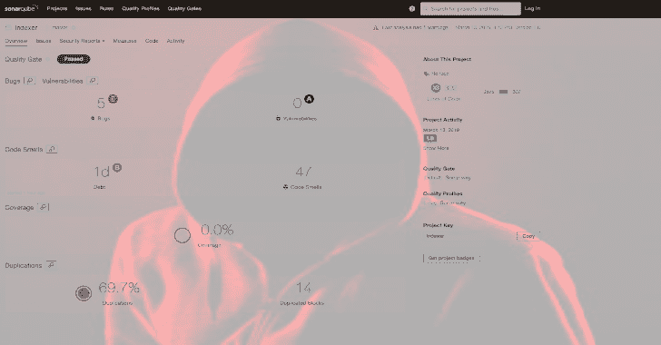
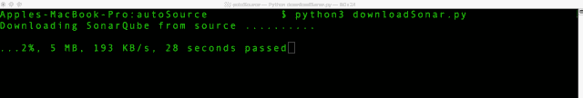
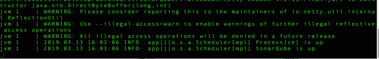
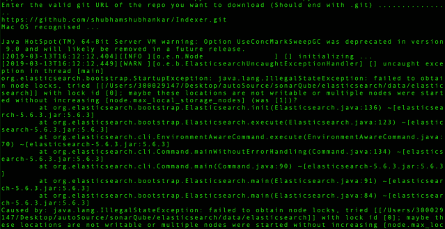
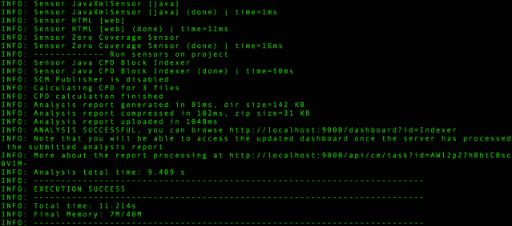
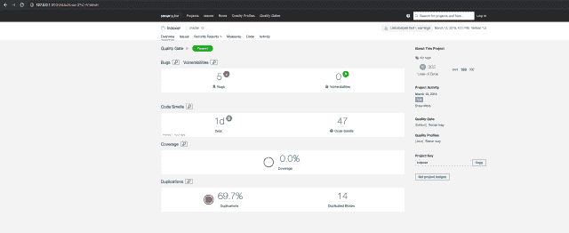

# AutoSource:自动化源代码 SonarQube

> 原文：<https://kalilinuxtutorials.com/autosource-sonarqube/>

AutoSource 是一个自动化源代码审查框架，与 SonarQube 集成，能够执行静态代码分析/审查。

它可以在软件开发生命周期的早期有效地发现漏洞。用户只需将 GIT 库链接到框架中，就可以扫描代码。

AutoSource framework 能够在所有平台(MAC、Linux 和 Windows)上执行源代码审查。

**安装**

1.  将自动源存储库下载到您的系统中。
2.  阅读 prerequisites.txt 文件并安装依赖项(针对每个平台)
3.  执行 download sonar . py(python 3 download sonar . py)，这将下载并设置 SonarQube 框架，该框架可从' [http://127.0.0.1:9000](http://127.0.0.1:9000/) 访问
4.  之后，运行 execute scanner . py(python 3 execute scanner . py)，这将询问您想要扫描的 GIT 存储库。
5.  访问 SonarQube 门户网站( [http://127.0.0.1:9000](http://127.0.0.1:9000/) ')上的结果

**又读-[Bashter:网络爬虫，扫描器&分析器框架](https://kalilinuxtutorials.com/bashter/)**

**截图**

**下载 SonarQube 和 SonarScanner**

**sonar cube 启动并运行**

**执行扫描仪**

**扫描开始**

**扫描仪执行成功**

**sonar cube 仪表盘中显示的结果**

**演职员表:**马尔基特·辛格&舒巴姆·舒班卡·夏尔马

[**Download**](https://github.com/Securityautomation/autoSource)