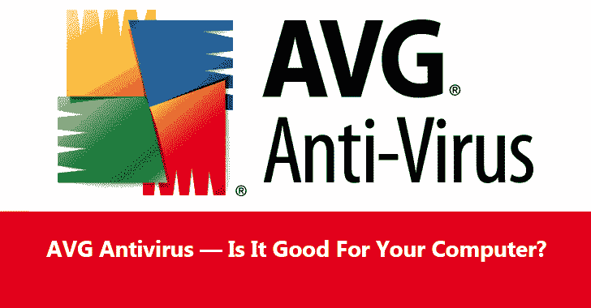

# AVG 杀毒软件——它对你的电脑有好处吗？

> 原文：<https://kalilinuxtutorials.com/avg-antivirus-review/>

AVG 总是在 2019 年防病毒排名中名列前五。许多人使用它是因为它是免费的。尽管开发人员不断提供购买付费版本，免费解决方案仍然很好，并提供可比的保护。

我们将向您介绍该产品的一些要点。你需要更多细节吗？阅读详细的 [AVG 反病毒](https://antivirus-review.com/avg-antivirus-review)审查。

## 什么是 AVG？

AVG 是一个可靠和快速的 Windows 计算机防病毒解决方案。它为您的计算机和在线活动提供基本保护，抵御最新的威胁。该产品经常在世界领先的防病毒应用程序中获得高分，并免费提供一些最好的安全功能。

### **系统要求是什么？**

AVG 的系统需求非常简单。您的计算机至少应该有:

*   奔腾 4 处理器(自 2000 年发布以来，大多数现代计算机都有强大得多的处理器单元)；
*   1 GB 内存；
*   2GB 的硬盘空间。

从 2019 年开始，开发者不再支持 Windows XP 和 Vista。杀毒效果很好，只在 Windows 7、8、10 上更新。

### **第一印象**

你可以在官网下载杀毒。另外，你可以在 AntivirusReview 的评论中找到链接。下载 exe 文件，运行它并等待安装完成。我们的安装花了大约 5 分钟。

防病毒程序使用很少的系统资源。它不会降低大多数现代计算机的性能。

该程序将提供第一次系统扫描。进行第一次检查。该应用程序将显著影响处理器负载。

反病毒扫描浏览器后，它将开始全面扫描您的计算机硬盘驱动器-系统和用户文件，以及性能错误。我们花了大约 10-15 分钟完成扫描，这已经很快了。除了病毒和恶意软件，该应用程序可以检测垃圾和临时文件。

然而，要删除垃圾文件，你必须购买付费扩展。对于一些用户来说，这个功能有点持久——一旦他们认为合适，他们更喜欢购买订阅。

### AVG 提供什么来保护您的计算机？

AVG 的免费版本提供了两个级别的保护:

*   电脑保护。实时保护将保护您的计算机免受病毒，间谍软件，勒索软件，rootkits，木马和其他麻烦。实时分析和改进的人工智能甚至可以防止最新的威胁。
*   网络和电子邮件保护。阻止所有不安全的链接、下载或电子邮件附件——您将在没有安全风险的情况下使用互联网。

### **网页保护模块**

反过来，web 防护包括几个模块:

*   针对各种在线威胁的实时安全的链接保护；
*   常驻盾牌，帮助程序阻止恶意软件；
*   电子邮件扫描仪，以保护您的电子邮件通信；
*   PC Analyzer 可以扫描和优化您计算机上的设备，以及解决问题；
*   身份保护将设置计算机管理员的保护，在这种情况下，其他用户无法更改操作系统设置、程序等。

这些都是普通个人电脑用户的基本功能，它们是免费的。此外，您可以将您的产品升级到 AVG Internet Security，并获得更好的 Internet Security 工具。

它们包括[垃圾邮件过滤](https://kalilinuxtutorials.com/phishing-attacks/)，网络摄像头防盗保护，更安全的网上购物能力，等等。其他付费扩展包括密码保护、内置 VPN、驱动程序更新等。

### **AVG 杀毒的利与弊**

#### **我们认为这款应用的优点是什么？**

*   您可以免费使用该产品，它将为您的计算机提供全面的防病毒保护。
*   对系统的要求不是很高——即使在旧电脑上也不会变慢。
*   快速检查整个电脑(花了我们不超过 15 分钟)；
*   界面并不复杂，只需点击一下就可以运行扫描。

#### 我们认为 AVG 哪里不好？

*   付费扩展的强迫性广告。

#### 其他人怎么说？

有些人无法在已经有病毒的电脑上安装杀毒软件。安装被阻止。他们必须先用杀毒软件来清理系统。

有人没有“阻止网站”功能。一位用户抱怨说，即使设置正确，杀毒软件也不会隔离删除文件。

AVG 是一个很好的免费杀毒软件。它使用可靠的防病毒软件或提供一些额外的模块来保护您的计算机免受恶意的在线活动。

如果您缺少基本功能，请购买付费订阅—它非常实惠，并提供替代级别的保护。