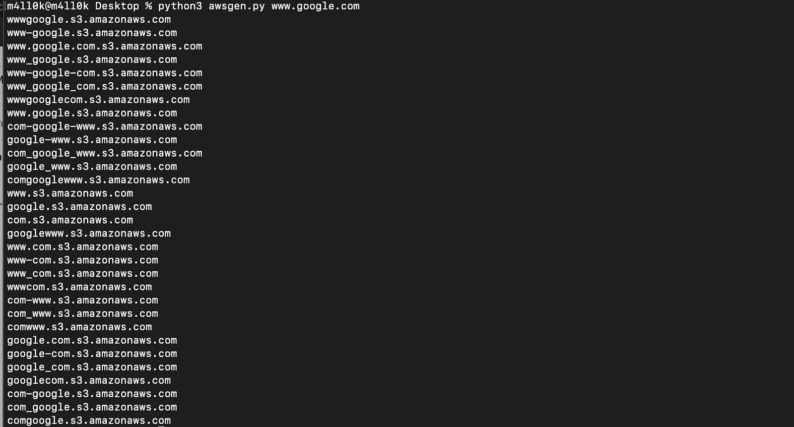

# AWSGen.py : AWS S3 存储桶名称生成器(测试版)

> 原文：<https://kalilinuxtutorials.com/awsgen-py-aws-s3-bucket-name-generator-beta-v/>

[")](https://1.bp.blogspot.com/-sW5f_Q_FX-c/XnEntDhiZhI/AAAAAAAAFh0/xvPh87P288Iz-E-5l9nQtGHJgDM6YBLXgCLcBGAsYHQ/s1600/example%25281%2529.png)

AWSGen.py 是一个简单的工具，用于生成 AWS S3 存储桶名称的排列、变更和突变

**也读作-[bet with:基于 Chrome Devtools 网络面板的 Web 调试代理](https://kalilinuxtutorials.com/betwixt/)**

**举例**:

[**Download**](https://github.com/m4ll0k/AWSGen.py)