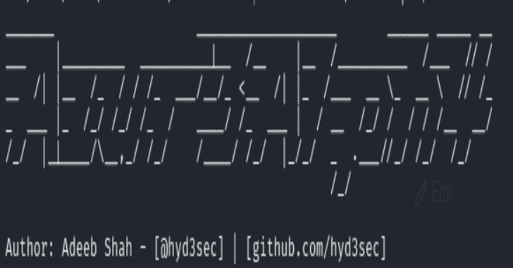

# Azur3Alph4:一个 PowerShell 模块，自动执行红队任务

> 原文：<https://kalilinuxtutorials.com/azur3alph4/>

**Azur3Alph4** 是一个 PowerShell 模块，它为 ops on objective 自动执行红队任务。该模块处于违约后(RCE 达成)的位置。如果不从这个位置开始，令牌提取和许多其他工具将无法成功执行。此模块应用于作为托管身份一部分的受损应用中的进一步枚举和移动。
Azur3Alph4 目前正在开发中。模块正在工作和更新。这其中的大部分仍未经测试。

脚本在 repo 中供个人使用并易于识别，但. psm1 文件将会不断更新。

**安装&使用**

`**Import-Module Azur3Alph4**`

将$envendpoint 指向 cmd 执行，将“env”传递给 Azure 后端。

**更新–2021 年 8 月 10 日**

*   添加了 Get-ResourceActions.ps1 并更新了 Azur3Alph4.psm1

**更新–2021 年 8 月 5 日**

*   使 Azur3Alph4 模块化
*   添加了 Get-SubscriptionId 函数

**为什么要建这个**

*   我做这个是因为我想了解更多关于 PowerShell 和 Azure 的知识，这是我非常想做得更好的两件事。
*   帮助自动化和消除大量重复的 PS 命令。
*   以我目前对天蓝色团队的了解为基础

**功能列表**

**获取-端点**

枚举 Azure 终结点以验证它是否属于托管身份

**山羊管理人 id**

使用提取的机密从端点获取受管身份令牌。将值存储在给定的变量中

**连接账户**

接受用户名和密码变量并自动进行 SecureString 转换，然后连接到 Azure 帐户

**获取-订阅 Id**

使用 Azure 的 REST API 获取订阅 ID

**获取-管理实体资源**

使用订阅 ID 枚举所有可访问的资源

**Get-resource actions . PS1**

使用 Azure 令牌枚举所有可用资源，并在其正下方列出每个资源的权限

[**Download**](https://github.com/hyd3sec/Azur3Alph4)