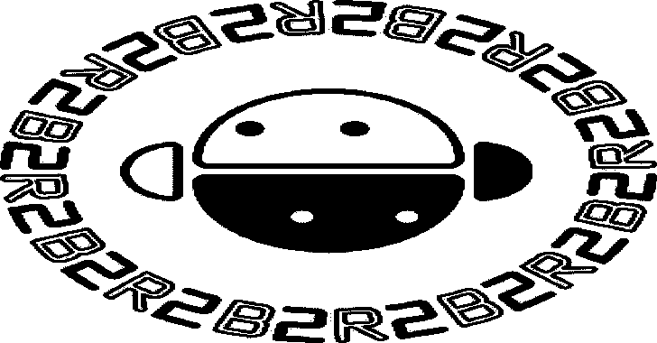

# B2R2:二进制分析的算法、函数和工具的集合

> 原文：<https://kalilinuxtutorials.com/b2r2-algorithms-functions-binary-analysis/>

**B2R2** 是一个有用的算法、函数和二进制分析工具的集合，完全用 F#编写(在。NET 隐语，是纯托管代码)。

它以《星球大战》中出现的一个著名的虚构机器人 R2-D2 命名。事实上，B2R2 的原名是 *B2-R2* ，但我们决定改用 *B2R2* 这个名字，因为。NET 不允许在标识符(或命名空间)中使用破折号(-)字符。

这个名字本质上代表“二进制”或“二”:“二进制”本身意味着“两个”状态。“B”和“2”表示“二进制”，“R”表示*反转*。

**b2r 2**是什么？

1.  它是分析友好的:它是用 F#编写的，F #提供了编写程序分析器的所有语法好东西，比如模式匹配、代数数据类型等等。
2.  **它很快:**它有一个快速高效的二进制分析前端引擎，纯函数式编写。因此，它自然支持*纯并行*进行二进制反汇编、提升和 IR 优化。
3.  **使用**很容易:B2R2 绝对没有依赖地狱，因为它是一个完全托管的库。你需要做的就是安装。NET Core SDK，您可以开始使用了！本机智能感知支持是另一个优势！
4.  它是独立于操作系统的:它可以在 Linux、Mac、Windows 等平台上运行。只要。网芯支持。
5.  **它是可互操作的**:它不受限于特定的语言。理论上，您可以将 B2R2 APIs 与任何 CLI 支持的语言一起使用。

**亦读-[GiveMeSecrets:使用正则表达式获取敏感信息](https://kalilinuxtutorials.com/givemesecrets/)**

**特色**

*   目前，我们的重点是二进制分析的前端，包括二进制解析器、提升器和优化器。
*   B2R2 原生支持平行升降，这是我们在 2019 年 NDSS 酒吧推出的新技术。
*   我们也有自己的后端工具，如 symbolic executor，但我们还不打算开源它们。
*   然而，B2R2 包含了一些有用的中端或后端特性，如 ROP 链编译、CFG 构建和自动图形绘制等。
*   B2R2 还附带了一个简单的命令行实用程序，我们称之为`**BinExplorer**`，它可以使用一个简单的命令行界面来帮助探索这些特性。

**依赖关系**

B2R2 依赖于一组微小的外部设备。NET 库，我们的设计原则是使用最少数量的库。下面是我们利用的库的列表。

*   系统。反射。元数据
*   微软。FSharpLu.Json
*   FParsec

**例子**

让我们尝试使用 B2R2 APIs。

*   首先我们创建一个空目录`**DIRNAME**`:

**mkdir 目录名**

*   然后我们用`**dotne**t`命令行创建一个空的控制台项目:

**$ dotnet 新主机-朗 F#**

*   添加我们的 nuget 包 *B2R2。项目前端*:

**$ dotnet 添加包 B2R2。前端**

*   用您喜欢的编辑器修改`**Program.fs**`文件，如下所示:

**打开 B2R2
打开 B2R2。前端
[ <输入类型> ]
让 main argv =
让 isa = ISA。of string " amd64 "
let bytes =[| 0x 65 uy；0x fuy；0x 15 uy；0x 10 uy；0x 00 uy；0x 00 uy；0x 00 uy |]
让处理程序= BinHandler。Init (isa，字节)
let in = bin handler。parse instr handler 0 ul
in。平移处理程序。平移上下文| > printfn "%A"
0**

*   然后我们只需输入:`**dotnet run**`来运行它。您将能够从您的控制台看到取消的 IR 声明。就是这样！您只是用几行 F#代码就完成了一条英特尔指令！

**打造**

构建 B2R2 既有趣又简单。你需要做的就是安装。网芯 SDK 3.0 或以上。对，就是这样！

*   要在发布模式下构建 B2R2，请在源代码根中键入`**make release**` **或** `**dotnet build -c Release**`。
*   要在调试模式下构建 B2R2，请在源代码根中键入`**make**`或`**dotnet build**`。

请访问 F#的官方网站，获取更多关于安装 F#开发环境的技巧:

**为什么要多此一举**

有许多其他可用的优秀工具，但我们希望构建一个功能优先的二进制分析平台，它安装起来没有痛苦，并且可以在任何平台上运行，没有任何麻烦。

B2R2 还处于起步阶段，但我们相信它为二进制分析提供了一组丰富的库函数。

它还有一个强大的前端，易于适应和扩展！目前，它可靠地支持 x86 和 x86-64，这意味着我们已经对它们进行了大量测试；它部分支持 ARMv7(和 Thumb)、ARMv8、MIPS32 和 MIPS64，这意味着它们可以工作，但我们尚未对它们进行全面测试。

**新增功能**

下面是我们计划在未来添加的功能列表:这个列表是完全不完整的。其中一些正在进行中，但我们期待您的贡献！

*   实现 CFG 恢复算法。
*   使用解析器组合子为当前支持的 ISAs 实现汇编器。
*   支持浮点运算。
*   支持更多架构，如 PPC。

**学分**:软科实验室成员

[**Download**](https://github.com/B2R2-org/B2R2)