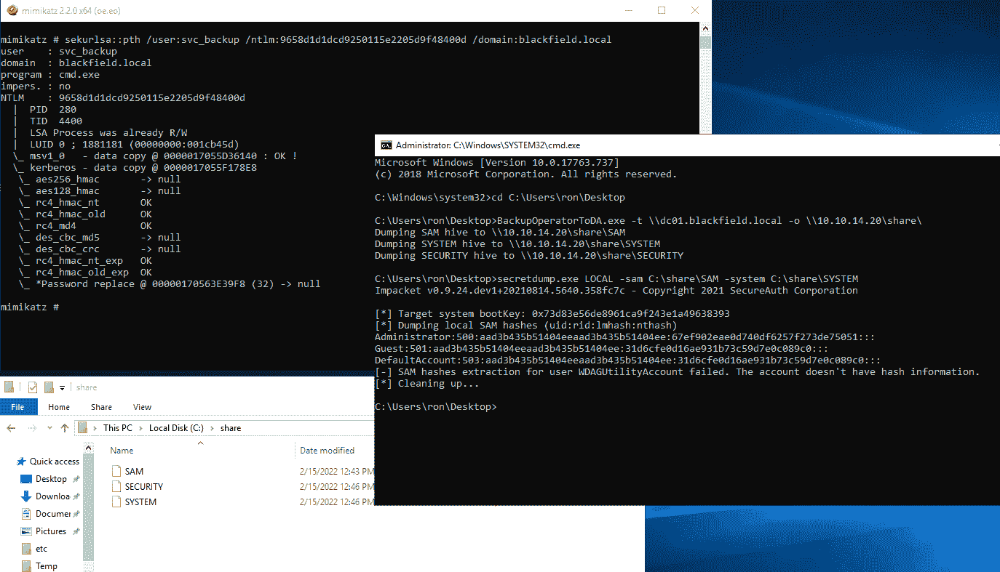

# BackupOperatorToDA:从组备份操作员的帐户成员到域管理员

> 原文：<https://kalilinuxtutorials.com/backupoperatortoda/>

.png)

**BackupOperatorToDA** ，从组备份操作员的帐户成员到域管理员，没有域控制器上的 RDP 或 WinRM。

如果您危及组 Backup Operators 的帐户成员的安全，您可以成为域管理员，而无需在域控制器上安装 RDP 或 WinRM。

所有的荣誉都来自菲利普·德拉戈维奇的第一个概念证明！我构建这个项目是因为我希望有一个更通用的带参数的二进制文件，并且能够在远程共享上导出 SAM 数据库！

**PS C:\Users\mpgn\POC >。\BackupOperatorToDA.exe -h
域管理员的备份操作员(by @mpgn_x64)
此工具的存在得益于@ filip _ dragovic/https://github.com/Wh04m1001
强制参数:
-t \ computer _ name(ex:\ dc01 . pouldard . wizard
-o 存储 sam /系统/安全文件的位置(可以是 UNC 路径)
可选参数:
-u 用户名
-p 密码
-d 域
-d**

示例:

*   在 DC 以外的另一台服务器上使用备份操作员组的用户 RON 成员
*   我在远程共享上转储和导出 SAM 数据库
*   然后我用 secretdump 读取 SAM 文件
*   我用 DC 的电脑账户来转储 NTDS！

### 有什么魔力？

代码非常简单，只有 3 个步骤:

*   `**RegConnectRegistryA**`:与另一台计算机上的预定义注册表项建立连接。
*   `**RegOpenKeyExA**`:打开指定的注册表项
*   `R**egSaveKeyA**`:将指定的键及其所有子项和值保存到一个新文件中

### 来自黑客盒子的布莱克菲尔德

aas _ s3curity 设计了这个框来利用“备份操作员”组中的用户成为域管理员并获得根标志。我稍微搜索了一下可用的文章，但是所有的文章都使用 WinRM 来利用“备份操作员”组。

使用此概念验证，您无需访问 WinRM 或 RPD:

[**Download**](https://github.com/mpgn/BackupOperatorToDA)