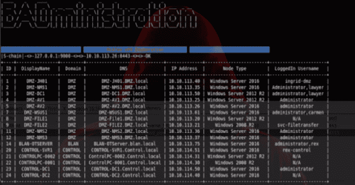

# BADministration:与管理或行政应用程序交互的工具

> 原文：<https://kalilinuxtutorials.com/badministration-management-administration-applications/>

从攻击性的角度来看，BADministration 是一个与管理或行政应用程序交互的工具。

它试图为海外人员提供一个能够识别和利用这些非技术性漏洞的工具。一如既往:善用，提升安全性，对抗应用程序传播。

很抱歉使用 python2.7，我发现很多供应商的 API 只能在 2.7 上运行，我没有足够的经验来混合和匹配 python 版本。

**应用传播**

在我看来，我们经常在网络分段方面做得非常出色，我们也开始在领域分段方面取得进展；然而，我经常看到我们失败的一个领域是应用程序分段。

应用程序分段类似于网络分段，因为我们试图减少不太受信任的区域暴露关键区域的可能性，以防其被利用。

管理应用程序通常拥有对其所有客户端的特权访问，如果攻击者登陆该管理应用程序，所有客户端也很有可能被利用。

应用程序分段试图确保服务器到客户端的关系不会跨越任何信任边界。例如，如果您的管理网络信任级别为 100，并且由您的 NMS 服务器管理，则您的 NMS 服务器应被视为信任级别为 100。

**也可以理解为-[SET:trusted sec](https://kalilinuxtutorials.com/set-social-engineer-toolkit-trustedsec/)T3 的社会工程师工具包储存库**

**安装**

会有一个 python 脚本，exe，谁知道什么的集合；对于中央 python 模块来说，这非常简单

**pip install-r requirements . txt**

**当前模块**

**太阳风猎户座**

*   solarwinds-enum–用于枚举 Orion 客户端的模块
*   solarwinds-list alerts–列出 Orion 警报，并引起对恶意管理警报的注意
*   solarwinds-alert remove–删除恶意警报
*   solarwinds-sys cmd–通过恶意警报在 Orion 服务器上执行系统命令
*   单机 **x64** 4.5。NET bad administration _ SW dump . exe–为 Orion 使用的 WMI 凭据清理内存。
    *   会消耗大量内存，使用时风险自担
    *   将我编译为 x64

**迈克菲 ePO**

*   McAfee-enum–用于枚举 ePO 客户端的模块
*   McAfee-list packages–列出所有 ePO 部署包
*   McAfee-remove package–删除 ePO 部署包
*   McAfee-upload package–上传使用 McAfee ePO 端点部署工具包(EEDK)创建的包
*   McAfee-create task–使用部署包创建客户端任务
*   McAfee-remote task–删除目标客户端任务
*   McAfee-list tasks–列出所有客户端任务
*   McAfee-runtask–运行目标客户端部署任务

**迈克菲 EEDK**

ePO 端点部署工具包(EEDK)创建某种签名的 zip 文件，可以上传到 ePO。可以利用 zip 文件创建客户端任务，授予对 ePO 客户端的特权访问权限。EEDK 需要运行 msvcp71.dll，这是一个旧的运行时库，可以在。NET Framework SDK 版。

*   EEDK 下载-[https://community . McAfee . com/t5/Documents/ePO-Endpoint-Deployment-Kit-9-6-1-Enterprise-Edition/ta-p/553541](https://community.mcafee.com/t5/Documents/ePO-Endpoint-Deployment-Kit-9-6-1-Enterprise-Edition/ta-p/553541)
*   微软。NET Framework SDK 版-[https://www.microsoft.com/en-ca/download/details.aspx?id=16217](https://www.microsoft.com/en-ca/download/details.aspx?id=16217)

[**Download**](https://github.com/ThunderGunExpress/BADministration)