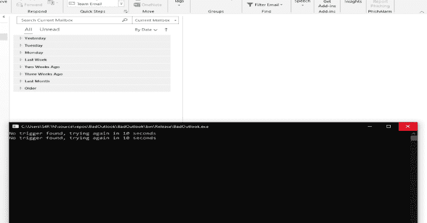
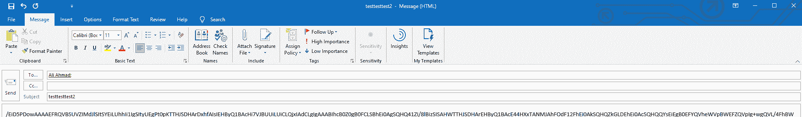
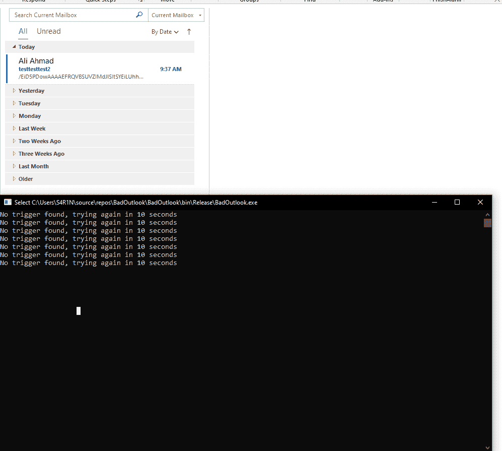
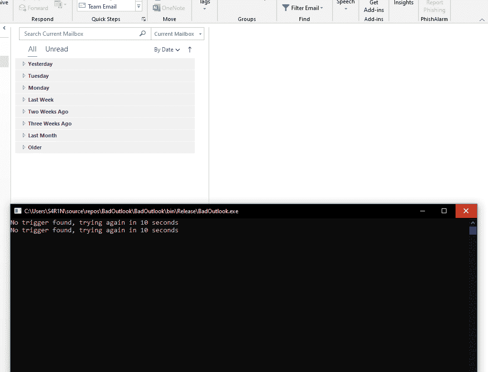

# BadOutlook:恶意 Outlook 阅读器

> 原文：<https://kalilinuxtutorials.com/badoutlook/>

**BadOutlook** 是一个简单的 PoC，它利用 Outlook 应用程序接口(COM 接口)根据特定的触发器主题行在系统上执行外壳代码。

通过利用`Microsoft.Office.Interop.Outlook`名称空间，开发人员可以表示整个 Outlook 应用程序(或者至少按照[微软](https://docs.microsoft.com/en-us/dotnet/api/microsoft.office.interop.outlook.application?view=outlook-pia)的说法)。这意味着新的应用程序应该能够做任何事情，从阅读电子邮件(是的，这也包括档案，垃圾等。)到把他们送出去。

基于数百万预先存在的 C#外壳代码加载程序，一封带有触发器主题行和 base64 编码外壳代码的电子邮件可以通过该程序的武器化实例发送到主机。然后，该程序将读取电子邮件，并执行电子邮件中嵌入的外壳代码。

**附加说明**

*   这可以用来建立一个完整的 C2 框架，该框架依赖电子邮件作为通信手段(其中植入物从不直接与互联网对话)
*   确实出现了安全警告，通知用户有应用程序试图访问 Outlook 数据
    *   当管理员修改注册表[时，可以关闭此功能，如下所示。](https://docs.microsoft.com/en-us/outlook/troubleshoot/security/a-program-is-trying-to-send-an-email-message-on-your-behalf)
    *   小规模测试表明，将此过程注入 Outlook 客户端不会导致出现警报(额外的测试会更受欢迎< 3)

**概念验证**

*   触发器的应用程序轮询 Outlook

*   创建外壳代码时触发电子邮件

*   outlook 客户端收到的电子邮件

*   BadOutlook 应用程序执行外壳代码

[**Download**](https://github.com/S4R1N/BadOutlook)