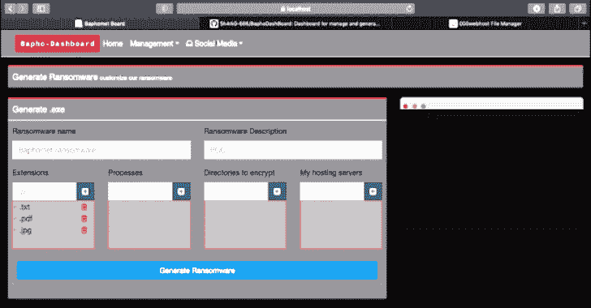

# BaphoDashBoard:用于管理和生成 Baphomet 勒索软件的仪表板

> 原文：<https://kalilinuxtutorials.com/baphodashboard/>

有了这个项目，我们将能够处理通过 Baphomet 勒索软件获得的受害者数据。BaphoDashBoard 是在框架 dotnet-core 3.1 下用 C#开发的。

Baphomet 勒索软件和 BaphoDashBoard 项目都是出于教育目的，所以我们可以从中获得一些东西来学习新的东西。

**仪表盘特征**

*   生成。exe 来加密数据。
*   生成。exe 来解密数据。
*   当我们生成勒索软件时，我们让加密对称密钥的 rsa 密钥负责加密文件。
*   地图上显示的每个受害者的位置。
*   更好的可视化图形。
*   我们可以获得所有托管服务器的数据。
*   处理我们生成的每个 baphomet.exe。
*   受害者的详细资料和更多使用网络抓取。

**要求**

*   点网核心 3.1
*   SDK 和运行时下载链接:[https://dotnet.microsoft.com/download/dotnet-core/3.1](https://dotnet.microsoft.com/download/dotnet-core/3.1)

**测试的操作系统**

*   Windows 10
*   Mac OS Mojave
*   Debian 10
*   Kali Linux

**我们必须修改的文件**

*   file:BaphoDashBoard > Dal > Services > base service . cs line:32
*   注意:我们添加了包含受害者数据的主机。例如[https://myhosting.com/data.txt](https://myhosting.com/data.txt)

**安装&框架使用**

要获得 Baphodashboard 的完整教程，请在 Patreon 上加入我，我将在这里分享关于黑客攻击、恶意软件创建、使用我的项目的教程等信息和独家内容。

**视频演示**

*   [https://open . lbry . com/@ hacking pills:c/BaphoDashBoard-Generate-Ransomware-Tool:6？r = 2 ffhigaxcxqd 1v 7 dnpazymdo 3 gmsz 6 pw](https://open.lbry.com/@HackingPills:c/BaphoDashBoard-Generate-Ransomware-Tool:6?r=2FfhiGAXcxqD1V7dnpaZYmDo3gmSz6pw)

[**Download**](https://github.com/Sh4rk0-666/BaphoDashBoard)