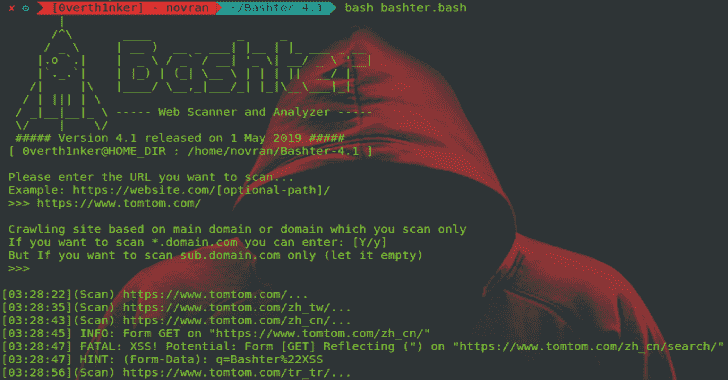

# Bashter:网络爬虫、扫描器和分析器框架

> 原文：<https://kalilinuxtutorials.com/bashter/>

Bashter 是一个基于 Shell 脚本的网络爬虫、扫描器和分析器框架。Bashter 是一个扫描基于 Web 的应用程序的工具。Bashter 非常适合做 Bug 赏金或者渗透测试。

它被设计成一个框架，所以你可以很容易地添加一个脚本来检测漏洞。

**例如**

为了更强大，您可以添加一些脚本(自定义)，如下所示:

**modules/form/your script . bash { we b-URL } { source code }
modules/URL/your script . bash { we b-URL } { source code }**
**modules/header/your script . bash { we b-URL } { source code }**

对于该示例，您可以遵循现有的脚本。

**也可理解为-[evilippy:用于创建恶意的 MS Office 文档](https://kalilinuxtutorials.com/evilclippy-malicious-ms-office-documents/)**

**禁用脚本**

例如，您只需要更改扩展名。 **bash = > .bashx.**

**默认:**

*   网络爬虫
*   收集输入表单
*   检测错误配置的 CORS
*   检测缺失的 X-FRAME 选项(点击潜在劫持)
*   通过 URL 检测反射的 XSS
*   通过表单检测反射的 XSS
*   通过 CRLF 注入检测 HTTP 拆分响应
*   检测打开的重定向

**如何跑:**

**git 克隆 https://github.com/zerobyte-id/Bashter.git**
**CD bash ter/**
**bash bash ter . bash**

**注意事项**:这个工具会消耗大量的磁盘空间，所以不要忘记整理 bashter-tempdata 和 scan-logs。

**演职员表**:肖帕特、苏哈达、阿拜

[Download](https://github.com/zerobyte-id/Bashter)