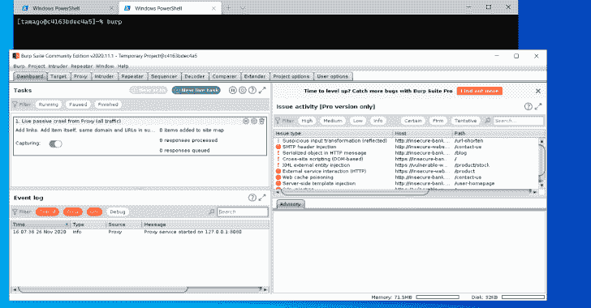
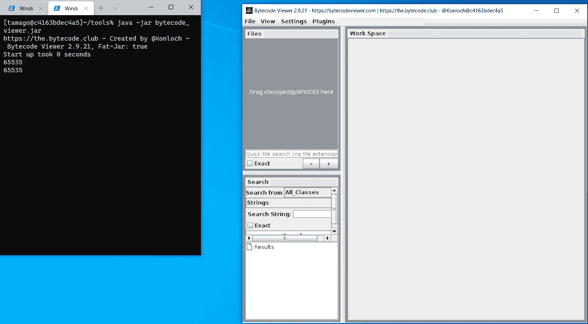
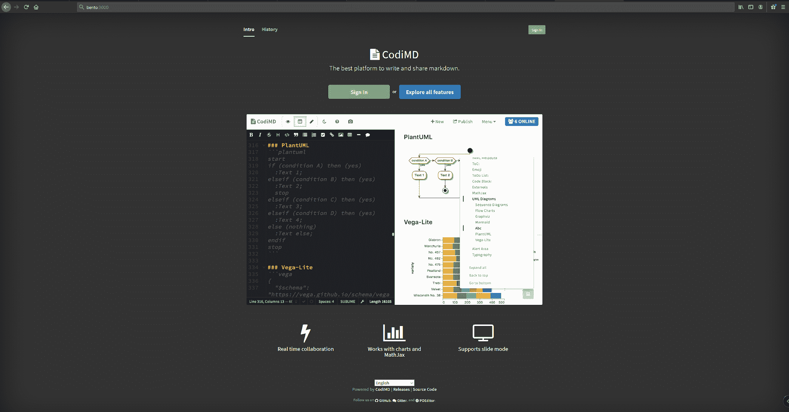

# Bento:用于渗透测试的基于 Fedora 的最小容器

> 原文：<https://kalilinuxtutorials.com/bento/>

一份便当弁当是一种源自日本的单份外卖或家庭套餐。 **Bento** Toolkit 是一个为渗透测试人员和 CTF 玩家准备的简单最小的 docker 容器。

它有 Docker 的可移植性加上 X，所以你也可以运行 GUI 应用程序(比如 burp)。

**先决条件**

要运行便当，你需要在你的主机上安装`Docker`和 **`Xorg server`** 。在 Windows 上你可以使用 [vcxsrv](https://sourceforge.net/projects/vcxsrv/) 、 [xming](https://sourceforge.net/projects/xming/) 、 [cygwin](https://www.cygwin.com/) 。

我们用`**vcxsrv**`和`**cygwin**`测试了这个配置。

*   **`vcxsrv` :** 启动 XLaunch，按照设置操作即可
*   **`cygwin` :** 你得先[安装 xorg](https://x.cygwin.com/docs/ug/setup.html) ，然后启动 XLaunch。

**用对接器安装**

*   `**git clone https://github.com/higatowa/bento && cd ./bento**`
*   生成密钥对并将包含您的公钥的`authorized_keys`放入`**./keys**`。
*   `**docker build -t bento .**`
*   因为我们需要将 X 转发到我们的机器，我们需要首先获得它的 ip，然后执行:`**docker run --cap-add=NET_ADMIN --device /dev/net/tun --sysctl net.ipv6.conf.all.disable_ipv6=0 -p 22:22 -d bento**`
*   通过 ssh 连接到 docker 机器，并用`**ssh -R 6000:localhost:6000 -L 8080:localhost:8080 tamago@bentoip**`转发端口 6000 (Xorg)
*   首次登录时，系统会要求您更改密码。

对于 GUI 工具，只需从终端运行它们:

**安装有 Docker Compose**

为了能够快速部署 bento 的多个实例，我们决定编写一个`**docker-compose**`文件。

这不仅仅是为了风格，我们还增加了一个协作板，`**codimd**`。

在我们的工作中，我们需要分享关于目标的信息，所以我们决定在 bento 中实现我们日常使用的解决方案。

默认情况下，焊盘暴露在端口`**3000**`上。

将`Installation with Docker`章节的步骤`3`和`4`替换为:

**`docker-compose build`和`docker-compose up`**

在项目目录中。

如果您想只部署`**bento**`而不部署`**codimd**`:

`**docker-compose up bento**`

**已知问题**

*   如果以用户身份运行，Burp 嵌入式浏览器不工作。我们在第三期讨论了这个问题。我们发现了这个问题，当我们等待 Portswigger 团队修复它时，我们编写了一个小的解决方法，只需将`**/home/tamago/burp_fix/burp_fix.sh**`作为`root`运行，它就会修复这个问题。

**当前工具&实用程序**

我们不喜欢[臃肿的](https://www.kali.org/) [发行版](https://www.parrotsec.org/)，所以我们尽可能保持这个容器最小化，只添加对网络和基础设施 PT 和 CTF 有用的工具，但是请记住，我们总是欢迎建议。

以下是工具和实用程序的列表:

*   [T2`codimd`](https://github.com/hackmdio/codimd)
*   [T2`Burp Suite`](https://forum.portswigger.net)
*   [T2`gobuster`](https://github.com/OJ/gobuster)
*   [T2`SecLists`](https://github.com/danielmiessler/SecLists)
*   [T2`odat`](https://github.com/quentinhardy/odat)
*   [T2`impacket`](https://github.com/SecureAuthCorp/impacket)
*   [T2`sqlmap`](https://github.com/sqlmapproject/sqlmap)
*   [`sqlplus`](https://docs.oracle.com/cd/B14117_01/server.101/b12170/qstart.htm) ，
*   `mysql-client`
*   [T2`openvpn`](https://openvpn.net/)
*   [T2`bytecode-viewer`](https://github.com/Konloch/bytecode-viewer)
*   [T2`ghidra`](https://ghidra-sre.org/)

[**Download**](https://github.com/higatowa/bento)