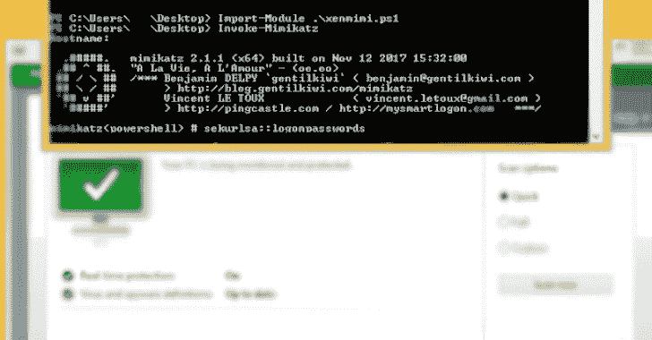

# Better Xen crypt:Xen crypt 的更好版本

> 原文：<https://kalilinuxtutorials.com/betterxencrypt/>

**BetterXencrypt** 是 Xencrypt 的更好版本。Xencrypt it self 是一个 Powershell 运行时加密程序，旨在规避 AVs。因为 Xencrypt 不再是 FUD，很容易被 AMSI 抓住，我重新编码存根，现在它又是 FUD。最初的 Xencrypt，如果你看到截图证明，他在 Windows 8 上测试过，如果我在最新的 Windows 10 上测试，它不会 FUD，因为我想让它再次成为 FUD，让每个人都高兴。

**特性**

*   绕过 MetaDefender 和 VirusTotal 上使用的 AMSI、行为监控和所有现代反病毒软件
*   压缩和加密 powershell 脚本
*   具有最小的甚至经常是负的(由于压缩)开销
*   随机化的变量名，以进一步混淆解密器存根
*   超级容易修改，以创建自己的密码变种
*   支持递归分层(加密输出加密)，测试多达 500 层。
*   支持导入模块和标准运行，只要输入脚本也支持它
*   所有功能都在一个文件中，因此您可以将它带到任何地方！

**感谢**

*   我创造这个工具的时候没有死
*   用于创建原始的 Xentropy 和 sec force[Xen crypt](https://github.com/the-xentropy/xencrypt)
*   Ed Wilson 又名 Microsoft Scripting Guy，是 Powershell 脚本编写教程的专家
*   最后一个是 Emeric Nasi，用于绕过 AV 动力学的研究

**用途**

最好在 Linux Powershell 上运行 BetterXencrypt 脚本，因为我从未在 Windows Powershell 上尝试过。(惊讶于 Linux 有 Powershell？看一看[这个](https://docs.microsoft.com/en-us/powershell/scripting/install/installing-powershell-core-on-linux?view=powershell-7.1)

**导入-模块。/better Xen crypt . PS1 Invoke-better Xen crypt-InFile Invoke-mimikatz . PS1-OutFile Xen Mimi . PS1**

现在，您的当前工作目录中会有一个加密的 xenmimi.ps1 文件。您可以像使用原始脚本一样使用它，因此在这种情况下:

**导入-模块。/xenmimi.ps1 Invoke-Mimikatz**

它还通过-Iterations 标志支持递归分层。

**Invoke-better Xen crypt-InFile Invoke-mimikatz . PS1-OutFile Xen Mimi . PS1-Iterations 100**

但是警告，文件可能会变得很大，生成输出文件可能需要很长时间，这取决于脚本和请求的迭代次数。

[**Download**](https://github.com/GetRektBoy724/BetterXencrypt)