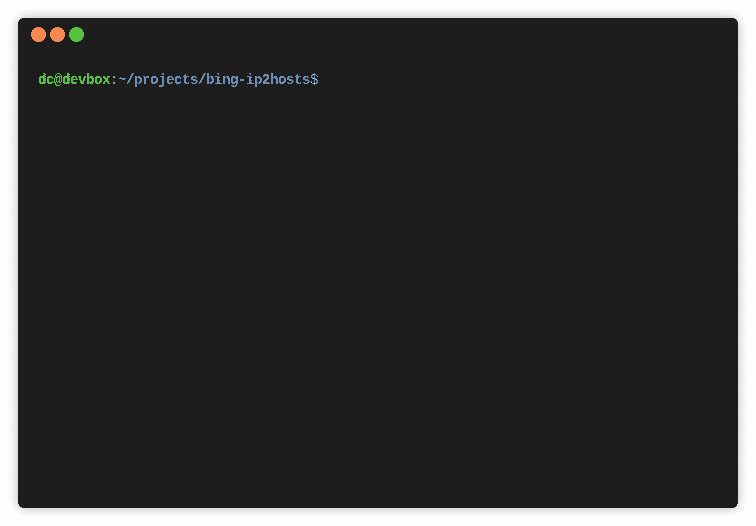

# Bing-IP2Hosts:一个通过 IP 地址发现网站的 Bing.com 网页抓取器

> 原文：<https://kalilinuxtutorials.com/bing-ip2hosts/>

[](https://1.bp.blogspot.com/-3w6G9kI9EcI/XtSo1QGbh0I/AAAAAAAAGi8/vAZ1JH1IyS0HyCqtjnyHZasLivP9cQYUACLcBGAsYHQ/s1600/Bing-ip2hosts.gif)

Bing-ip2hosts 是一个 Bing.com 网页抓取器，通过 ip 地址发现主机名。Bing 是微软的旗舰搜索引擎，原名 MSN Search 和 Live Search。

它提供了搜索引擎独有的功能——允许通过 IP 地址进行搜索。Bing-ip2hosts 使用这个特性。

它可以用来发现子域和其他相关的领域。它还有助于识别托管在共享托管环境中的网站。这种技术遵循渗透测试或 bug bounty 的侦察阶段的最佳实践，以扩大目标的攻击面。

与其他许多网络搜索工具不同，这款工具具有智能搜索行为，可以最大限度地发现主机名。

**特性**

*   智能抓取行为最大限度地发现主机名。
*   显示抓取进度的控制台用户界面。
*   通过 IP 地址发现子域和主机名。
*   可以通过主机名或 IP 地址进行搜索。
*   有或没有 URL 前缀的输出。
*   以列表或 CSV 格式输出到文件。
*   不需要 Bing API 密钥。
*   选择搜索语言和市场。
*   从命令行或文件中指定目标。
*   没有严重依赖性的轻量级 Bash shell 脚本。

**亦读-[AutoRDPwn:影子攻击框架](https://kalilinuxtutorials.com/autordpwn-2/)**

**必应网页抓取**


Bing 提供了搜索引擎独有的功能——允许通过 IP 地址进行搜索。要尝试这个，去 Bing.com 搜索`IP:40.113.200.201`。它应该会显示 microsoft.com 的结果。如果显示空结果，则添加一个点。

*   **智能刮擦行为**

与抓取 10 个结果页面后停止的其他 Bing web 抓取器不同，bing-ip2hosts 可以抓取数千个结果。它继续抓取搜索结果页面，直到不再找到新的结果。

满足以下任一条件时，刮擦完成:

*   在页面未能返回新结果的可配置阈值之后(默认值:5)。
*   单页搜索结果，例如 10 个或更少的结果。
*   搜索结果的最后一页。
*   空结果。

当 Bing 报告某些结果已被删除时，它也会提醒用户。

*   **避免空的搜索结果**

如果按 IP 地址搜索返回空的搜索结果，请添加一个点。Bing-ip2hosts 总是在查询中附加一个点(%2e)来避免这个问题。

*   **搜索语言和市场**

默认情况下，该工具将搜索语言指定为“en-us”。市场被置之不理，因为这似乎能使结果最大化。

可以配置以下 URL 参数:

*   塞特朗语
*   市场代码

这两个参数都会影响返回多少结果。

市场代码的完整列表可以在[docs . Microsoft . com/en-us/azure/cognitive-services/bing-web-search/language-support](https://docs.microsoft.com/en-us/azure/cognitive-services/bing-web-search/language-support)找到。

*   **重复搜索结果页面**

有时，Bing 不允许用户到达搜索结果页面的末尾。

例如，在显示 3 页结果的搜索中，并不总是允许用户到达第 3 页。相反，它将返回结果的第一页。这可以通过搜索`ip:8.8.8.8 .`来演示。请注意，它并不总是返回的第一页。

**帮助**

使用以下命令获取用法信息。

bing-ip2hosts 是一个 Bing.com 网页抓取器，通过 ip 地址发现网站。
用于发现突防试验目标的攻击面。

**用法:**。/bing-ip2hosts【选项】IP|hostname

**选项有:**
**-o** FILE 将主机名输出到文件。
**-i** 文件从文件中输入 IP 地址或主机名列表。
**-n** NUM 抓取页面后 NUM 停止，不返回新结果(默认值:5)。
**-l** 选择在 setlang 参数中使用的语言(默认:en-us)。
**-m** 选择在 setmkt 参数中使用的市场(默认为未设置)。
**-u** 只显示主机名。默认情况下包括 URL 前缀。
**-c** CSV 输出。在每行上输出 IP 和主机名，用逗号分隔。
**-q** 安静。除最终结果外，禁用输出。
**-t** DIR 使用这个目录而不是/tmp。
**-V** 显示 bing-ip2 主机的版本号并退出。

**安装**

*   **依赖关系**

bing-ip2hosts 需要 wget。这在 Ubuntu Linux 和 Kali Linux 中是默认安装的。

可以用家酿安装在 macOS 中。

**自制软件安装 wget**

可以用 apt 安装在 Debian 和 Ubuntu Linux 中。

**sudo apt 安装 wget**

**安装**

将 bing-ip2hosts 复制到$PATH 中的一个文件夹中。

**须藤 cp。/bing-IP 2 hosts/usr/local/bin/**

**兼容性**

Bing-ip2hosts 使用 Bash 脚本语言。

已知与以下系统一起工作。

*   **Ubuntu Linux**

```
GNU bash, version 4.4.20(1)-release (x86_64-pc-linux-gnu)
Copyright (C) 2016 Free Software Foundation, Inc.
License GPLv3+: GNU GPL version 3 or later <http://gnu.org/licenses/gpl.html>

This is free software; you are free to change and redistribute it.
There is NO WARRANTY, to the extent permitted by law. 
```

*   **马科斯·卡特琳娜**

与 macOS 捆绑的 Bash 版本发布于 2007 年，是 GPLv2 许可的最新版本。最新版本获得了 GPLv3 的许可，许可条款禁止苹果在 macOS 中捆绑销售。

```
GNU bash, version 3.2.57(1)-release (x86_64-apple-darwin19)
Copyright (C) 2007 Free Software Foundation, Inc. 
```

**链接**

*   首页:[http://www.morningstarsecurity.com/research/bing-ip2hosts/](http://www.morningstarsecurity.com/research/bing-ip2hosts/)
*   来源:https://github.com/urbanadventurer/bing-ip2hosts
*   卡利 Linux 工具:[https://tools.kali.org/information-gathering/bing-ip2hosts](https://tools.kali.org/information-gathering/bing-ip2hosts)
*   Kali Linux 包:[https://git lab . com/kali Linux/packages/bing-ip2 hosts/tree/kali/master](https://gitlab.com/kalilinux/packages/bing-ip2hosts/tree/kali/master)
*   家酿卡利:[https://github.com/b-ramsey/homebrew-kali](https://github.com/b-ramsey/homebrew-kali)
*   ArchLinux 软件包:[https://aur.archlinux.org/packages/bing-ip2hosts/](https://aur.archlinux.org/packages/bing-ip2hosts/)
*   大罢工:[https://archstrike.org/packages/bing-ip2hosts](https://archstrike.org/packages/bing-ip2hosts)
*   布莱克 arch:[https://blackarch.org/recon.html](https://blackarch.org/recon.html)

[**Download**](https://github.com/urbanadventurer/bing-ip2hosts)