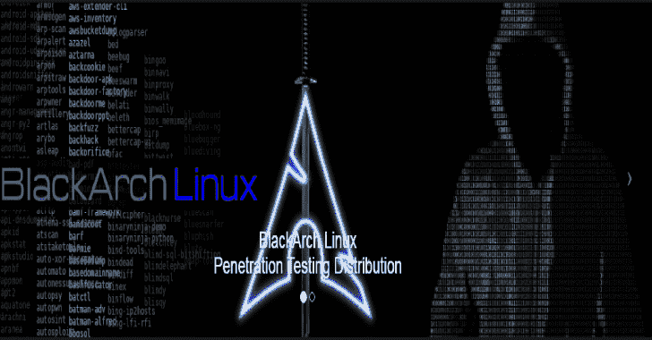

# BlackArch Linux–渗透测试发行版

> 原文：<https://kalilinuxtutorials.com/blackarch-linux-penetration-testing-distribution/>

BlackArch Linux 是一个基于 Arch Linux 的发行版，面向渗透测试人员和安全研究人员。这个储存库包含了 **[2336](https://blackarch.org/tools.html)** 工具。您可以单独或成组安装工具。BlackArch Linux 与现有的 Arch 安装兼容。

**变更日志**

*   添加了 150 多种新工具
*   增加了所有 wm 的终端字体(感谢 psf 修复了 i3-wm 的错误)
*   包含的 linux 内核 5.2.9
*   新~/。vim 和~/。vimrc(感谢 noptrix 提供他的配置文件)
*   将 blackarch-installer 更新至 1.1.19 版
*   各种改进和错误修复
*   已删除 dwm 窗口管理器
*   用 rxvt-unicode 替换了默认终端 xterm
*   更新的外观:WMs、grub、syslinux 等的新 BlackArch 主题。(特别感谢 Erik！)
*   QA'ed 和修复所有软件包(运行时执行)。
*   更新了所有 blackarch 工具和软件包，包括配置文件
*   已更新所有系统包
*   更新了所有窗口管理器菜单(awesome，fluxbox，openbox)

**也可阅读-[Barq:AWS 云发布开发框架](https://kalilinuxtutorials.com/barq-aws-cloud-exploitation-framework/)**

以下列表包含官方 BlackArch live 和 netinstall ISO 映像。你可以将这些图像刻录到 DVD 和闪存盘上。

live ISO 包含一个完整的、功能性的 BlackArch Linux 系统。netinstall ISO 是用于引导机器的轻量级映像。

如果可能的话，请尽量使用你身边的镜子下载 ISOs。你可以在下面的中找到一张[镜子列表。](https://blackarch.org/downloads.html#mirror-list)

| **图像** | **版本** | **激流** | **尺寸** | **SHA1sum** |
| [BlackArch Linux 64 位实时 ISO](https://ftp.halifax.rwth-aachen.de/blackarch/iso/blackarch-linux-live-2019.09.01-x86_64.iso) | 2019.09.01 | [激流](https://blackarch.org/blackarch/torrent/blackarch-linux-live-2019.09.01-x86_64.iso.torrent) | 16 GB | 1c 63 f 42625 a 0 C4 c8 ff 0 f 9148 f 6 f 857 c 56 a 851 a 05 |
| [BlackArch Linux 64 位网络安装 ISO](https://ftp.halifax.rwth-aachen.de/blackarch/iso/blackarch-linux-netinst-2019.09.01-x86_64.iso) | 2019.09.01 | [激流](https://blackarch.org/blackarch/torrent/blackarch-linux-netinst-2019.09.01-x86_64.iso.torrent) | 660 兆字节 | eb2a 791348626 和 98db 0(4ca 8 至 289 ef 7 至 8e7d0b5) |

* * *

不要使用 UNetBootIn 将 ISO 文件写入闪存驱动器。UNetBootIn 修改 bootloader 配置，这是不好的。您可以改为使用此选项(其中/dev/sdX 是您的闪存驱动器，file.iso 是 BlackArch ISO):

**#示例镜像编写** $ sudo DD bs = 512m if = file . iso of =/dev/sdX

**默认登录**

所有 iso 和 OVA 的默认登录是: **root:blackarch**

**安装在 ArchLinux 之上**

**BlackArch Linux** 与现有/普通 Arch 安装兼容。它充当一个非官方的用户存储库。以下是如何以这种方式安装 BlackArch 的说明。

**> >以 root 用户身份运行 https://blackarch.org/strap.sh，并按照说明进行操作。** curl-O https://blackarch.org/strap.sh
**>>SHA1 总和应匹配:**9f 770789 df3b 7803105 e 5 FBC 19212889674 CD 503 strap . sh
sha1 sum strap . sh
**>>设置执行位**
chmod+x strap . sh
**>>Run strap . sh** sud/strap.sh

您现在可以从 blackarch 库安装工具了。

**> >列出所有可用的工具，运行** sudo pacman-Sgg | grep black arch | cut-d ' '-F2 | sort-u
**>>安装所有的工具，运行** sudo pacman-S black arch
**>>安装一类工具，运行** sudo pacman-S black arch-
**>>**

作为另一种安装方法的一部分，您可以从源代码构建 blackarch 包。你可以在 github 上找到 PKGBUILDs [。要构建整个回购，可以使用 blackman 工具。](https://github.com/BlackArch/blackarch)

**> >首先必须安装 blackman。如果你的机器上安装了 BlackArch 软件包库，你可以安装 blackman 如下:**
sudo pacman-S blackman
**>>下载、编译并安装软件包:** sudo blackman-I
**>>下载、编译并安装整个类别** sudo blackman-g
>>下载、编译并安装所有 BlackArch 工具
sudo blackman

**从 ISO 安装**

您可以使用 Live 或 Netinstall 介质安装 BlackArch Linux(软件包和环境)。

**> >安装 blackarch-install-scripts 包** sudo pacman-S black arch-Install-scripts
**>>现在，你可以运行并按照说明** sudo blackarch-install

[**Download**](https://blackarch.org/downloads.html)