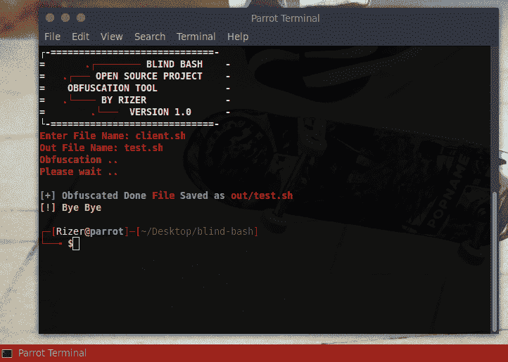
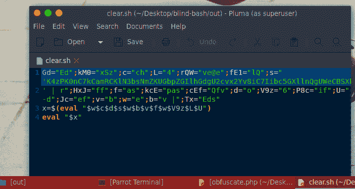

# Blind-Bash:混淆 Bash 代码的项目

> 原文：<https://kalilinuxtutorials.com/blind-bash-obfuscate-bash-code/>

Blind-bash 是一个开源项目，你可以使用这个项目来混淆你的 bash 代码，混淆是隐藏代码中重要内容的最佳方式。

这个工具将为您提供盲目而强大的代码，但是每个了解 bash 脚本的人都可以对这些代码进行反混淆。

所以这种混淆不是 100%安全的，不要让你的 bash 代码中的重要东西只是用这种混淆来开玩笑。

这个项目的目标是让 Bash 知识有限的人很难读懂代码。对于每个热爱编码和 BASH 的人来说。

**也读 [同形异义字——获取相似字母，转换成 ASCII，检测可能的语言& UTF-8 组](https://kalilinuxtutorials.com/homoglyphs-convert-ascii-utf-8-group/)**

## **盲击截图**

