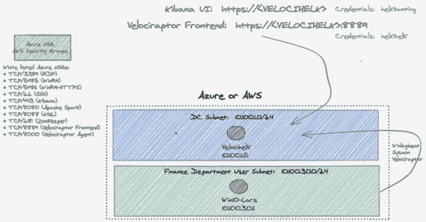
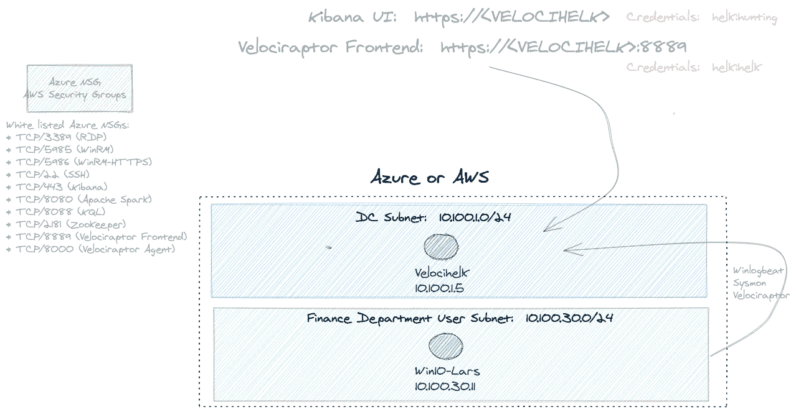

# BlueCloud : Cyber 系列，包括 Velociraptor + HELK 系统，带有用于安全测试和 R&D 的 Windows VM

> 原文：<https://kalilinuxtutorials.com/bluecloud/>

**蓝云**，海尔克和迅猛龙的赛博靶场部署！在 Azure 或 AWS 中自动部署一个运行 HELK + Velociraptor 服务器的系统，并注册一个 Windows 端点。一个自动(快速)部署小型 HELK + Velociraptor R & D 实验室的 Terraform 和 Ansible 脚本集合。

**用例**

*   EDR 测试实验室
*   渗透测试实验室
*   SIEM /威胁追踪/DFIR/HELK+迅猛龙实时响应实验室[1，2]
*   使用 HELK 服务器、Jupyter 笔记本电脑进行数据科学研究
*   用 Mordor 进行检测工程研究[3，4]

[**Download**](https://github.com/iknowjason/BlueCloud)