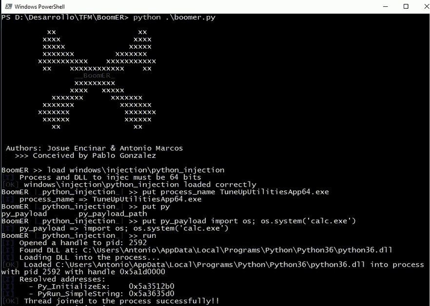
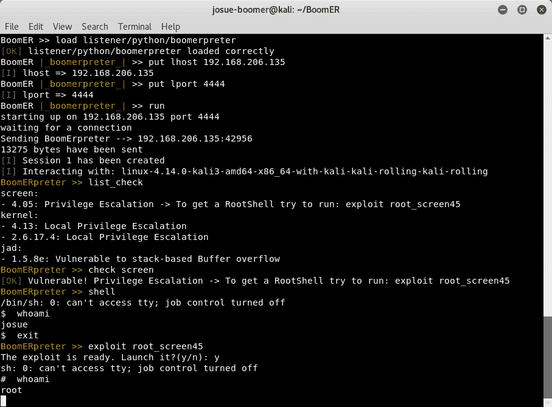

# BoomER:利用本地漏洞的框架

> 原文：<https://kalilinuxtutorials.com/boomer-local-vulnerabilities/>

BoomER 是一个开源框架，用 Python 开发。该工具侧重于后期利用，其主要目标是检测和利用本地漏洞，以及从系统中收集信息，例如他们已安装的应用程序。

该框架允许第三方通过开发模块进行扩展，因为开发人员必须遵循某些准则，其中最突出的是:

*   继承类型
*   要实现的方法或功能
*   必需的或新的参数
*   模块名
*   模块在框架中的位置

我们希望让该工具与 Metasploit 建立联系，因为它是 pentesters 的参考框架，所以从 BoomER 可以在 Metasploit 中打开会话。

要使用 BoomER，您应该使用命令行，它非常类似于当前存在的用于检测和利用漏洞的工具，这有助于减少学习曲线。

**也可阅读-[赛斯:执行 MitM 攻击&从 RDP 连接中提取明文凭证](https://kalilinuxtutorials.com/seth-mitm-attack-rdp-connections/)**

DLL 注入的示例:

我们自己的 meterpreter(基于 Metasploit):

[**Download**](https://github.com/Josue87/BoomER)