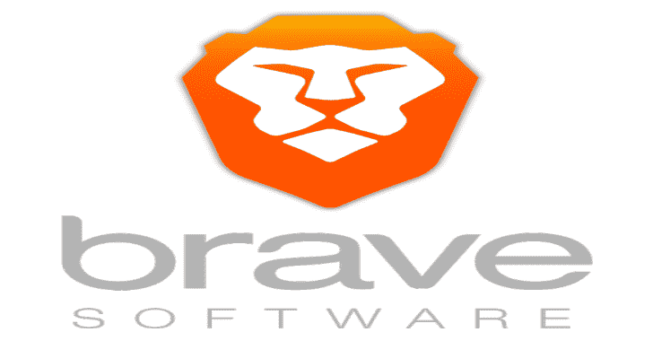

# 勇敢的浏览器-安全，快速和私人的网络浏览器与广告拦截器

> 原文：<https://kalilinuxtutorials.com/brave-browser-secure-fast-private-web-browser-adblocker/>

勇敢的浏览器是您快速、安全的私人网络浏览器，带有广告拦截器、私人标签和弹出窗口拦截器。浏览时不会被广告商、恶意软件和弹出窗口跟踪。

**快速&安全网络浏览器**无外部插件或设置！勇敢的隐私浏览器只是为 Android 提供了最安全、最快的网络浏览器。享受没有弹出窗口(弹出窗口拦截器)、广告、恶意软件和其他烦恼的浏览。

**AdBlock 网页浏览器**Brave Privacy Browser 应用程序设计有内置的广告拦截器(弹出广告拦截器)。Brave 的免费广告拦截器保护您免受在您浏览网页时跟踪您的广告的影响，保护您的隐私。

**自动隐私–AdBlock 浏览器保护**Brave Privacy Browser 应用程序还通过领先的隐私和安全功能为您提供保护，例如 HTTPS 无处不在(加密数据流量)、脚本拦截、第三方 cookie 拦截和匿名隐私标签。

**[点击这里](https://laptop-updates.brave.com/download/KIT903)** 下载。

**App 功能**

*   私人浏览器
*   免费内置广告拦截器
*   弹出窗口拦截器(拦截广告)
*   安全隐私浏览
*   入侵式无广告网络浏览器
*   安全同步书签
*   免费跟踪保护网络浏览器
*   Https 无处不在(为了安全)
*   脚本拦截器
*   第三方 cookie 拦截器
*   私人书签
*   浏览历史
*   最近和私人标签
*   快速，免费，私人搜索引擎

**也读作-[HAL-硬件分析器](https://kalilinuxtutorials.com/hal-hardware-analyzer/)**

**勇敢奖励**

在你的旧浏览器中，你通过观看广告来付费浏览网页。现在，勇敢者欢迎你来到新的互联网。在这里，你的时间是有价值的，你的个人数据是保密的，你的关注实际上是有报酬的。

勇敢奖励是如何运作的？

*   勇敢的浏览器用户通过网上冲浪赚取代币
*   他们给你小费代币，他们最喜欢的内容创作者
*   您注册成为勇敢奖励计划的认证内容创建者
*   在 Creators dashboard 中收集您的提示

Brave Browser 旨在通过开发一款安全、私密、快速的浏览器来拯救网络，同时为内容创作者增加广告收入。Brave 的目标是通过微支付和一种新的收入共享解决方案来改变在线广告生态系统，为用户和出版商提供更好的交易，安全、快速的浏览是开放网络更光明未来的道路。

[**Download**](https://brave.com/kit903)