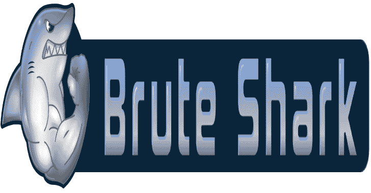
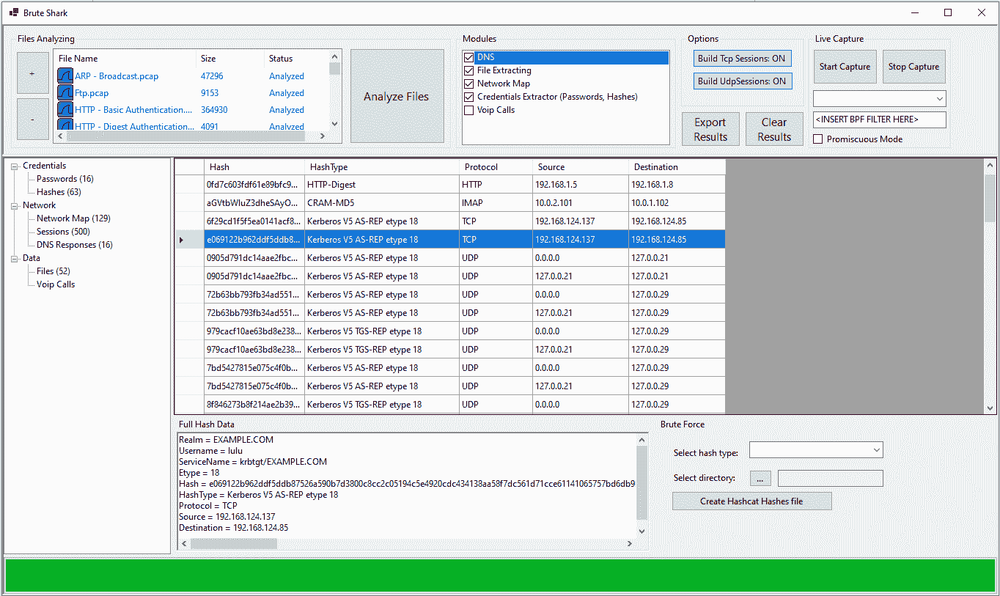

# BruteShark:网络分析工具

> 原文：<https://kalilinuxtutorials.com/bruteshark/>

.png)

**BruteShark** 是一款网络取证分析工具(NFAT ),可对网络流量(主要是 PCAP 文件，但也能从网络接口直接实时捕获)进行深度处理和检查。它包括:提取密码，构建网络图，重建 TCP 会话，提取加密密码的哈希，甚至将其转换为 Hashcat 格式，以便执行离线暴力攻击。

该项目的主要目标是为安全研究人员和网络管理员提供解决方案，帮助他们进行网络流量分析，同时发现潜在攻击者可能利用的弱点，从而访问网络上的关键点。

有两个 BruteShark 版本可用，一个基于 GUI 的应用程序(Windows)和一个命令行界面工具(Windows 和 Linux)。解决方案中的各种项目也可以独立用作基础设施，用于分析 Linux 或 Windows 机器上的网络流量。欲了解更多详情，请参见架构部分。

这个项目是我在业余时间开发的，以解决我的两个主要爱好:软件架构和分析网络数据。

我喜欢从 BruteShark 用户那里得到反馈，你的意见对我很重要！随时联系我的 contact.oded.shimon@gmail.com 或创建新的问题。

如果这个项目对你有帮助，请⭐️这个库！还有，如果你觉得慷慨，你可以给我买杯咖啡

## 它能做什么

*   提取和编码用户名和密码(HTTP、FTP、Telnet、IMAP、SMTP……)
*   提取认证散列并使用 Hashcat (Kerberos、NTLM、CRAM-MD5、HTTP-Digest……)破解它们
*   构建可视化网络图(网络节点、开放端口、域用户)
*   提取 DNS 查询
*   重建所有 TCP 和 UDP 会话
*   锉刀雕刻
*   提取 Voip 呼叫(SIP、RTP)

## 下载

### Windows

*   先决条件:
    *   Npcap 驱动程序(Wireshark 默认安装其中一个)
    *   。NET 核心运行时(注意，你必须根据你的需要安装合适的运行时，这意味着**。NET Core Desktop Runtime**for brutesharkdestate 和**。用于 BruteSharkCli 的. NET 核心运行时**)。
*   对于桌面版本，请下载 brutesharkdestheck Windows Installer(64 位)。
*   对于 CLI 版本，请下载 BruteSharkCli Windows 10 可执行文件。

##### Linux

*   先决条件:libpcap 驱动程序
*   下载 BruteSharkCli 并运行它

**wget https://github . com/odedshimon/brute shark/releases/latest/download/brute shark CLI
。/BruteSharkCli**

# 例子

##### 视频

构建网络图
https://user-images . githubusercontent . com/18364847/131922221-5714 f351-85f 7-4490-be C9-8da 4339 b 66 b 3 . MP4
BruteSharkCli 使用示例–提取多个密码和哈希(也可在 youtube 上找到)
https://user-images . githubusercontent . com/18364847/1317

##### 哈希提取

**用途**

一般来说，建议加载、运行并浏览结果。包含演示所有 BruteShark 功能的场景的示例 PCAP 文件可以从这里下载。
注意，分析网络流量是一项耗费时间和资源的操作，建议在加载大文件时只选择需要的模块。
应特别注意“构建 TCP 会话”/“构建 UDP 会话”选项。

## BruteSharkDesktop

GUI 非常简单明了，只需加载所需的文件，配置所需的模块，然后按下运行按钮。

## BruteSharkCli

BruteSharkCli 是面向 Linux 和 Windows 用户的 BruteShark 的 Cli 版本。它拥有 BruteSharkDesktop 的所有功能，并被设计为从外壳操作。作为一个经典的 CLI 工具，它的工作原理是获取所有相关的处理参数，然后将结果打印到标准输出或文件中。

打印帮助菜单:

**BruteSharkCli–帮助**

从目录中的所有文件获取凭证(密码和哈希将打印到 stdout):

**BruteSharkCli-m Credentials-d " C:\ Users \ King \ Desktop \ Pcap Files "**

从目录中的所有文件获取凭证，并将提取的散列(如果找到的话)导出到 Hashcat 输入文件。

**BruteSharkCli-m Credentials-d C:\ Users \ King \ Desktop \ Pcap _ Examples-o C:\ Users \ King \ Desktop \ Results**

对一个目录中的所有文件运行多个模块，并导出所有结果。

**BruteSharkCli -m 凭证，NetworkMap，file extracting-d C:\ Users \ King \ Desktop \ Pcap _ Examples-o C:\ Users \ King \ Desktop \ Results**

嗅探一个名为“Wi-Fi”的接口，运行多个模块，并将所有结果导出到一个目录中(只有在按 CTRL + C 停止嗅探器时，才会导出结果)。

**BruteSharkCli -l Wi-Fi -m 凭证、网络地图、文件提取、DNS-o C:\ Users \ King \ Desktop \ Test Export**

## 模块

BruteShark 是一个模块化工具，专为扩展而设计。

##### 凭证模块

该模块负责提取和编码用户名和密码以及认证散列。事实上，这个模块负责更新两个显示表，密码表和哈希表。虽然用户名和密码可以直接使用，但哈希最常用于更复杂的攻击，如传递哈希或通过暴力迫使他们获取密码。BruteShark 与 Hashcat 集成在一起，因此提取的所有哈希都可以转换成 Hashcat 输入文件。

| 草案 | 散列型 | Hascat Mode (-m) |
| --- | --- | --- |
| 超文本传送协议 | HTTP-Digest | Eleven thousand four hundred |
| SMTP\IMAP | CRAM-MD5 | Sixteen thousand four hundred |
| NTLM(例如中小企业) | NTLMv1 | Five thousand five hundred |
| NTLM(例如中小企业) | NTLMv2 | Five thousand six hundred |
| 麻省理工学院开发的安全认证系统 | AS-REQ etype 23 | Seven thousand five hundred |
| 麻省理工学院开发的安全认证系统 | AS-REP 类型 23 | Eighteen thousand two hundred |
| 麻省理工学院开发的安全认证系统 | TGS 共和国类型 23 | Thirteen thousand one hundred |
| Kerberos (AES128) | TGS 共和国类型 17 | Nineteen thousand six hundred |
| Kerberos (AES256) | TGS 共和国类型 18 | Nineteen thousand seven hundred |

##### 网络地图模块

该模块负责通过识别网络中的组件以及它们之间的连接来构建网络图。网络图可以导出到两个 JSON 文件中，一个文件包含网络中的所有连接，另一个文件包含所有端点及其相关信息(如开放端口、DNS 映射等)。).这些文件可用于 Neo4j 等外部工具的分析。

此模块尝试从 UDP / TCP 会话中提取文件(因此，请注意，为了使此模块有效，应该打开“构建 TCP 会话”/“构建 UDP 会话”)。目前这个模块支持经典的取证技术的文件雕刻的“页眉-页脚”算法是有效的文件已知的文件页眉和页脚一样，JPG，PNG，PDF。

##### 网络电话通话模块

这个模块从 SIP 和 RTP 协议中提取 Voip 呼叫。提取的呼叫可以导出为原始音频文件，并可以使用适当的音频播放器(如 Audacity)播放

# 建筑

所有的 BruteShark 项目都是使用`**.Net Core**`和`**.Net Standard**`来实现现代和跨平台支持的。该解决方案采用三层架构设计，每层包括一个或多个项目——DAL、BLL 和 PL。各层之间的分离是由每个项目仅引用其自己的对象这一事实造成的。

##### PcapProcessor (DAL)

作为数据访问层，这个项目负责使用适当的驱动程序(WinPcap，libpcap)和克里斯·莫根的惊人的包装库 SharpPcap 读取原始 PCAP 文件。可以一次分析一系列文件，并提供额外的功能，如重建所有的 TCP 会话(使用令人敬畏的项目 TcpRecon)。

##### PCA 分析仪(BLL)

业务逻辑层，负责分析网络信息(数据包、TCP 会话等)。)，实现了可插拔机制。每个插件基本上都是一个实现接口 *IModule* 的类。使用反射加载所有插件:

**private void _ initilyzeModulesList()
{
//通过查找
//实现 IModule 的每个类，为任何可用的模块创建一个实例。
这个。_modules = AppDomain。current domain . GetAssemblies()
。select many(s =>s . GetTypes())
。其中(p = > typeof(IModule)。IsAssignableFrom(p)&T18！p.IsInterface)
。选择(t = > (IModule)激活器。CreateInstance(t))
。to list()；
//注册到每个模块事件。
foreach(var m in _ modules)
{
m . ParsedItemDetected+=(s，e) = > this。ParsedItemDetected(s，e)；
}**

##### BruteSharkDesktop (PL)

基于 WinForms 的 Windows 桌面应用程序。使用交叉项目，即同时引用达尔和 BLL 层。这是通过组成每个层，注册到它们的事件，当事件被触发时，将事件对象转换为下一层的等效对象，并将其发送到下一层来完成的。

**public MainForm()
{
initialize component()；
_ files = new HashSet()；
//创建达尔和 BLL 对象。
_ 处理器=新的 PcapProcessor。处理器()；
_analyzer =新的 PcapAnalyzer。analyzer()；
_ 处理器。BuildTcpSessions = true
//创建用户控件。
_ networkmap user control = new networkmap user control()；
_ 网络地图用户控制。Dock = DockStyle。填充；
_ sessionexplorerucontrol = new sessionexplorerucontrol()；
_ sessionexplorusercontrol。Dock = DockStyle。填充；
_ hashesUserControl = new hashesUserControl()；
_ 哈希用户控制。Dock = DockStyle。填充；
_ passwordsUserControl = new generictable user control()；
_passwordsUserControl。Dock = DockStyle。填充；
//收缩事件。
_ 处理器。TcpPacketArived += (s，e)=>_ 分析器。分析(选角。CastProcessorTcpPacketToAnalyzerTcpPacket(e . Packet))；
_ 处理器。TCP session drived+=(s，e) = > _analyzer。分析(选角。castprocessortcpsessionanalyzertcpsession(e . TCP session))；
_ 处理器。fileprocessstarted+=(s，e)=>SwitchToMainThreadContext(()=>OnFileProcessStart(s，e))；
_ 处理器。fileprocessended+=(s，e)=>SwitchToMainThreadContext(()=>OnFileProcessEnd(s，e))；
_ 处理器。ProcessingPrecentsChanged += (s，e)=>SwitchToMainThreadContext(()=>onprocessingpresents changed(s，e))；
_ 分析仪。parsetitemdetected+=(s，e)=>SwitchToMainThreadContext(()=>OnParsedItemDetected(s，e))；
_ 处理器。TcpSessionArived += (s，e)=>SwitchToMainThreadContext(()=>onsession arived(Casting。castprocessortcpsessiontobrutesharkdesktoptcp session(e . TCP session)))；
_ 处理器。ProcessingFinished += (s，e)=>SwitchToMainThreadContext(()=>OnProcessingFinished(s，e))；
initialize filesicon slist()；
this . modulestreeview . expandall()；
}**

[**Download**](https://github.com/odedshimon/BruteShark/#brutesharkdesktop-pl)