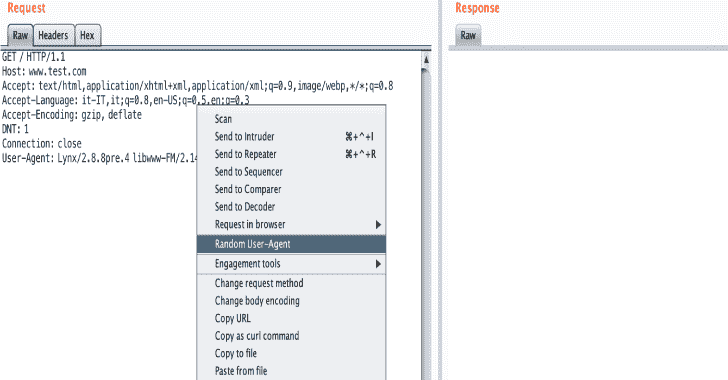

# 用于生成随机用户代理的打嗝套件扩展

> 原文：<https://kalilinuxtutorials.com/burp-suite-extension/>

一个 **Burp Suite** 扩展，帮助 pentesters 生成一个随机的用户代理。这个扩展是由 M'hamed (@m4ll0k) Outaadi 开发的。

**安装**

下载发行版中的 jar 文件或编译 java 代码:

**$ git 克隆 https://github.com/m4ll0k/BurpSuite-Random_UserAgent.git 随机用户代理
$ cd 随机用户代理/src/main/java
$ javac burp/*。Java
$ jar cf random-user agents . jar burp/*。阶级**

**也可阅读-[伤害安卓:易受攻击的安卓应用](https://kalilinuxtutorials.com/injuredandroid/)**

**演示**

> [查看 imgur.com 的帖子](https://imgur.com/4rRAIbX)