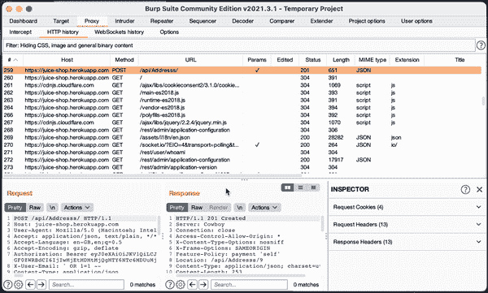

# Burpsuite:复制为 XMLHttpRequest 扩展

> 原文：<https://kalilinuxtutorials.com/burpsuite-2/>

该扩展为 BurpSuite 添加了一个上下文菜单，允许您将多个请求复制为 Javascript 的 XmlHttpRequest，这简化了利用 XSS 时的 PoC 开发。

**安装**

*   从发行版下载最新的 [JAR](https://www.kitploit.com/search/label/JAR) 或者手动构建
*   使用选项卡将 JAR 添加到 [burpsuite](https://www.kitploit.com/search/label/Burpsuite) 中:“扩展器”- >“扩展”- >“添加”

**用途**

*   从任何选项卡中选择一个请求，或在“代理”->“HTTP 历史”选项卡中选择几个请求
*   调用上下文菜单并选择“复制为 XMLHttpRequest”

[**Download**](https://github.com/vulnbe/burpsuite-copy-as-xmlhttprequest)