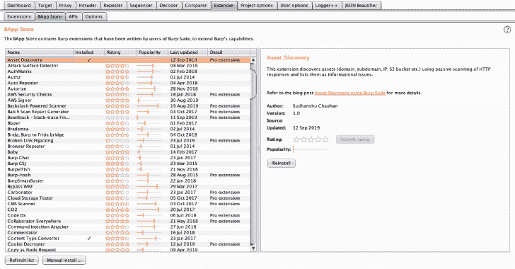
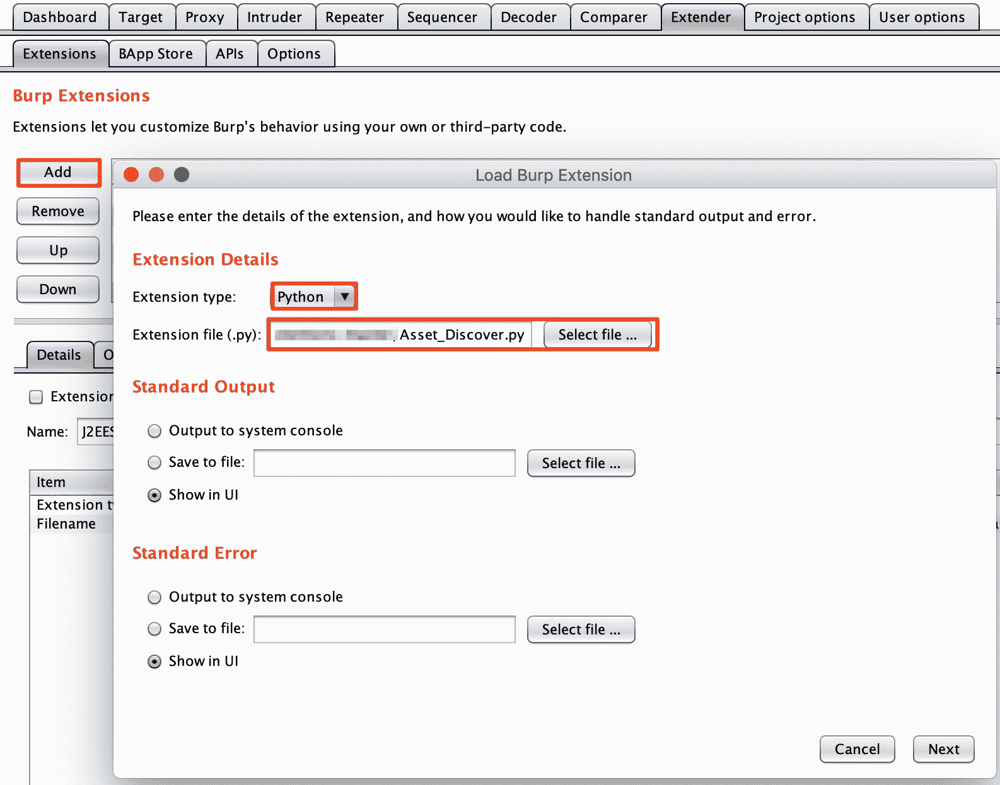
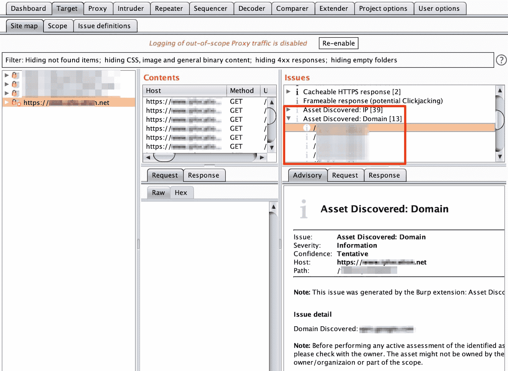

# 资产发现:从 HTTP 响应中发现资产的 Burp 套件扩展

> 原文：<https://kalilinuxtutorials.com/burpsuite-asset_discover/>

Asset Discover 是 burp suite 扩展的一个工具，用于使用被动扫描从 HTTP 响应中发现资产。任何安全评估程序的结果，无论是漏洞评估、渗透测试还是红队，都受到其范围的限制。

我们无法补救与特定资源相关的风险，这不属于评估范围，因为它们只是未知的未知数。这个问题的答案是使用持续的资产发现来跟踪资产。

资产发现过程很简单，但并不容易。我们需要从一些关于组织的种子信息开始，如公司名称、域名、IP 等。；拥有一个用种子类型映射的数据源列表，然后从中提取信息。

此外，这个过程本质上需要是递归的，以检查新识别的信息是否可以成为另一个源的种子信息。我们的联合创始人 Shubham 在他的 OSINT for Proactive Defense-RootConf 2019 演示中简要谈到了这一点。

资产发现的一个主要挑战是对所识别信息的真实性和相关性的信任程度。任何由组织直接拥有/管理的信息源都具有高信任级别，另一方面，第三方信息源可能需要多次检查来验证信息。

一个可以依赖的来源是目标组织拥有的网站。当然，必须对从这个来源识别的资产进行进一步的验证，但是我们可以对它们有很高的信任度。

**设置**

*   通过在 Burp Suite 的“Extender”下的“Options”选项卡中提供 [jython.jar](https://www.jython.org/downloads.html) 文件来设置 python 环境。
*   下载[扩展](https://github.com/redhuntlabs/BurpSuite-Asset_Discover/archive/master.zip)。
*   在“Extender”下的“Extensions”选项卡中，选择“Add”。
*   将扩展类型更改为“Python”。
*   提供文件“Asset_Discover.py”的路径，然后单击“下一步”。

**用途**

*   将 URL 添加到“目标”选项卡下的“范围”中。扩展将通过被动扫描开始识别资产。

**要求**

*   [Jython 2.7.0](https://www.jython.org/downloads.html)
*   [打嗝套件专业版 v2.1](https://portswigger.net/burp)

[**Download**](https://github.com/redhuntlabs/BurpSuite-Asset_Discover)