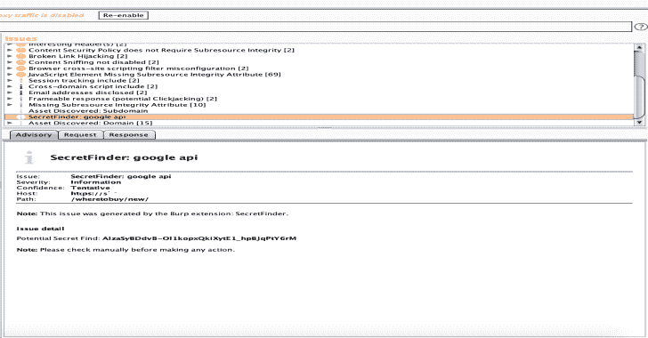

# BurpSuite : Secret Finder 扩展，用于从 HTTP 响应中发现 API keys/令牌

> 原文：<https://kalilinuxtutorials.com/burpsuite-secret-finder/>

BurpSuite 是一个 Secret Finder Burp Suite 扩展，用于从 HTTP 响应中发现 apikey/tokens。

**安装**

> >**下载 Secret Finder**
wget https://raw . githubusercontent . com/M4 ll0k/Burp suite-Secret _ Finder/master/Secret Finder . py

或

git 克隆 https://github.com/m4ll0k/BurpSuite-Secret_Finder.git
>>**现在打开 Burp > Extender >扩展>添加>设置 python 并选择文件(SecretFinder.py)**

**也可阅读-[子域名 3:发现子域名的新一代工具](https://kalilinuxtutorials.com/subdomain3-tool-discovering-subdomains/)**

**要求**

*   jython
*   硬石膏

[**Download**](https://github.com/m4ll0k/BurpSuite-Secret_Finder)