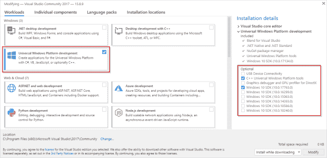

# 计算器:Windows 自带的一个简单而强大的计算器

> 原文：<https://kalilinuxtutorials.com/calculator-windows/>

Windows Calculator 应用程序是一个用 C++编写的现代 Windows 应用程序，预装在 Windows 中。

该应用程序提供了标准、科学和程序员计算器功能，以及一组各种测量单位和货币之间的转换器。

它定期发布新功能和错误修复。你可以在微软商店获得最新版本的计算器。

**也可阅读-[Angr:功能强大的&用户友好的二进制分析平台](https://kalilinuxtutorials.com/angr-user-friendly-binary-analysis/)**

**特性**

*   标准计算器功能，提供基本操作，并在命令输入时立即进行评估。
*   科学计算器功能，提供扩展运算，并使用运算顺序评估命令。
*   程序员计算器功能，为开发者提供通用的数学运算，包括通用基数之间的转换。
*   计算历史和记忆能力。
*   许多测量单位之间的转换。
*   基于从 [Bing](https://www.bing.com/) 中检索的数据进行货币兑换。

**入门**

**先决条件:**

*   您的电脑必须运行 1803 版或更高版本的 Windows 10
*   安装最新版本的 [Visual Studio](https://developer.microsoft.com/en-us/windows/downloads) (免费社区版就够了)
    *   安装“通用 Windows 平台开发”工作负载
    *   安装可选的“C++通用 Windows 平台工具”组件
    *   安装最新的 Windows 10 SDK

*   安装 XAML·斯泰勒 Visual Studio 扩展
*   获取代码:

git 克隆 https://github.com/Microsoft/calculator.git

*   在 Visual Studio 中打开 src\Calculator.sln，构建并运行计算器应用程序。
*   有关项目架构的一般描述，请参见 ApplicationArchitecture.md。

**投稿**

想投稿？团队鼓励社区反馈和贡献。请遵循我们的[投稿指南](https://github.com/Microsoft/calculator/blob/master/CONTRIBUTING.md)。

如果工作不正常，请在[反馈中心](https://insider.windows.com/en-us/fb/?contextid=130)提交报告。我们也欢迎在 GitHub 上提交[问题。](https://github.com/Microsoft/calculator/issues)

**路线图**

有关 Windows 计划和发布时间表的信息，请参见 [Windows 计算器路线图](https://github.com/Microsoft/calculator/blob/master/docs/Roadmap.md)。

**数据/遥测**

该项目收集使用数据并将其发送给微软，以帮助改进我们的产品和服务。阅读我们的[隐私声明](https://go.microsoft.com/fwlink/?LinkId=521839)了解更多信息。默认情况下，遥测在开发构建中是禁用的，可以通过`SEND_TELEMETRY`构建标志来启用。

**报告安全问题**

安全问题和漏洞应该通过电子邮件私下报告给位于<[secure@microsoft.com](mailto:secure@microsoft.com)>的微软安全响应中心(MSRC)。您应该会在 24 小时内收到回复。

如果由于某种原因你没有，请通过电子邮件跟进，以确保我们收到您的原始邮件。更多信息，包括 [MSRC PGP](https://technet.microsoft.com/en-us/security/dn606155) 密钥，可以在[安全技术中心](https://technet.microsoft.com/en-us/security/default)找到。

[**Download**](https://github.com/Microsoft/calculator)