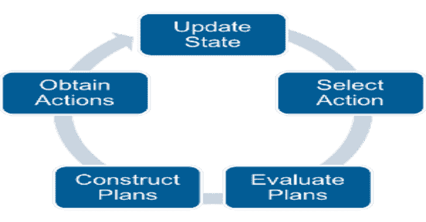

# Caldera:自动对手模拟系统

> 原文：<https://kalilinuxtutorials.com/caldera-automated-adversary-emulation-system/>

卡尔德拉是一个自动化的对手仿真系统，建立在[米特里 ATT&CK](https://attack.mitre.org/)框架之上。它的工作原理是将能力附加到对手身上，并在行动中操控对手。这个系统的完整文档可以在[的维基](https://github.com/mitre/caldera/wiki)中找到。

运行该系统需要 Python 3.5.3+版本。

**安装**

从递归克隆这个存储库开始。这将拉出所有可用的[插件](https://github.com/mitre/caldera/wiki/What-is-a-plugin%3F)。

**git 克隆 https://github.com/mitre/caldera.git–递归**

从这个项目的根目录，安装 PIP 需求。

**pip install-r requirements . txt**

然后启动服务器。

**python server.py**

**也可阅读-[Pown Duct:发现盲注攻击的必备工具](https://kalilinuxtutorials.com/pown-duct-blind-injection-attacks/)**

**快速启动**

为了了解火山口，它有助于运行一个操作。下面是你可以执行的预设任务来理解这个系统。这些任务假设火山口正在当地运行。

任务#1:爱管闲事的邻居

> 在受损的笔记本电脑上执行侦察。您的雇主需要一份笔记本电脑用户首选 WIFI 网络的列表。抓住这个列表，收集其他任何东西，然后让用户离线。最后，滚出去。快点。不留痕迹。有一点需要注意:笔记本电脑的反病毒软件每分钟都会对电脑进行全面扫描。你必须在 60 秒内完成这项任务。

在与 CALDERA 相同的计算机上启动一个 [54ndc47 代理](https://github.com/mitre/caldera/wiki/Plugin:-sandcat)。为此，请打开一个终端，并为您的操作系统粘贴正确的交付命令。你应该会收到一条日志消息，表明代理已经向 CALDERA 发送了一个“信标”。

转到位于 127.0.0.1:8888 的浏览器，使用凭据 admin:admin 登录。点击进入[链插件](https://github.com/mitre/caldera/wiki/Plugin:-chain)并使用“操作”部分，使用“爱管闲事的邻居”对手和 my_group 组启动一个操作。填写操作名称，但保留所有其他字段的默认值。

操作完成后，比较第一个和最后一个命令的执行时间。任务成功了吗？对手跑得无影无踪了吗？你能弄清楚为什么这些能力会以这样的顺序运行吗？

**任务#2:文件猎人**

> 一台存有机密敏感文件的笔记本电脑已经被盗。扫描计算机，查找与文件扩展名(.txt 和。yml)已知的敏感文件。那就去偷文件。

类似于任务#1，启动一个 54ndc47 代理，并确认它“信标”回火山口。

确认后，进入 127.0.0.1 的浏览器，点击进入链模式。点击“事实”部分，检查可用的[事实来源](https://github.com/mitre/caldera/wiki/What-is-a-fact%3F)。请注意，*扩展名*事实源包含您将寻找的文件扩展名。

点击进入“操作”部分，开始一个新的操作。选择“文件猎手”对手，并确保选择扩展的事实来源。通过将这些事实输入到操作中，所选择的对手配置文件(文件猎人)将在其能力范围内利用它们。

行动找到敏感文件了吗？多少？您能确定是什么控制了它要查找的文件数量吗？

**版本**

使用最新的 master branch 源代码可以运行最先进的代码。稳定版本由 major.minor.bugfix 编号标记，可以通过克隆适当的标记版本来使用:

**git 克隆–分支 2 . 2 . 0 https://github.com/mitre/caldera.git–递归**

查看 GitHub 发行版，获取最稳定的发布版本。

> **重要**:核心系统依赖插件(git 子模块)。如果您不熟悉这个概念，并且想要运行最先进的代码，那么对这个代码进行“git pull”可能是不够的。运行前沿代码最简单的方法是，当你想更新 CALDERA 时，递归地重新克隆它。

开发者

我们使用基本功能分支 GIT 流。创建一个主特征分支，准备好之后，提交一个合并请求。使分支名称和提交具有描述性。合并请求应该解决一个问题，而不是许多问题。

[**Download**](https://github.com/mitre/caldera)