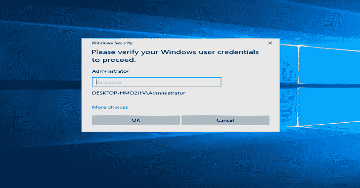

# CamPhish:从目标的手机前置摄像头或 PC 网络摄像头抓取视频，只需发送一个链接。

> 原文：<https://kalilinuxtutorials.com/camphish/>

**CamPhish** 是一种技术，可以通过摄像头或电脑摄像头拍摄目标的手机。CamPhish 在内置的 PHP 服务器上托管一个假网站，并使用 ngrok & serveo 生成一个链接，我们将转发给目标，这可以在互联网上使用。网站要求摄像头许可，如果目标允许，该工具会抓取目标设备的摄像头

**特色**

在这个工具中，我为网页上的目标添加了两个自动网页模板，以获得更多的 cam 图片

*   节日愿望
*   YouTube 电视直播

只需输入节日名称或 youtube 的视频 ID

**这个工具在**上测试过

*   Kali Linux
*   泰尔穆克
*   马科斯
*   人的本质
*   干屎蛋

**安装及要求**

这个工具需要 PHP 的网络服务器，SSH 或 serveo 链接。首先在您的终端上运行以下命令

**apt-get -y 安装 php openssh git wget**

**安装(Kali Linux/Termux)**

**git 克隆 https://github.com/techchipnet/CamPhish
CD CamPhish
bash CamPhish . sh**

[**Download**](https://github.com/techchipnet/CamPhish)