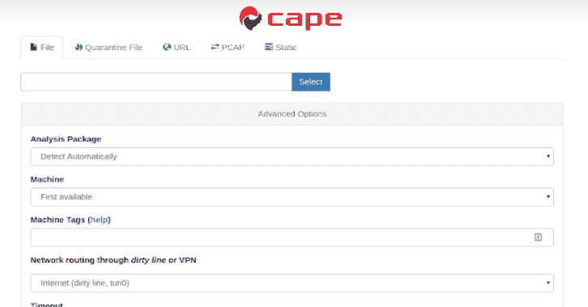

# CAPE:恶意软件配置和有效载荷提取

> 原文：<https://kalilinuxtutorials.com/cape-malware-configuration-payload-extraction/>

**CAPE** 是一个恶意软件沙箱。它源自 Cuckoo，旨在自动化恶意软件分析过程，目标是从恶意软件中提取有效负载和配置。

这使得 CAPE 能够根据有效载荷签名检测恶意软件，并自动实现恶意软件逆向工程和威胁情报的许多目标。

网上有一个社区版本，任何人都可以免费试用:

[**https://cape.contextis.com/submit**](https://cape.contextis.com/submit)

 **CAPE 可以从对样本的初始运行中检测出许多恶意软件技术或行为，以及特定的恶意软件家族。该检测然后可以触发对特定包的进一步运行，以便提取恶意软件有效载荷以及可能的其配置，用于进一步分析。

CAPE 通过定制的调试器和 API 挂钩来控制恶意软件。触发 CAPE 包的检测可以基于 API 或 Yara 签名。

调试器使用 Yara 签名或 API 挂钩来允许在单个指令、内存区域或函数调用上设置断点。一旦到达感兴趣的区域，就可以对其进行处理和分析，并可能进行配置解析。

CAPE 检测并打包的技术或行为包括:

*   过程注入
    *   外壳代码注入
    *   DLL 注入
    *   过程空洞化
    *   过程二重性
*   内存中可执行模块的解压缩
*   提取内存中的可执行模块或外壳代码

针对这些行为的包将转储正在注入、提取或解压缩的有效载荷，以供进一步分析。这通常是未打包形式的恶意软件负载。

CAPE 自动为每个进程创建一个进程转储，或者在 DLL 的情况下，在内存中创建 DLL 的模块映像。这对于使用简单打包程序打包的样本非常有用，因为通常模块映像转储是完全解包的。Yara 签名可能触发流程转储，可能导致提交特定的包或配置解析。

CAPE 还有一个软件包，可以动态解包使用“黑客”(修改)UPX 的样本，这在恶意软件作者中非常流行。这些样本在 CAPE 的调试器中运行，直到它们的 OEP(原始入口点),然后它们被转储、修复，它们的导入被自动重建，为分析做好准备。

**也可阅读-[子域名 3:发现子域名的新一代工具](https://kalilinuxtutorials.com/subdomain3-tool-discovering-subdomains/)**

目前，CAPE 拥有针对以下恶意软件家族的特定包转储配置和有效负载:

*   PlugX
*   邪恶攫取
*   秘密组织
*   塞伯
*   特技机器人
*   汉西托尔
*   乌尔斯尼夫
*   QakBot

CAPE 拥有针对以下恶意软件家族的配置解析器/解码器，其有效负载由行为包自动提取:

*   Emotet
*   红叶
*   隐藏所
*   http 浏览器
*   这是一个陷阱
*   毒葛
*   尖叫声
*   TSCookie
*   Dridex
*   烟雾装卸工

许多其他恶意软件家族的有效载荷由行为包自动提取，CAPE 使用 Yara 签名来检测有效载荷。该列表还在不断增加，包括:

*   阿佐鲁尔，Formbook，ryk，Hermes，Shade，Remcos，Ramnit，Gootkit，QtBot，zerot，wanacry，nettraveler，Locky，BadRabbit，Magniber，Redsip，Kronos，PetrWrap，Kovter，Azer，Petya，Dreambot，Atlas，NanoLocker，Mole，codoso，cryptoshield，Loki，Jaff，icedid，Scarab，Cutlet，rokrat，olk rat，olympidor，gandcrab，Fareit，zeuspanda，Tesla，AgentTesla

配置数据可以从系列包中输出，也可以从行为包产生的有效载荷中输出。然后，可以通过基于 Yara 的检测对此进行配置解析，并基于 CAPE 的配置解析框架、malwareconfig.com 的 RATDecoders 框架和 DC3-MWCP(国防网络犯罪中心-恶意软件配置解析器)进行配置解析。来自 malwareconfig.com 的许多解析器/解码器也包括在内，其中包括:Sakula，DarkComet，PredatorPain 和 PoisonIvy。感谢凯文·布林/TechAnarchy 的这个框架和解析器([https://github.com/kevthehermit/RATDecoders](https://github.com/kevthehermit/RATDecoders))，感谢 DC3 的框架([https://github.com/Defense-Cyber-Crime-Center/DC3-MWCP](https://github.com/Defense-Cyber-Crime-Center/DC3-MWCP))。特别感谢 Jason Reaves (@sysopfb)为 TrickBot 解析器和杨奇煜·佩里高德为 PlugX 解析器所做的工作。

实用程序包也包括在内:“DumpOnAPI”允许一个模块在调用一个可以在 web 界面中指定的特定 API 函数时被转储。“DumpConfigRegion”允许为常用的 API 调用转储包含 C2 信息或其他配置数据的内存区域。

这些包可用于快速打开包装/转储新样品或配置。“跟踪”包通过接受四个断点(RVA 值)来设置指令，从而允许快速访问调试器，随后将输出一个简短的指令跟踪。可选的“base-on-api”参数允许通过 api 调用来设置映像库。

CAPE 调试器允许在读取、写入或执行内存地址或区域时设置断点，以及单步执行模式。这允许对恶意软件的执行进行精细控制，直到可以转储包含代码或配置数据的感兴趣的存储器区域。

断点可以由包代码、API 挂钩或 Yara 签名动态设置。得益于嵌入式 distorm 库，调试器可以在单步模式下或遇到断点时输出指令反汇编，从而产生指令跟踪。

CAPE 可以通过使用一个简单的 API 不同地转储进程、模块和内存区域。然后可以对这些转储进行扫描和解析，以获取配置信息。可执行模块在被转储时是固定的，也可能自动重建它们的导入(基于 Scylla:[https://github.com/NtQuery/Scylla](https://github.com/NtQuery/Scylla))。

可以基于 API 挂钩、CAPE 调试器或两者的组合来编写包。目前有许多其他行为和恶意软件家族包和解析器正在开发中，所以请关注这个空间。

包含监视器 dll 代码的库是一个独特的库，它构成了这些包的基础:[https://github.com/ctxis/capemon](https://github.com/ctxis/capemon)。这个库被组织在不同包的分支中。

CAPE 源自斯彭德沙盒([https://github.com/spender-sandbox](https://github.com/spender-sandbox))，后者源自布谷鸟沙盒([https://github.com/cuckoosandbox](https://github.com/cuckoosandbox))，因此感谢布拉德·斯宾格勒、克劳迪奥·瓜尼里、朱里安·布雷默和无数其他布谷鸟贡献者，没有他们，这项工作就不可能完成。

还要看 VirusTotal 的亚拉([https://github.com/VirusTotal/yara](https://github.com/VirusTotal/yara))。感谢 oletools 的 Decalage (@decalage2)、pdf 工具的 Didier Stevens 和 peepdf (@peepdf)、Vba2Graph 的 MalwareCantFly 和 binGraph 的 Matt Holley (@mrmolley)。非常感谢 doomed raven(@ d 00 m3 R4 v3n)、桑德尔·内梅斯(@sandornemes)、凯文·罗斯和恩佐(@enzok)的支持和贡献。

请为这个项目作出贡献，帮助创建新的恶意软件家族，包装，技术或配置解析器包。或者联系@CapeSandbox 或 Kevin O'Reilly 了解 CAPE 开发的更多详情。

**最佳性能的安装建议和脚本**

*   为了获得最佳兼容性，我们强烈建议安装在 [Ubuntu 18.04 LTS](https://ubuntu.com/#download)
*   建议将 KVM 作为虚拟机管理程序

**须藤。/kvm-qemu.sh all <用户名>**

*   安装 CAPE 本身， [cuckoo.sh](https://github.com/doomedraven/Tools/blob/master/Cuckoo/cuckoo.sh) 进行所有优化

**须藤。/cuckoo.sh 所有海角**

*   重启，尽情享受吧

*所有脚本都包含**帮助** `-h`，但请检查脚本以了解它们在做什么。

[**Download**](https://github.com/ctxis/CAPE)**