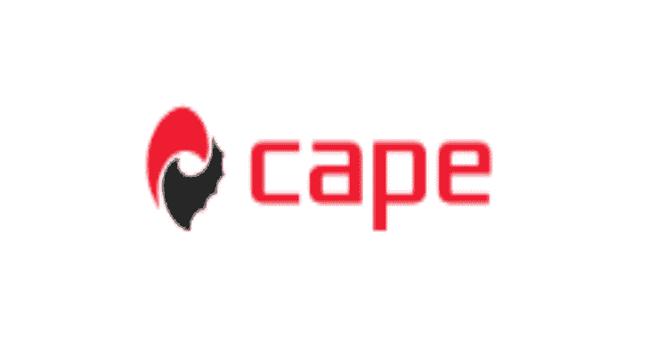

# CAPEv2:恶意软件配置和有效载荷提取

> 原文：<https://kalilinuxtutorials.com/capev2/>

.png)

**CAPEv2** 是一个恶意软件沙箱。它源自 Cuckoo，目标是添加自动恶意软件拆包和配置提取——因此它的名字是一个缩写:“配置和有效载荷提取”。自动解包允许基于 Yara 签名的分类，以补充网络(Suricata)和行为(API)签名。

任何人都可以使用免费的在线社区实例:

https://capesandbox.com

虽然配置和有效负载提取是最初的目标，但 CAPE 中调试器的开发首先激发了这个项目:为了从任意恶意软件家族中提取配置或解压缩的有效负载，而不依赖于进程转储(坏人迟早会阻挠)，指令级监控是必要的。CAPE 中的新型调试器遵循最大化使用处理器硬件和最小化(几乎完全)使用 Windows 调试界面的原则，允许恶意软件从入口点秘密地被检测和操纵，硬件断点在引爆期间由 Yara 签名或 API 调用以编程方式设置。这允许捕获指令踪迹，或者执行诸如控制流操作或存储区域转储之类的动作。

调试器允许 CAPE 继续超越其原始功能，现在包括动态反规避旁路。由于现代恶意软件通常试图逃避沙箱内的分析，例如通过使用虚拟化的定时陷阱或 API 挂钩检测，CAPE 允许开发动态对策，结合 Yara 签名内的调试器操作来检测逃避的恶意软件，并在它引爆时执行控制流操作，以强制样本完全引爆或跳过逃避的操作。CAPE 中的动态旁路列表正在增加，但包括:

*   Gul loader
*   乌尔斯尼夫
*   Dridex
*   装货设备
*   表格簿
*   缓冲器
*   教区

CAPE 利用许多恶意软件技术或行为来捕获未打包的有效负载:

*   过程注入
    *   外壳代码注入
    *   DLL 注入
    *   过程空洞化
    *   过程二重性
*   内存中可执行模块的解压缩
*   提取内存中的可执行模块或外壳代码

这些行为将导致捕获的有效载荷被注入、提取或解压缩以供进一步分析。此外，CAPE 会自动为每个进程创建一个进程转储，或者在 DLL 的情况下，在内存中创建 DLL 的模块映像。这对于使用简单打包程序打包的样本非常有用，因为通常模块映像转储是完全解包的。

通过断点选项“bp0”到“bp3”可以快速访问调试器，接受 RVA 或 VA 值来设置断点，从而输出一个由“计数”和“深度”选项控制的简短指令跟踪(例如，bp0=0x1234，深度=1，计数=100)。为了在模块入口点设置断点，使用“ep”而不是地址(例如 bp0=ep)。或者，“返回时中断”允许在挂钩 API 的返回地址上设置断点(例如，返回时中断=NtGetContextThread)。可选的“base-on-api”参数允许通过 api 调用设置 RVA 断点的映像库(例如，base-on-api=NtReadFile，bp0=0x2345)。

选项“action0”到“action3”允许在遇到断点时执行操作，如转储内存区域(如 action0=dumpebx)或更改执行控制流(如 action1=skip)。CAPE 的文档包含此类操作的更多示例。

“dump-on-api”允许模块在调用特定的 api 函数时被转储，该 API 函数可以在 web 接口中指定，这对于快速解包/转储新样本是有用的(例如，dump-on-api=DnsQuery_A)。

CAPE 还有一个选项“upx=1 ”,可以动态解包使用“黑客”(修改)upx 的样本，这在恶意软件作者中非常流行。这些样本在 CAPE 的调试器中运行，直到它们的 OEP(原始入口点),然后它们被转储、修复，它们的导入被自动重建，为分析做好准备。

CAPE 的恶意软件系列覆盖范围在不断扩大，但它有针对以下示例的配置解析器:

*   Emotet
*   特技机器人
*   QakBot
*   汉西托尔
*   乌尔斯尼夫
*   Dridex
*   烟雾装卸工
*   冰孩子
*   红叶
*   隐藏所
*   http 浏览器
*   这是一个陷阱
*   毒葛
*   尖叫声
*   TSCookie

CAPE 使用 Yara 签名作为其主要分类方法来检测未打包的有效载荷。这份名单还在不断增加，包括:

*   阿佐鲁尔，Formbook，ryk，Hermes，Shade，Remcos，Ramnit，Gootkit，QtBot，zerot，wanacry，nettraveler，Locky，BadRabbit，Magniber，Redsip，Kronos，PetrWrap，Kovter，Azer，Petya，Dreambot，Atlas，NanoLocker，Mole，codoso，cryptoshield，Loki，Jaff，icedid，Scarab，Cutlet，rokrat，olk rat，olympidor，gandcrab，Fareit，zeuspanda，Tesla，AgentTesla

有一个社区签名库，包含由 CAPE 社区:https://github.com/kevoreilly/community 开发的数百个签名

配置解析可以使用 CAPE 的配置解析框架，malwareconfig.com 和 DC3-MWCP 的 RATDecoders 框架(国防网络犯罪中心-恶意软件配置解析器)来完成。来自 malwareconfig.com 的许多解析器/解码器也包括在内，其中包括:Sakula，DarkComet，PredatorPain 和 PoisonIvy。感谢凯文·布林/TechAnarchy 提供的这个框架和解析器(https://github . com/kevthermit/rat decoders)，感谢 DC3 提供的框架(https://github . com/Defense-Cyber-Crime-Center/DC3-MWCP)。特别感谢 Jason Reaves (@sysopfb)为 TrickBot 解析器和杨奇煜·佩里高德为 PlugX 解析器所做的工作。

包含监视器 dll 代码的库是一个独特的库:https://github.com/kevoreilly/capemon.

请通过帮助创建新的签名、解析器或绕过更多的恶意软件家族来为此项目做出贡献。目前有很多正在进行中，所以请关注这个空间。

## CAPEv2！–为了不错过任何重要的更新，请关注:changelog

非常感谢@ d 00 m3 R4 v3 n 一手将 CAPE 移植到 Python 3。

*   Python3
    *   agent.py 是用 python (3.7.2|3.8) x86 测试的。**你应该在 VM 内部使用 x86 python 版本！**
    *   主机用 python3 版本 3.7 和 3.8 测试过，但是更新的版本应该也能工作

## 最佳性能的安装建议和脚本

0.  熟悉正确配置的文档
1.  为了最好的兼容性，我们强烈建议安装在 LTS 的 Ubuntu 20.04 上
2.  建议使用 KVM 作为虚拟机管理程序，将`<W00T>`替换为真实模式

*   `**sudo ./kvm-qemu.sh all <username> | tee kvm-qemu.log**`

3.  要安装 CAPE 本身，cape2.sh 和所有优化
    *   `**sudo ./cape2.sh base cape | tee cape.log**`
    *   海角服务公司
        *   cape.service
        *   cape-处理器.服务
        *   cape-web.service
        *   海角寻根服务
        *   要重启任何服务，请使用`**systemctl restart <service_name>**`
    *   要调试任何问题，请停止服务并手动运行运行服务的命令以查看更多日志，检查`**-h**`，调试模式 **( `-d` )** 会有所帮助。
    *   只有 root 用户应该作为 root 执行，其余的作为 **cape** 用户执行。
    *   以 root 用户身份运行会影响权限
4.  重启，尽情享受吧

*   所有的脚本都包含**帮助** `**-h**`，但是请检查脚本让**明白**他们在做什么。

### 如何使用#virt-manager 创建虚拟机

这将是一个关于如何简单快速地创建虚拟机的快速帖子，并且修复了一些**杀毒软件**

-1.你可以通过桌面上的本地**虚拟管理器**将连接到远程服务器

*   按文件->新连接->选择 ssh 复选框，并指定用户和服务器。
*   或者直接从命令行:

**virt-manager-c " QEMU+ssh://YOUR _ USER @ YOUR _ SERVER/system "**

*   您需要确保这个用户可以连接到 libvirtd，并将您的 ssh pub 密钥添加到这个用户**。ssh/authorized_keys** 。
    *   `usermod -g libvirt -a <your_username>`
    *   `usermod -g KVM -a<your_username>`

0.如何在 virt-manager 中添加类似 **HOSTONLY**
的网络接口/类型按**编辑** - > **连接详情- >“按+”->**设置您的网络范围并选择**隔离**

*   按下**文件下的图标**

*   选择 iso 或任何其他方式来安装它，我们将在本教程中使用 ISO

*   指定到 **ISO** 的路径

*   为虚拟机设置 ram 内存和 CPU 数量

*   为虚拟机创建特定的硬盘，参见**选择或创建自定义存储，**按**管理**，参见下一个屏幕

*   设置虚拟机名称、大小> 100GB 和格式 qcow2

*   选择新创建的图像并按下**选择音量**

*   在安装之前选择**自定义配置，以便能够应用**杀毒**并按下完成**

*   虚拟机的详细配置，在**概述**中选择 **XML** 和**按照这篇博文的说明**进行 antivm。**重要提示**:使用 i44fx for < = Windows7，Q35 有更好的性能，但在 Windows 10 之前不支持开箱即用

*   内部的 cpu 类型禁用**复制主机 cpu 配置**如果是服务器 cpu 为**至强**，并发送一个你喜欢的，这是棘手的部分，如果你选择的 cpu 类型与你的服务器 cpu 不兼容(CPU 特性)，你的虚拟机可能会很慢，所以这里你需要自己玩，但想想现实世界的 CPU 类型**不是:**

*   将**性能选项**设置为该图像上的

*   联网，伪造你的 **MAC 地址**，我强烈建议使用 **hostonly** 而不是 **NAT**

*   点击应用，然后开始安装并安装你的操作系统

*   要拍摄快照:按下最后一个图标，你可以看到它被选中，就像屏幕上播放一样，然后在底部+设置你的快照名称，并按下完成

## 虚拟机核心依赖性

*   巧克力.蝙蝠

## 如何更新

*   海角:`**git pull**`
*   社区:`**python3 utils/community.py -waf**`见 **`-h`** 之前保证你明白

## 一大堆不能公开的自定义小修改怎么升级？

#### 用 rebase

**git add–all
git commit-m '[STASH]'
git pull–rebase origin master
必要时修复冲突(rebase)
git reset HEAD ~ 1**

**同合并**

**确保 kevoreilly repo 已被添加为远程(只需执行一次)
git remote 添加 kevoreilly https://github.com/kevoreilly/CAPEv2.git
确保您的所有更改都提交到您将合并的分支上
git commit -a -m "
从 kevoreilly repo 获取更改
git 获取 kevoreilly
将 kevoreilly 主分支合并到您当前的分支中
git 合并 kevoreilly/master
如果需要，修复合并冲突
推送**

[**Download**](https://github.com/kevoreilly/CAPEv2)