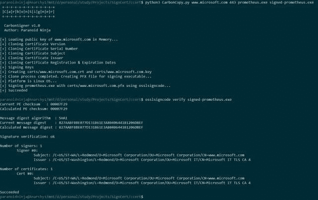

# CarbonCopy:创建任何在线网站的假冒证书的工具

> 原文：<https://kalilinuxtutorials.com/carboncopy-spoofed-certificate/>

CarbonCopy 是一个工具，它可以创建任何在线网站的欺骗证书，并为防病毒的可执行文件签名。适用于 Windows 和 Linux。

**也读作-[DNS-Shell:通过 DNS 通道](https://kalilinuxtutorials.com/dns-shell/)的交互式 Shell**

CarbonCopy 创建一个自签名证书，它看起来像原始证书，即主题、颁发者等看起来匹配。但是，证书根本不是由指定的发行者签名的。

这意味着，如果对证书进行了正确的验证，将找不到本地信任锚，并且该证书将作为不可信证书被拒绝。

[**Download**](https://github.com/paranoidninja/CarbonCopy)