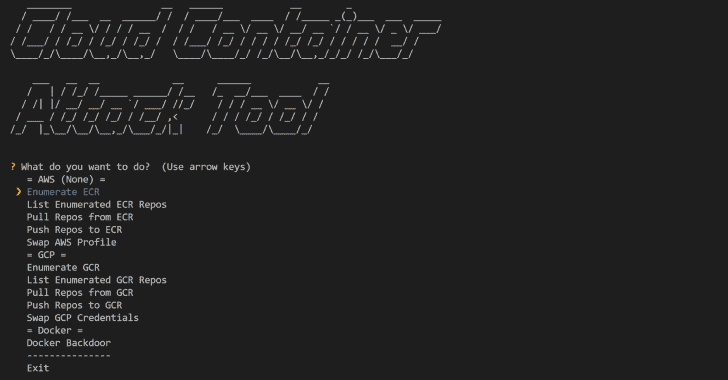
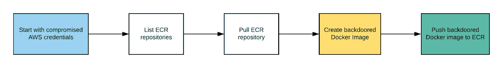

# CCat:云容器攻击工具 2019

> 原文：<https://kalilinuxtutorials.com/ccat-cloud-container-attack/>

**云容器攻击工具(Cloud Container Attack Tool)或 CCat** 是一款测试容器环境安全性的工具。

**要求**

*   需要 Python 3.5+版本。
*   需要 Docker。注:用 Docker 引擎 19.03.1 版本测试。
*   使用 AWS 功能需要命名配置文件。
*   使用 GCP 功能需要服务帐户或访问令牌。

**安装**

**注意:**我们建议使用提供的 Docker 映像来运行它，这样您就不会在自己的系统上遇到任何所需的依赖问题。

**也可阅读-[AT fuzzer:Android 智能手机 AT 界面的动态分析](https://kalilinuxtutorials.com/atfuzzer-dynamic-analysis-at-interface-android/)**

**从源安装**

**$ git 克隆 https://github.com/RhinoSecurityLabs/ccat.git
$ CD ccat
$ python 3 setup . py 安装
$ python3 ccat.py**

**使用 CCAT 的码头工人形象**

**警告:**运行这个命令会在 Docker 容器启动时将您的本地 AWS 配置文件挂载到 Docker 容器中。这意味着任何可以访问容器的用户都可以访问您的主机的 AWS 凭证。

**警告:**运行这个命令会将 Docker 守护进程默认监听的本地 Unix 套接字挂载到 Docker 容器中。这意味着有权访问容器的用户将有权访问您的 Docker 守护进程，这意味着他们可以轻松地逃到您的主机。

**$ docker run -it -v ~/。aws:/root/。AWS/-v/var/run/docker . sock:/var/run/docker . sock-v $ { PWD }:/app/rhinosecuritylabs/ccat:最新**

**入门**

**例句用法**

下面是一个演示 CCAT 用法的示例场景。

从受损的 AWS 凭证开始，攻击者列举并探索 ECR 存储库。然后，攻击者发现他们使用 NGINX Docker 映像，并从 ECR 中提取该 Docker 映像。此外，攻击者在目标 Docker 映像中创建一个反向外壳后门。最后，攻击者将后门 Docker 映像推送到 ECR。

**剥削路线:**

*   **CCAT 视频开发路线演练:**

https://www.youtube.com/watch?v=12zEXfCxIrk&feature=youtu.be

**免责声明**

CCAT 是一个绝对没有任何保证的工具。通过使用 CCAT，您对由此产生的任何和所有后果承担全部责任。

[**Download**](https://github.com/RhinoSecurityLabs/ccat)