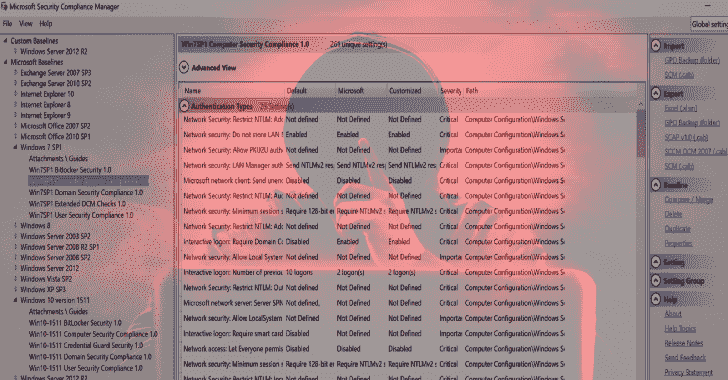

# CHAPS:配置强化评估 PowerShell 脚本

> 原文：<https://kalilinuxtutorials.com/chaps/>

[](https://1.bp.blogspot.com/-Dn5rN8uM0-s/Xhzkx70tPuI/AAAAAAAAEac/Kuvmg698NyQqdp9F_l7WyM0iVwb8ZlTiwCLcBGAsYHQ/s1600/CHAPS%25281%2529.png)

**CHAPS** 是一个 PowerShell 脚本，用于检查无法安装其他软件和评估工具(如 Microsoft Policy Analyzer)的系统安全设置。

该脚本的目的是在服务器或工作站上运行，以收集有关该系统的配置信息。然后，收集的信息可用于提供建议(和参考),以提高组织的 Windows 环境中单个系统和系统问题的安全性。

该脚本有用的环境示例包括工业控制系统(ICS)环境，其中系统不能被修改。这些系统包括部署在生产环境中的工程师/操作员工作站、人机界面(HMI)系统和管理服务器。

此脚本并不打算取代微软的策略分析器。审计系统配置的最佳方式是使用[微软安全合规工具包](https://docs.microsoft.com/en-us/windows/security/threat-protection/security-compliance-toolkit-10)和带有 [Windows 工作站安全基线 GPO](https://adsecurity.org/?p=3299) 的策略分析器。

策略分析器的输出可以导出为 MS Excel 文件，但要求系统上安装了 Microsoft Excel。剪切和粘贴这些信息确实有效，但在物理系统上可能不可行。此外，使用策略分析器需要安装 Windows 软件，这可能是不允许的。

这个脚本在 PowerShell 中运行，应该与 PowerShell 版本无关。根据 Windows 版本、系统配置以及是否以管理员权限运行，某些检查可能会失败。命令运行不成功的情况会被记录下来，并在可能的情况下进行手动调查。

该脚本是使用多个来源的信息开发的(在有用的资源一节中提到),以确定推荐的安全配置来降低系统受损的可能性，并记录在系统上进行的用户事件。它严重背离了[肖恩·梅特卡夫](https://adsecurity.org/?author=2)概述的[保护 Windows 工作站](https://adsecurity.org/?p=3299)基线。

**也可以理解为-[偷渡者:偷渡者的多跳代理工具](https://kalilinuxtutorials.com/stowaway-multi-hop-proxy-tool-for-pentesters/)**

**如何使用？**

在 ICS 环境中运行该脚本的最佳方式是不要向被审查的系统编写任何程序或脚本。通过从运行在网络上另一个系统上的 web 服务器提供这些脚本来做到这一点。

把 CHAPS 和 PowerSploit 下载到同一个目录下，打开一个终端，换到那个目录。使用 Python3 运行命令“python3 -m http.server 8181”。这将启动一个监听所有系统 IP 地址的 web 服务器。

在目标系统上打开一个 CMD.exe 窗口，最好以管理员身份打开。运行命令`powershell.exe -exec bypass`成为 PowerShell 提示符。在这个提示符下，运行下面的命令来执行`chaps.ps1`脚本。

**IEX(新客体网。WebClient)。download string(' http://<webserver>:8181/chaps/chaps . PS1 ')</webserver>**

要运行`**chaps-powershell.ps1**`脚本，请确保关闭系统的反病毒功能，以提供实时保护。运行以下命令将导入适当的 PowerSploit 脚本，然后运行它们。

```
IEX(新对象网)。web 客户端)。下载字符串(' http://<webserver>:8181/power ploit/recon/power view . PS1’)</webserver>
<webserver>iex(新对象网)。web 客户端)。下载字符串(' http://<webserver>:8181/power ploit/exhaustion/get-gpppa ssford . PS1 ')；</webserver></webserver>
<webserver><webserver>(新对象网)。web 客户端)。下载字符串(' http://<webserver>:8181/power ploit/渗出/get-gppaukon . PS1’)</webserver></webserver>
<webserver><webserver><webserver>iex(新对象网)。web 客户端)。下载字符串(' http://<webserver>:8181/power ploit/exout/get-vault credentials . PS1 ')；</webserver></webserver></webserver>
<webserver><webserver><webserver><webserver>iex(新对象网)。web 客户端)。下载字符串(' http://<webserver>:8181/power ploit/private ESC/power up . PS1’)</webserver></webserver></webserver></webserver><webserver><webserver><webserver><webserver>【iex】(新 web 客户端)。下载字符串(' http://<webserver>:8181/chaps/chaps-power ploit . PS1’)</webserver></webserver></webserver></webserver></webserver></webserver></webserver></webserver>
```

每个脚本的输出将被写入用户的临时目录，如$env:temp 变量所定义的。将这些文件从被检查的系统中复制出来，删除它们，如果需要，重新启动系统的反病毒程序。

**系统配置检查**

**系统信息命令**

*   运行 systeminfo 命令获取系统信息，以运行 [Windows 漏洞利用建议器-下一代](https://github.com/bitsadmin/wesng)工具。

**系统信息**

*   管理员权利
    *   该检查确定运行脚本的用户是否具有管理员权限。没有管理员权限，某些检查可能无法进行。大多数检查都将有效，除非一些安全控制或配置阻止它。
    *   有一条错误抑制线已被禁用。取消注释该行以隐藏所有错误。“-ErrorAction SilentlyContinue”也被用于脚本中的一些命令。
*   系统信息
    *   系统版本
    *   用户和路径信息
    *   系统 IPv4 地址。
    *   系统 IPv6 地址。
    *   Windows 自动更新配置。
    *   检查是否缺少关键和重要的更新
    *   检查 BitLocker 磁盘加密
    *   检查 AlwaysInstallElevated 提升的注册表项
*   PowerShell 事件日志设置
    *   确定是否启用了 PowerShell 命令行审核。
    *   确定是否启用了 PowerShell 模块日志记录。
    *   确定是否启用了 PowerShell 脚本块和调用日志记录。
    *   确定 PowerShell PowerShell 调用头日志记录是否已启用。
    *   确定是否启用了 PowerShell 受保护事件日志记录。
*   Windows 事件日志配置
    *   检查关键日志的最大日志文件设置:
    *   应用
    *   系统
    *   安全性
    *   Windows PowerShell
    *   Microsoft-Windows-终端服务-本地会话管理器/操作
    *   微软视窗任务调度/操作
    *   Microsoft-Windows-SMB server/Audit
    *   微软-视窗-安全-网络登录/操作
    *   Microsoft-Windows-WinRM/操作
    *   微软-视窗-WMI-活动/操作
*   PowerShell 配置设置
    *   默认 PowerShell 的版本
    *   检查是否允许 PowerShell 版本 2。
    *   确定已安装的版本。NET 来确定它们是否支持 PowerShell 版本 2。
    *   确定 PowerShell 语言模式是否为“ConstratinedLanguage”。
*   缓存的凭据
    *   检查系统配置为维护多少缓存凭据。
*   远程访问配置
    *   确定 RDP 是否配置为允许远程连接。
        *   检查 AllowRemoteRPC 的设置。
        *   检查 fDenyTSConnections 的设置。
*   了解 WinRM 配置。
    *   使用两种不同的方法测试 WinRM 服务是否正在运行。
    *   检查 Windows 防火墙配置，查看是否启用了允许 WinRM 的规则。
*   本地管理员帐户
    *   确定是否有多个用户是本地管理员组的成员。

**powers loit 安全检查**

PowerSploit 项目(dev 分支)可以用来收集关于系统的附加信息。开发了`chaps-powersploit.ps1`脚本来收集这些信息。当然，大多数反恶意软件程序会阻止、保护和警告 PowerSploit 的使用。因此，应禁用反恶意软件或不使用 chaps-powersploit.ps1 脚本，**注意**:在验证脚本正确运行后，应立即重新启用反恶意软件程序。

**板材-power ploit . PS1 全部:**

这里列出了一些不工作的、需要解决的或者可能的功能请求。

*   需要在领域环境中进行测试。
*   优雅地处理错误。
*   确定要运行的新 cmdlets，例如带有与 ICS 项目文件相关的特定文件列表的`**Find-InterestingFiles**`。

**安全基线检查–保护 Windows 工作站**

*   **检查 AppLocker**
    *   确定 AppLocker 是否配置为至少监视脚本。
*   **检查阁楼**
    *   如果版本低于 Windows 10，请检查 EMET 服务是否正在运行。
*   **展开圈数**
    *   确定是否安装了 LAPS。**注**:不检查是否配置或使用。
*   **强制组策略在“刷新”期间重新应用设置**
    *   确定如何配置 NoGPOListChanges，以在每次检查 GPO 时查看它们是否结盟。
*   **禁用网络会话枚举**
    *   **注意**:现在，需要额外的动作来测试这一点。参见: [TechNet 脚本 NetSessEnumPerm.ps1](https://gallery.technet.microsoft.com/scriptcenter/View-Net-Session-Enum-dfced139)
*   **禁用 WPAD**
    *   检查 Windows“etc \ hosts”文件中的 WPAD 条目。
    *   检查 WpadOverride 注册表项。
    *   确定 WinHTTPAutoProxySvc 是否正在运行。
    *   检查是否安装了 Windows 修补程序 KB3165191。
    *   检查 WINS 配置。
    *   确定以下各项的网络适配器配置:
        *   DNSEnabledForWINSResolution
        *   WINSEnableLMHostsLookup
*   **禁用 LLMNR**
    *   确定是否 DNSClient。EnableMulticast 已禁用。
*   **禁用 Windows 浏览器协议**
    *   确定计算机浏览器服务是否正在运行。
*   **禁用 NetBIOS**
    *   检查 TcpipNetbiosOptions 的设置以确定它是否被禁用。
*   **禁用 Windows 脚本**
    *   检查 Windows 脚本主机注册表项是否已启用。
    *   检查是否安装了 Windows 修补程序 KB2871997。
    *   **注意**:不确定如何检查“控制脚本文件扩展名”
*   **阻止交互登录**
    *   检查注册表项 LocalAccountTokenFilterPolicy 的配置，查看它是否被禁用。
*   **禁用 WDigest**
    *   检查注册表项 WDigest 的配置。使用 LogonCredential 来确定它是否被禁用。
*   **禁用 SMBv1**
    *   使用 Get-SmbServerConfiguration 检查:
        *   如果 SMBv1 被禁用。
        *   如果启用了 SMBv1 审核。
*   **在 Windows 10 上屏蔽不可信字体**
    *   检查注册表项内核。缓解选项，用于确定是否将其配置为阻止不受信任的字体。
*   **在 Windows 10 上启用凭证/设备保护**
    *   检查凭据保护或 HVCI 服务是否正在运行。**注意**:不检查配置设置。
    *   检查是否配置了设备防护。**注意**:不检查配置设置。
*   **安全 LanMan 认证**
    *   检查注册表项 Lsa。NoLmHash 已启用。
    *   检查注册表项 Lsa。LmCompatibilityLevel 被配置为“仅发送 NTLMv2 响应。拒绝 LM & NTLM。”
    *   检查域的匿名枚举是否受到限制。
    *   检查本地系统的匿名枚举是否受到限制。
*   **保护微软办公软件**
    *   目前未实施。
*   **限制 RPC 客户端**
    *   确定远程 RPC 客户端访问是否受到限制。
*   **配置 NTLM 会话安全性**
    *   检查 NTLM 会话服务器安全设置，以确定它是否需要 NTLMv2 和 128 位加密。
    *   检查 NTLM 会话客户端安全设置，以确定它是否需要 NTLMv2 和 128 位加密。

**TODO？**

这里列出了一些不工作的、需要解决的或者可能的功能请求。

*   **问题**
    *   漏洞扫描工具可能需要 WMI 远程处理和防火墙规则。因此，如果启用，请测试是否仅限于用户和特定系统。
    *   修复 PowerShell 版本 2 检查
    *   修复。NET 版本检查。
        *   (Get-child item ' HKLM:\ SOFTWARE \ Microsoft \ NET Framework Setup \ NDP '-递归-错误操作 0| Get-ItemProperty -Name 版本-错误操作 0) |选择-对象版本
*   **有用的**
    *   生成报告行。
        *   标记，以便另一个脚本可以扫描结果并为报告构建发现和建议部分。
    *   检查 SYSMON 程序。
    *   更新检查，使其特定于 Windows 版本。例如 Windows 10、Windows 7、Windows 2018。
    *   列出已安装的程序(包括 x86)和直接安装到 C: drive 的程序
    *   检测并获取 JAVA、flash 和 Adobe 的版本信息。
*   **拥有美好事物**
    *   作为用户指定的选项，使用域测试进行更新。
    *   仅 CMD(非 PowerShell)版本。
    *   从卡洛斯佩雷斯的蜜獾插件添加检查。必须从 Ruby 转换到 PowerShell。

[**Download**](https://github.com/cutaway-security/chaps)