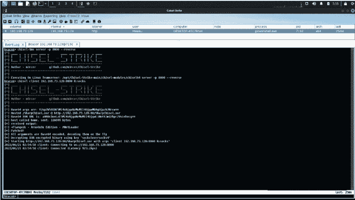
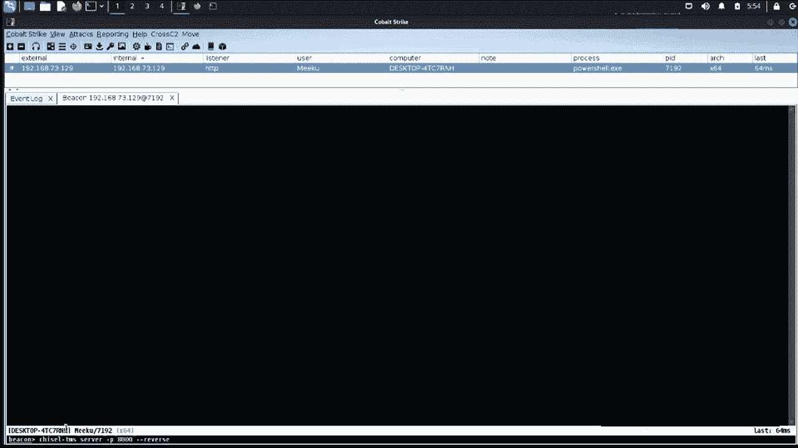

# Chisel-Strike:一个. NET XOR 加密的钴击攻击者实现，用于 Chisel 利用更快的代理

> 原文：<https://kalilinuxtutorials.com/chisel-strike/>

.png)

**Chisel-Strike** 是 Chisel 的. NET XOR 加密钴击攻击者实现，以利用更快的代理和高级 socks5 功能。

## 为什么要写这个？

根据我的经验，我发现 socks4/socks4a 代理与它的 socks5 对等物相比非常慢，并且在大多数 C2 框架中缺乏 socks5 的实现。chisel 的 go 版本有一个 C#包装器，名为 SharpChisel。这个包装器有一些问题，并且没有维护到 chisel 的最新版本。它不允许使用外壳代码与甜甜圈，反射方法或`**execute-assembly**`。我用 SharpChisel-NG 项目找到了解决这个问题的方法。

由于 SharpChisel 装配在 **`16.7 MB`、`execute-assembly`** (有一个隐藏的尺寸限制`**1 MB**`)附近，类似的记忆方法就行不通了。为了在内存中维护大部分执行，我引入了 Flangvik 的 NetLoader 项目，它通过`**execute-assembly**`执行，在内存中反射性地托管和加载带有 base64 参数的`**SharpChisel**`的 XOR 加密版本。

或者，也可以通过替换项目中适当的 chisel 二进制文件来实现类似的 C#代理，如 SharpSocks。

## 设置

*注意:如果使用 Windows teamserver，跳过步骤 2 和 3。*

*   克隆/下载存储库:`**git clone https://github.com/m3rcer/Chisel-Strike.git**`
*   使所有二进制文件可执行:

*   `**cd Chisel-Strike**`
*   `**chmod +x -R chisel-modules**`
*   `**chmod +x -R tools**`

*   安装`**Mingw-w64**`和`**mono**`:

*   `s`**`udo apt-get install mingw-w64`**
*   **T2`sudo apt install mono-complete`**

*   使用`**Script Manager**`在钴击中导入`**ChiselStrike.cna**`

*如果需要，从`**src**`文件夹中重新编译二进制文件。*

## 用法

chisel 可以在 teamserver (windows/linux)和 beacon 上执行。其中任一个充当服务器/客户端。一个正常的执行流程是在 teamserver 上设置一个 chisel 服务器，并在信标上创建一个连接回 teamserver 的客户机。

### 命令

*   在灯塔上凿东西
*   在你的团队服务器上运行 Chisel
*   `**chisel-enc**`:用选择的密码对`**SharpChisel.exe**`进行异或加密
*   `c**hisel-jobs**`:在团队服务器和信标上列出活动的 chisel 作业
*   杀死烽火台上活跃的凿工
*   `**chisel-tms-kill**`:终止 teamserver 上的活动 chisel 作业

### 举例

## 退出

使用 NimCrypt2 之类的项目，NetLoader 很容易被混淆并用于绕过 defender。

然而`**SharpChisel.exe**`由于在类似于`**C:\Users\m3rcer\AppData\Local\Temp\Costura\CB9433C24E75EC539BF34CD1AA12B236\64\main.dll**`的位置使用了`**Costura/Fody**`包而在磁盘上丢弃了一个`**dll**`，这被 defender 检测到。建议使用 SharpChisel-NG 项目中的 gobfuscate 等项目来混淆 chisel dll，并重新构建新的 SharpChisel-NG 二进制文件，如下所示。

[**Download**](https://github.com/m3rcer/Chisel-Strike)