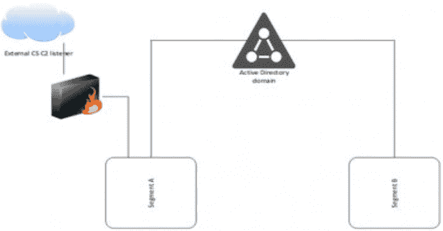

# 声明:多云 iam 权限枚举工具

> 原文：<https://kalilinuxtutorials.com/cliam/>

**Cliam** 是一个简单的云权限标识符。CLI 有两个主要组件。大多数枚举的权限是列表、描述或获取权限。只测试不需要特定资源的权限。

*   `**enumerate**`可用于列举具体权限(推荐)
*   一些服务提供商有服务组，可以检查特定服务/资源子集的权限。

## 安装

下载最新版本。DEV 标签是最新的，但不稳定。

为了在本地构建二进制文件，将 cd 放入`**cli**`目录并运行`**make dev**`

## 用法

Cliam 使用从众所周知的 envars 服务或从 cli 传递通常需要的标志获得的凭证。

**强烈建议设置命令完成，因为大多数`enumerate`选项必须是特定的。**要生成完成，使用`c**liam completion [shell]**`并根据您的 shells 完成目录进行设置。

**❯❯cliam–help
cloud enumerate 是一款为权限枚举云凭证的工具。
用法:
cliam【命令】
可用命令:
aws 为其权限枚举 aws 凭证。
完成为指定的 shell 生成自动完成脚本
gcp 枚举 gcp 服务帐户的权限。
help 关于任何命令的帮助
标志:
-h，–cliam 的帮助帮助
其他帮助主题:
cliam azure 为其权限枚举 azure 凭据。
使用“cliam[command]–help”了解有关命令的更多信息。**

### 自动警报系统

使用 AWS rest api 通过传入的凭证发出签名请求。这大大提高了速度，但增加新权限的难度也更大了。规模问题是 AWS 在服务级别使用 3-4 种不同的请求

支持从 AWS 配置文件、标志或默认 AWS 环境变量获取凭证，如 **`AWS_ACCESS_KEY_ID`、`AWS_SECRET_ACCESS_KEY`** 和可选的 **`AWS_SESSION_TOKEN`。**

**cliam aws–help
枚举 AWS 凭证的权限。
用法:
cliam aws【命令】
可用命令:
通用枚举通用 aws 资源的权限。
计算枚举通用计算 AWS 资源的权限。
数据库枚举通用 AWS 数据库资源的权限。
枚举指定 AWS 资源的枚举权限。
无服务器枚举通用无服务器 AWS 资源的权限。
存储枚举通用存储 AWS 资源的权限。
标志:
–Access-Key-ID 字符串 AWS Access Key ID
-h，–AWS 的帮助帮助
–Profile 字符串 AWS Profile。设置配置文件时，将忽略访问密钥 id、秘密访问密钥和会话令牌。
–区域字符串 AWS 区域(默认为“us-east-1”)
–秘密访问密钥字符串 AWS 秘密访问密钥
–会话令牌字符串 AWS 会话令牌
全局标志:
–max-threads int 要使用的最大线程数。(默认为 5)
–request-time out int 每个请求的超时时间(秒)。(默认 10)**

### 已知资源

Cliam for AWS 还支持枚举某些需要已知值的权限。例如，当使用 awscli 时，我们可以使用`**aws lambda get-function --function-name <function_name>**`获得一个函数。

这直接映射到我们可以使用的声明:

**cliam AWS enumerate lamda-known-value function-name =**

这将枚举 lambda 的所有权限，该权限将 function-name 作为有效参数。这也适用于其他 AWS 资源。(更多报道即将推出)

#### 例子

强制 AWS 配置文件中的所有无服务器资源

**❯❯ cliam aws 无服务器–profile = my-profile**

使用获得的临时会话令牌检查所有 ec2 权限

**❯❯cliam AWS enumerate ec2–session-JSON = creds.json
其中 creds . JSON 有
{
"Type" : "AWS-HMAC "，
"AccessKeyId" : "ASIA…"，
"SecretAccessKey" : "…"，
"Token" : "…"，
}**

枚举 s3、iam 和 ec2 的权限

**❯❯cliam AWS enumerate S3 iam ec2**

### GCP

目前，使用`**cloudresourcemanager**` API 枚举权限。如果不启用此服务，此操作将会失败，但未来计划使用 rest alls 来扩展确认权限。

GCP 支持从特定的服务帐户 json 文件中枚举。来自 GCP 环境变量`**GOOGLE_APPLICATION_CREDENTIALS**`和`**CLOUDSDK_CORE_PROJECT**`的~~凭证也被支持~~。

因为 GCP 枚举有两种模式，如果启用了`**cloudresourcemanager**`则使用 enumerate，或者使用`**rest**`来枚举特定的权限。

**cliam gcp–help
枚举 GCP 服务帐户的权限。
用法:
cliam gcp【命令】
可用命令:
bruteforce 枚举所有 gcp 权限
枚举枚举指定的 gcp 权限
使用 REST API 的 rest GCP 权限
标志:
-h，–帮助 GCP 的帮助
–项目 id 字符串 GCP 项目 id
–区域字符串 GCP 区域(默认为“us-central 1”)
–服务帐户字符串 GCP 服务帐户路径
–区域字符串 GCP 区域(默认为“us-centra(默认为 5)
–request-time out int 每个请求的超时时间(秒)。(默认 10)
使用“cliam GCP[command]–help”了解有关命令的更多信息。**

## 调试

claim 支持两个环境变量来显示调试输出

*   DEBUG=true(显示请求的状态代码)
*   VERBOSE=true(显示请求正文)

[**Download**](https://github.com/securisec/cliam)