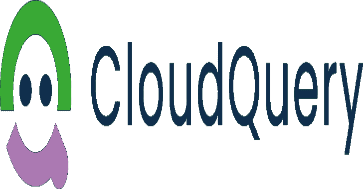
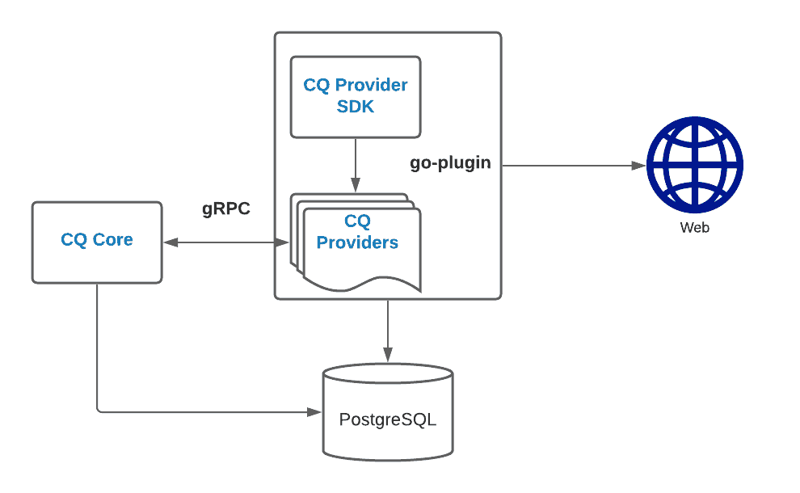

# Cloudquery:将您的云基础架构转换为 SQL 数据库，以实现轻松监控、治理和安全性

> 原文：<https://kalilinuxtutorials.com/cloudquery/>

**Cloudquery** 提取基础设施的配置和元数据，并将其转换为关系 SQL 数据库。这允许您编写 SQL 查询，以便于监控、治理和安全。

**主要特征**

**使用 SQL 进行探索和监控**

CloudQuery 将来自不同云和 SaaS 提供商的分散 API 的数据提取、转换(规范化)和加载(ETL)到 PostgreSQL 关系数据库中。这使您能够使用 SQL 专注于您的业务逻辑，而无需编写代码和直接使用 API。

**作为代码的安全性和合规性**

您可以使用 SQL 作为查询语言，使用 HCL 作为引擎来编写安全性和遵从性规则。就像您使用 IaC 来构建、更改和版本化您的基础设施一样，您可以使用 CloudQuery 策略来监控、提醒和版本化您的云基础设施安全性和合规性规则。

**可扩展**

CloudQuery 是一个开源的可扩展框架。所有官方和批准的社区提供商和政策都列在 CloudQuery Hub 中。请参见开发新的提供商。

**用例**

CloudQuery 以 SQL 可访问的规范化方式为您的云基础设施和 SaaS 应用程序提供了前所未有的能力和可见性。

下面是安全、开发运维、基础架构和 SRE 团队中一些众所周知的 CloudQuery 用例。

**安全性和合规性**

CloudQuery 策略允许您通过跨云提供商的 SQL 查询来编纂您的安全性和合规性规则。

**云库存和资产管理**

CloudQuery Providers 使您能够获得跨帐户、不同云提供商和 SaaS 应用程序的可见性。

CloudQuery 为您提供了对整个云环境的 SQL 访问。

**审计**

CloudQuery 让您能够监控基础设施随时间的变化，既可以用于调查和分析目的，也可以用于接近实时的规则和警报(在 CloudQuery SaaS 中提供。

**入门**

**下载并安装**

您可以从发行版或使用 CLI 下载预编译的二进制文件:

*   预编译二进制文件
*   公司自产自用
*   码头工人

下载最新版本:

**export OS=Darwin #可能值:Linux、Windows、Darwin
curl-L https://github . com/cloud query/cloud query/releases/latest/download/cloud query _ $ { OS } _ x86 _ 64-o cloud query
chmod a+x cloud query**

下载特定版本:

**export OS=Darwin #可能值:Linux、Windows、Darwin
export VERSION = # specify a VERSION
curl-L https://github . com/cloud query/cloud query/releases/download/$ { VERSION }/cloud query _ $ { OS } _ x86 _ 64-o cloud query**

**运行中**

CloudQuery Hub 列出了所有官方和经批准的社区提供商及其各自的文档。

**初始化命令**

第一步是生成一个`**config.hcl**`文件，该文件将描述您希望使用哪个云提供商以及您希望 cloud query ETL 哪些资源:

**cloud query init aws
cloud query init gcp AWS #这将生成一个包含 GCP 和 AWS 提供者的配置
cloud query init–help #显示所有可能自动生成的配置和标志**

**生成或连接到数据库**

CloudQuery 需要一个 PostgreSQL 数据库(> 11)。您可以生成一个本地的(通常适用于开发和本地测试)或者连接到一个现有的。

对于本地，您可以使用以下 docker 命令:

**docker run-p 5432:5432-e POSTGRES _ PASSWORD = pass-d POSTGRES**

如果您使用现有的数据库，您必须更新 config.hcl 中的`connection`部分:

**cloud query {
plugin _ directory = "。/CQ/providers "
policy _ directory = "。/CQ/policies "
provider " AWS " {
source = " "
version = " latest "
}
connection {
DSN = " host = localhost user = postgres password = pass database = postgres port = 5432 "
}
}**

**获取命令**

一旦生成了 **`config.hcl`** ，运行下面的命令来获取资源。(您需要进行身份验证—请参见每个提供商下的相关部分):

**cloud query fetch
# cloud query fetch–help #显示所有可能的**fetch 标志

一旦您的提供程序获取了资源，您就可以运行下面的示例查询。

**浏览和运行查询**

CloudQuery Hub 中提供了每个提供者的模式和表

AWS 的几个例子:

列出 ec2 _ 图像

**SELECT * FROM AWS _ ec2 _ images；**

查找所有面向公众的 AWS 负载平衡器:

**SELECT * FROM AWS _ elb v2 _ load _ balancers WHERE scheme = ' internet-facing '；**

**策略命令**

CloudQuery 策略允许用户编写安全性、治理、成本和合规性规则，使用 SQL 作为查询层，使用 HCL 作为逻辑层。

所有官方和批准的社区政策都列在 CloudQuery Hub 上。

**执行策略**

所有官方政策都由 https://github.com/cloudquery-policies.主持

**cloudquery 策略运行 aws-cis-1.2.0**

**获取配置文件 hcl**

`**config.hcl**`是`**cloudquery**`执行提取所需的主要(也是唯一)文件。正如后缀所暗示的，它使用 HCL 语言(参见原因)。

在大多数情况下，这个文件可以由`**cloudquery init [provider_name]**`生成，然后您可以根据需要调整配置。

**云查询块**

每个`**config.hcl**`必须指定一次`**cloudquery**`块。这通常看起来像:

**//由 CloudQuery CLI 自动生成的配置
cloud query {
plugin _ directory = "。/CQ/providers "
policy _ directory = "。/cq/policies"
提供者" AWS " {
source = " "
version = " latest "
}
连接{
DSN = " host = localhost user = postgres password = pass database = postgres port = 5432 "
}
}**

**自变量**

*   plugin _ directory–cloud query 将下载提供者插件的目录。
*   policy _ directory–cloud query 将下载策略的目录。

**提供者块**

该块必须指定一次或多次，指定要使用的提供程序和版本。CloudQuery Hub 上列出了所有官方和批准的社区提供商及其各自的版本和文档。

`**cloudquery fetch**`命令将下载所有提供者及其各自的版本到`**plugin_directory**`。一旦它们被下载，CloudQuery 将验证它们并执行 ETL 每个提供者支持的配置和元数据。

**连接块**

连接块指定应该通过 **`dsn`** 参数连接到哪个数据库。

**提供者块**

provider 块必须指定一次或多次，并且应该首先在`**cloudquery**`块中指定。

每个提供程序有两个块:

*   `**configuration**`–参数因提供商而异，其文档可在 CloudQuery Hub 中找到。
*   `**resources**`–该提供者支持的所有资源，可以从中获取配置和元数据。

**初始化**

为 fetch 命令生成初始 config.hcl。

**用途**

**cloud query init[选择一个或多个提供者(aws、gcp、azure、okta、…)] [flags]**

**例题**

# **下载 aws 提供者并为 AWS 提供者生成 config . HCl
cloud query init AWS
#下载 AWS、GCP 提供者并为两个提供者生成一个 config . HCl
cloud query init AWS GCP**

**附加帮助主题**

使用“cloudquery init options”获取全局 CLI 选项列表。

**获取**

从已配置的提供程序获取资源。

这需要一个 config.hcl 文件，它可以由`**cloudquery init**`生成。

**用途**

**cloudquery fetch [flags]**

**例题**

**#获取在 config.hcl 中配置的 PostgreSQL 的配置提供程序
cloudquery 获取**

**附加帮助主题**

使用“cloudquery 获取选项”查看全局 CLI 选项列表。

**政策**

下载和执行 CloudQuery 策略的顶级命令。

**用途**

**云查询策略【命令】**

**可用命令**

**下载从 CloudQuery 策略中心下载策略
运行在 CloudQuery 数据库上执行策略**

**附加帮助主题**

**使用“云查询策略[命令]–帮助”了解有关命令的更多信息。
使用“cloudquery 策略选项”查看全局 CLI 选项列表。**

**政策下载**

从 CloudQuery 策略中心下载策略。

**用途**

**cloudquery 策略下载 GITHUB_REPO [flags]**

**例题**

**下载官方政策
cloudquery policy 下载 aws-cis-1.2.0
以下将同上
官方政策在此托管:https://github.com/cloudquery-policies
cloud query policy 下载 cloud query-policies/AWS-cis-1 . 2 . 0
下载 COMMUNITY policy
cloud query policy 下载 COMMUNITY _ GITHUB _ ORG/AWS-cis-1 . 2 . 0
其他政策见 https://hub.cloudquery.io。**

**附加帮助主题**

使用“云查询策略下载选项”获取全局 CLI 选项列表。

**策略运行**

对 CloudQuery 数据库执行策略。

**用途**

**cloudquery 策略运行 GITHUB _ REPO[PATH _ IN _ REPO][flags]**

**标志**

**-h，–运行帮助帮助
–输出字符串在给定路径生成一个新文件，输出
–跳过下载跳过下载策略库
–跳过版本控制跳过策略版本控制并使用最新文件
–失败时停止在第一次失败时停止执行
–子路径字符串强制策略运行命令仅执行该子策略/查询**

**附加帮助主题**

使用“cloudquery 策略运行选项”查看全局 CLI 选项列表。

**完成**

为 CloudQuery CLI 安装 shell 完成功能。

**用途**

**cloudquery 完成[bash|zsh|fish|powershell]**

**痛击**

**$ source<(cloud query completion bash)为每个会话加载完成，执行一次:Linux:cloud query completion bash>/etc/bash _ completion . d/cloud query
MAC OS:
$ cloud query completion bash>/usr/local/etc/bash _ completion . d/cloud query**

**Zsh**

**#如果您的环境中尚未启用 shell 完成，您将需要
#来启用它。可以执行以下一次:
$ echo " autoload-U compinit；compinit" > > ~/。zshrc
#为了加载每个会话的完成，执行一次:
$ cloud query completion zsh>" $ { fpath[1]}/_ cloud query "
#您需要启动一个新的 shell 来使这个设置生效。**

**鱼**

**$ cloudquery completion fish | source
#为每个会话加载完成，执行一次:
$ cloudquery completion fish>~/。config/fish/completions/cloud query . fish**

**Powershell**

**PS>cloud query completion powershell | Out-String | Invoke-Expression
#要为每个新会话加载完成，请运行:
PS>cloud query completion powershell>cloud query . PS1
#并从您的 powershell 配置文件中获取该文件。**

**架构**

这是描述 CloudQuery 内部工作和设计的高级部分。(在开发新的提供商时，这可能很有用)。

CloudQuery 有一个可插拔的架构，使用 go-plugin 来加载、运行，并通过 gRPC 在提供者之间进行通信。要为 CloudQuery 开发一个新的提供者，你不需要理解 go-plugin 的内部工作原理，因为它们是从 cq-provider-sdk 中抽象出来的。

类似于任何利用 go-plugin 框架的应用程序，CloudQuery 分为 CloudQuery 核心和 CloudQuery 提供者。

**CloudQuery** **核心职责**

*   用户的主入口点和 CLI。
*   正在读取 CloudQuery 配置。
*   下载、验证和运行提供程序。
*   运行策略包。

**CloudQuery 提供商职责**

*   旨在仅由 cloudquery-core 运行。
*   通过 gRPC 与 cloudquery-core 通信，以接收命令和操作。
*   通过第三方云/SaaS API 进行初始化、验证和获取数据。

**调试**

**在调试模式下运行提供程序**

调试 CQ 提供程序是一个相当简单的过程:

首先，我们必须在调试模式下运行提供程序。为此，在我们的 IDE 或终端中设置环境变量`**CQ_PROVIDER_DEBUG=**1`并执行 provider。

执行插件二进制文件时，会出现以下消息。

**Linux/Osx**

**Provider 启动，对 Cloudquery 设置 CQ _ 重附属 _ 提供者 env var:
导出 CQ _ 重附属 _ 提供者=/cq-my-provider/。cq _ 重附属**

**窗户**

**Provider 启动，要附加 Cloudquery 设置 CQ _ 重附属 _ 提供者环境变量:
命令行提示:设置 CQ _ 重附属 _ 提供者=。/providers/cq-my-provider/。CQ _ REATTACH
PowerShell:＄env:CQ _ REATTACH _ PROVIDERS =。/providers/cq-my-** provider/。cq _ 重附属

一旦我们设置好`**CQ_REATTACH_PROVIDERS**`，我们将能够从我们的 CQ 二进制文件中执行任何命令，它将使用调试过的插件，而不是最新版本。

**例子**

在下面的示例中，我们将下载一个现有的提供程序，编译它，并在调试模式下执行它。

**git 克隆 https://github.com/cloudquery/cq-provider-aws.git
go build-o CQ-PROVIDER-AWS
export CQ _ 提供者 _ 调试=1
。/cq-provider-aws //执行 provider 二进制
// Provider 启动，以附加 Cloudquery 设置 CQ _ 重附属 _ 提供者 env var:
//导出 CQ _ 重附属 _ 提供者=//。cq _ 重附属**

在执行提供者之后，当我们执行主 CQ 二进制文件时，我们将得到一个关于如何重新附加提供者的消息。

**//执行 aws 提供程序的路径
export CQ _ 附属提供程序=/providers/cq-provider-aws/。cq _ 重贴
。/cloud query fetch–DSN " host = localhost user = postgres password = pass db . name = postgres port = 5432 "**

**开发新的供应商**

本节将介绍为 CloudQuery 开发自己的提供者需要做些什么，并有选择地将其发布在 CloudQuery Hub 上。

在继续之前，建议先熟悉一下 CloudQuery 架构。

CloudQuery 提供者利用 cq-provider-sdk，它抽象了大部分的 TL(在 e TL 中，提取-转换-加载)。因此，作为一名开发人员，您只需通过第三方 API 实现初始化、认证和获取数据，SDK 将负责转换数据并将其加载到数据库中。此外，随着 cloudquery-core 的发展，您的提供商将获得对新功能和其他数据库支持的现成支持。

这是一个模板项目，您可以从中创建自己的 https://github.com/cloudquery/cq-provider-template.

我们将浏览模板中的文件，并解释您需要实现的每个部分。

**resources/provider.go**

**func 插件()*插件。提供者{ return &插件。提供商{名称:"您的提供商名称"，配置:提供商。Configure，ResourceMap: map[string]* 模式。表{
“资源名称”:资源。ResourceName()，
}，
Config: func()提供者。Config {
返回&提供者。配置{}
}，
}**

在这个文件中，一切都已经为您设置好了，您只需要更改`**Name**`来匹配您的提供者名称，并在您实现它们并将它们添加到您的提供者时将新资源添加到`**ResourceMap**`。

**client/config.go**

**包客户端
//提供方配置
类型帐户结构{
名称字符串`hcl:"name,optional"`
}
类型配置结构{
帐户[]帐户`hcl:"account,block"`
用户字符串`hcl:"user,optional"`
调试 bool `hcl:"debug,optional"`
}
//将示例传递给 cloudquery 当 cloudqueyr init 将调用
func (c Config)示例()字符串{
返回`配置{
//可选。创建提供者将运行的多个帐户块
//account {
//name =
//}
//可选。有些字段我们决定添加
user = "cloudquery"
//可选。启用提供程序 SDK 调试日志记录。
调试=假
}
}**

在获取任何资源之前调用这个函数。提供者有机会读取顶级配置，初始化和验证所有需要的第三方客户端，并返回您的初始化对象，该对象将被传递到您的每个获取器。

**resources/demo _ resources . go**

在这个目录中，您将为每个资源创建一个新文件。每个资源可能包含一个或多个相关的表。请参阅内联文档。

**包资源
导入(
【上下文】
【github . com/cloud query/CQ-provider-SDK/plugin/schema】
【github . com/cloud query/CQ-provider-template/client】
)
func demo resource()* schema。表{
返回&模式。Table{
//必需。表格名称
名称:“provider_demo_resources”，
//必选。为表提取数据。请参见 fetchDemoResources
解析器:fetchDemoResources，
//可选。DeleteFilter 返回从数据库中截断该表的数据时要添加的键/值对的列表。
// DeleteFilter: nil，//func(meta client meta)[]interface { }
//可选。返回重新定位的元客户端。SDK 将使用它们中的每一个来执行该表。有用的话要针对不同账号等执行……
//Multiplex:nil，//func(meta client meta)[]client meta
//可选。检查是否应忽略从表解析器返回的错误。如果返回 true，SDK 将忽略并继续，而不是中止。
// IgnoreError: nil，//ignore error func func(err error)bool
//可选。在解析所有列之后，在将资源插入数据库之前，调用 Post 资源解析程序。
// PostResourceResolver: nil，// RowResolver func(ctx 上下文。Context，meta ClientMeta，resource *Resource)错误
列:[]架构。列{
{
名称:“帐户标识”，
类型:模式。TypeString，
//可选。如果列名与名称不匹配，或者它只是一个需要从其他地方获取数据的额外的
//列，那么您可以有一个特殊的列解析器。
解析器:customColumnResolver，
}，
{
名称:“区域”，
类型:架构。TypeString，
}，
{
名称:“创建日期”，
类型:模式。TypeTimestamp，
}，
{
Name:“Name”，
Type: schema。TypeString，
// schema。PathResolver 是一个实用函数，它从结构中的不同名称获取数据。
//解析器:模式。path resolver(" other _ name _ in _ struct ")，
}，
}，
//一个表可以有关系
//关系:[]*schema。table {
//{
//Name:" provider _ demo _ resource _ children "，
//Resolver:fetchDemoResourceChildren，
// Columns: []schema。column {
//{
//Name:" bucket _ id "，
// Type: schema。TypeUUID，
//解析器:架构。ParentIdResolver，
// }，
//{
//Name:" resource _ id "，
// Type: schema。TypeString，
//解析器:schema。PathResolver("Grantee。ID ")，
// }，
// {
// Name: "type "，
// Type: schema。TypeString，
// Resolver: schema。PathResolver("Grantee。式》)、
// }、
// }、
// }、
///}、
}、
}、//= = = = = = = = = = = = = = = = = = = = = = = = = = = = = = = = = = = = = = = = = = = = = = = = = = = = = = = = = = = = = = = = = = = = = = = = = = = = = = = = = = = = = = = = = = = = = = = = = = = = = = = = = = = = = = = = = = = = = = = = = = =
上下文，元模式。ClientMeta，parent *schema。Resource，res chan interface{})错误{
c := meta。(*客户。Client)
_ = c
//使用第三方客户端获取并将结果放入 RES
//RES<-c . thirdpartyclient . getdat()
return nil
}
func customColumnResolver(CTX 上下文。上下文，元模式。ClientMeta，资源*架构。资源，c 架构。列)错误{
资源。Set("column_name "，" value ")
return nil
}**

本质上，对于您支持的每个资源，您只需要定义两件事情:

*   模式——表在数据库中的外观——列名和类型。
*   实现主表解析器函数，该函数将从第三方 SDK 获取数据并将其传递给 SDK。
    *   SDK 将自动读取数据，并使用默认的命名约定将其插入到表列中。默认的命名约定是 CamelCase 换句话说，如果列名是`**some_name**`，那么传递给 SDK 的结构中的字段名应该是:`**SomeName**`。如果需要不同的名称或逻辑，可以实现列解析器。

**最佳实践**

**对云提供商的只读访问权限**

每个提供者都有自己的认证方式(在 hub 中有描述)，但是所有提供者的经验法则是，在 100%的情况下(当然，如果可能的话)，CloudQuery 只需要一个只读密钥来获取信息。CloudQuery **不会**对你的基础设施或者 SaaS 应用做任何改变。

**跨账户访问**

如果可能，您应该为每个云提供商使用一个只读帐户，该帐户可以访问您的所有帐户/项目。例如，在 AWS 中，您可以使用 AssumeRole 功能。在 GCP，帐户应该能够访问所有相关项目(只读)。请参阅 CloudQuery Hub 中的相关文档。

如果这不可能，您可以通过指定多个提供程序块来使用多个帐户。

**每日基础设施快照**

建议每天通过 cron 运行`**cloudque**ry fetch`(在 lambda 或任何其他可以访问所需基础设施的安全地方)。当然，这取决于您的需求，甚至可以更频繁地运行。

**安全**

本节将列出关于 CloudQuery 的关键安全点。如果您决定“自己主持”，请确保遵循最佳实践

**安全提供商认证凭证**

*   提供者身份验证凭据应该始终是只读的。
*   运行 CloudQuery 的机器应该具有正确的权限，因为它包含了云基础设施的凭证。

**安全云查询数据库**

即使 CloudQuery 数据库只包含配置和元数据，您也应该通过正确的访问和权限来保护它并保证它的安全。

[**Download**](https://github.com/cloudquery/cloudquery)