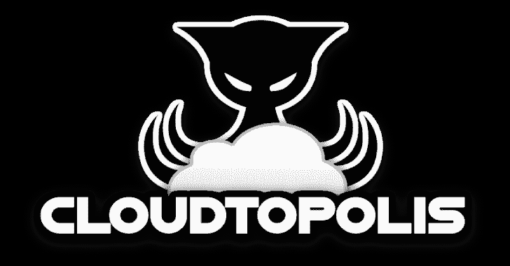

# Cloudtopolis:免费破解云中的哈希

> 原文：<https://kalilinuxtutorials.com/cloudtopolis/>

Cloudtopolis 是一个工具，可以在 Google Cloud Shell 平台上快速、完全无人值守地安装和提供 Hashtopolis(而且是免费的！).

**要求**

*   拥有 1 个谷歌帐户(至少)。

**安装**

*   Cloudtopolis 安装分两个阶段进行:

**第一阶段**

通过以下链接访问 Google Cloud Shell:

[https://ssh.cloud.google.com/cloudshell/editor?hl=es&fromcloudshell = true&shell only = true](https://ssh.cloud.google.com/cloudshell/editor?hl=es&fromcloudshell=true&shellonly=true)

然后，在该终端中运行以下命令:

wget https://raw . githubusercontent . com/joelmsec/Cloudtopolis/master/Cloudtopolis . sh
chmod+x Cloudtopolis . sh
。/Cloudtopolis.sh

**第二阶段**

通过以下链接访问 Google 联合实验室:

[https://colab . research . Google . com/github/joelmsec/Cloudtopolis/blob/master/Cloudtopolis . ipynb](https://colab.research.google.com/github/JoelGMSec/Cloudtopolis/blob/master/Cloudtopolis.ipynb)

有必要用在 Google Cloud Shell 和 Hashtopolis 中获得的数据填充“Requeriments”部分中的字段。

为此，您可以从以下 url 直接访问 Hashtopolis:

[https://ssh.cloud.google.com/devshell/proxy?authuser=0&port = 8000&environment _ id = default](https://ssh.cloud.google.com/devshell/proxy?authuser=0&port=8000&environment_id=default)

或者通过 SSH 隧道，按照第一个脚本执行后出现的指令执行。

最后，运行协作代码，直到代理在 Hashtopolis 中注册。

**使用**

安装完成后，可以根据需要多次重复阶段 2 来添加更多代理。为此，有必要为每个协同实验室实例使用一个 Google 帐户。没有必要在任何时候重复第一阶段，您可以使用您的其他帐户或您的朋友和同事的帐户。

现在可以选择附加选项了！

AllwaysP100 =如果选中，脚本将不会运行，除非分配的 GPU 是特斯拉 P100
无脸男=将下载 Kaonashi.txt 字典和 OneRuleToRuleThemAll 规则
Rockyou =将下载 rockyou.txt 字典
加载它们，只需要在从笔记本启动代码之前将“False”改为“True”即可。
默认情况下，启动时只选择加载 Rockyou。

详细的安装、使用和建议指南在以下链接:
[https://dark byte . net/cloudtopolis-rompiendo-hashes-en-la-nube-freet](https://darkbyte.net/cloudtopolis-rompiendo-hashes-en-la-nube-gratis)

**执照**

这个项目是在 GNU 3.0 许可下授权的——更多细节请看许可文件。

以下是 NVIDIA 和 Google 的合作条款和条件，以及常见问题:

[https://colab.research.google.com/pro/terms](https://colab.research.google.com/pro/terms)
https://research.google.com/colaboratory/faq.htmlT5[https://cloud.google.com/terms/service-terms/nvidia](https://cloud.google.com/terms/service-terms/nvidia)

**致谢&致谢**

*   这个工具是由 Joel gámez Molina//@ joelmsec 从头开始创建和设计的
*   原创来自@mxrch，灵感来自彭拉布:[https://github.com/mxrch/penglab](https://github.com/mxrch/penglab)
*   塞恩·科雷的散列表:[https://github.com/s3inlc/hashtopolis](https://github.com/s3inlc/hashtopolis)
*   哈希卡特:[https://github.com/hashcat/hashcat](https://github.com/hashcat/hashcat)

[**Download**](https://github.com/JoelGMSec/Cloudtopolis)