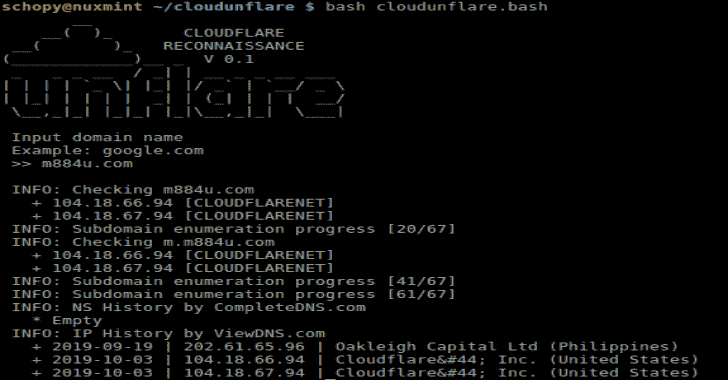

# CloudUnflare:cloud flare 旁路的侦察真实 IP 地址

> 原文：<https://kalilinuxtutorials.com/cloudunflare-cloudflare-bypass/>

**CloudUnflare** 是一个用来侦察真实 IP 地址的工具，用于绕过 Cloudflare。

**准备:**

**1 .完成 API〔t1〕**

*   在[completedns.com](https://completedns.com/)创建一个账户，并首先验证。
*   在`cloudunflare.bash`中的`CompleteDNS_Login`变量上输入您的电子邮件和密码。

**2。所需的依赖关系**

*   卷曲
*   挖苦
*   whois

**也可阅读-[JSONBee:一个准备好使用 JSONP 端点/有效负载来帮助绕过不同网站的内容安全策略](https://kalilinuxtutorials.com/jsonbee-jsonp-endpoints-payloads/)**

**基于 Debian 的**

**apt-get 安装 curl dnsutils whois -y**

**安装:**

*   克隆此回购

**git 克隆 https://github . com/grey catz/cloudunfaire . git**

**命令**

*   **前往** `**CloudUnflare**` **路径**

**云端 CD**

*   **运行**

bash cloudunflare . bash .巴沙尔·阿萨德

[**Download**](https://github.com/greycatz/CloudUnflare)