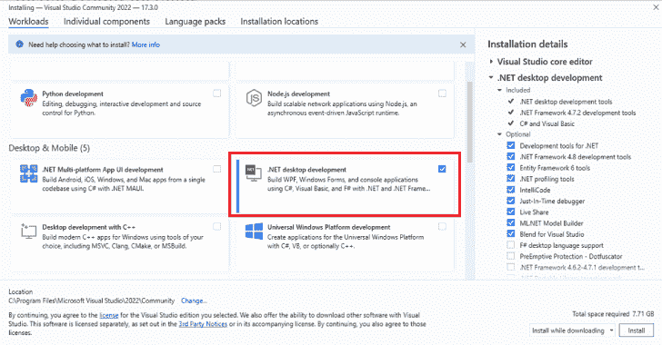
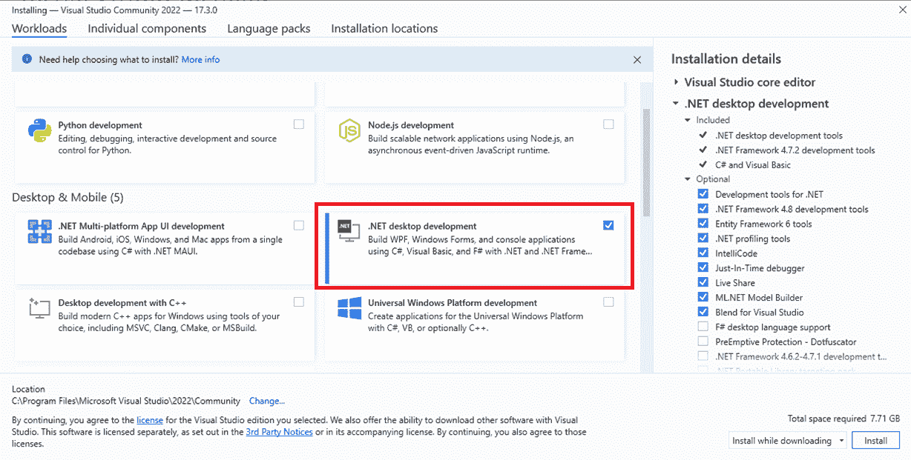
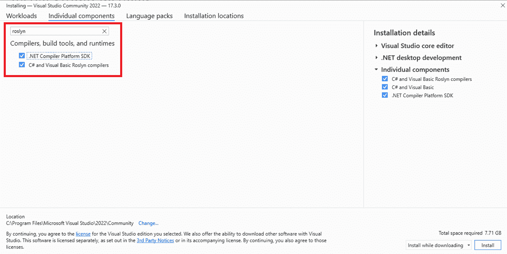
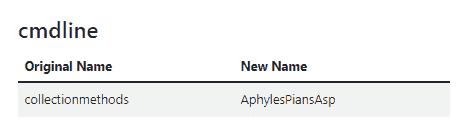
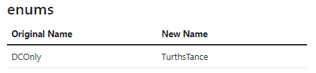
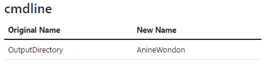

# Codecepticon:。NET 应用程序，允许您混淆 C#、VBA/VB6(宏)和 PowerShell 源代码

> 原文：<https://kalilinuxtutorials.com/codecepticon/>

[](https://blogger.googleusercontent.com/img/b/R29vZ2xl/AVvXsEgQ_J_w8-gjEtr_PM__YhwRCdRqKzVwGUJG7QnreLNMs4H46Y7Do0yLUP9n0AN8z69puPXdySl4MSXHMSdaJ5TMKxobd5XZPjby1svKGV-T8GyudY2UzHM2LukR828H1Y4C-3vWs9Yv9DRIXKSSpnFfUoOdiNhAG_SjusBShS-ZQSJot16cgMUk7EQF/s728/Codecepticon1(1).png)

**Codecepticon** 是一个. NET 应用程序，允许您混淆 C#、VBA/VB6(宏)和 PowerShell 源代码，是为红/紫队等攻击性安全活动开发的。Codecepticon 与其他混淆器的区别在于，它的目标是源代码而不是编译后的可执行文件，并且是专门为反病毒/EDR 规避而开发的。

Codecepticon 允许您混淆和重写代码，但也提供了重写命令行等功能。

## 先看看这个

！在我们开始之前！

*   本文档仅介绍如何安装和使用 Codecepticon。不会提供 Rubeus 和 SharpHound 等工具的编译、使用和支持。有关更多信息，请分别参考每个项目的回购协议。
*   Codecepticon 正在 VS2022 中积极开发/测试，但它*应该*也可以在 VS2019 中工作。除非问题在 VS2022 中重现，否则不会调查为 VS2019 及更低版本创建的任何票证/问题。所以请用最新最棒的 VS2022。
*   以下软件包**必须是 3.9.0** ，因为较新的版本有以下仍未解决的问题:[dot net/roslyn # 58463](https://github.com/dotnet/roslyn/issues/58463)Codecepticon 在运行时检查这些软件包的版本，如果版本不同于 3.9.0，它会通知您
    *   微软。CodeAnalysis.CSharp.Workspaces
    *   微软。code analysis . work spaces . msbuildCodecepticon checks the version of these packages on runtime and will inform you if the version is different to v3.9.0.
*   这一点怎么强调都不为过:**总是首先在本地测试你的混淆代码**。

## 先决条件

### Visual Studio 专业版/社区版 2022



### 罗斯林编译器



### 打开并编译

打开 Codecepticon，等待所有 NuGet 包下载完毕，然后构建解决方案。

## 使用码觉康

有两种方法可以使用 Codecepticon，要么将所有参数放在命令行中，要么传递一个 XML 配置文件。由于支持高水平的定制，不建议手动浏览`--help`输出来尝试并确定使用哪些参数以及如何使用。使用[CommandLineGenerator.html](https://github.com/Accenture/Codecepticon/blob/main/CommandLineGenerator.html)并快速生成您的命令:


命令生成器的输出格式可以是`Console`或`XML`，这取决于您的喜好。控制台命令可以按如下方式执行:

```
Codecepticon.exe --action obfuscate --module csharp --verbose ...etc
```

而当使用 XML 配置文件时，作为:

```
Codecepticon.exe --config C:\Your\Path\To\The\File.xml
```

如果您想深入了解 Codecepticon 的功能，[请查看本文](https://github.com/Accenture/Codecepticon/blob/main/docs/Functionality.md)。

关于你可以使用的技巧，[请查看本文](https://github.com/Accenture/Codecepticon/blob/main/docs/Tips.md)。

### C#

混淆一个 C#项目很简单，只需选择你想要的解决方案。请注意，不会对解决方案本身进行备份，当前的解决方案将被混淆。在尝试对目标项目运行 Codecepticon 之前，请确保您可以独立编译该项目。

### VBA/VB6

VBA 模糊处理针对的是源代码本身，而不是 Microsoft Office 文档。这意味着您不能将一个`doc(x)`或`xls(x)`文件传递给 Codecepticon。它必须是模块本身的源代码(按 Alt-F11 并从那里复制代码)。

### PowerShell

由于 PowerShell 脚本的复杂性，以及它在如何编写脚本方面提供的自由度，涵盖所有边缘情况并确保模糊结果将完全起作用是一项挑战。虽然预计 Codecepticon 可以很好地运行简单的脚本/功能，但在复杂的脚本/功能上运行它就不行了——这是一项正在进行的工作。

### 混淆命令行参数

混淆应用程序或脚本后，命令行参数很可能也被重命名。对此的解决方案是使用 HTML 映射文件来查找新名称。例如，让我们转换以下命令行:

```
SharpHound.exe --CollectionMethods DCOnly --OutputDirectory C:\temp\
```

通过在 HTML 映射文件中搜索每个参数，我们得到:



通过替换所有字符串，结果是:

```
ObfuscatedSharpHound.exe --AphylesPiansAsp TurthsTance --AnineWondon C:\temp\
```

但是，有些值可能存在于多个类别中:


因此，始终首先在本地环境中测试您的结果是至关重要的。

[Click Here To Download](https://github.com/Accenture/Codecepticon)